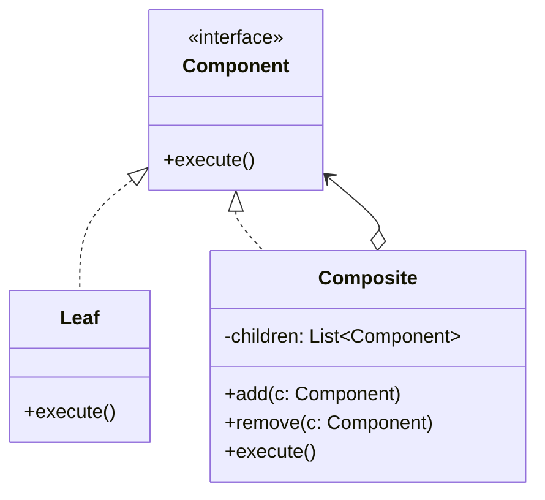

# Composite Pattern

## Introduction
The Composite pattern is a structural design pattern that lets you compose objects into tree structures to represent part-whole hierarchies. It allows clients to treat individual objects and compositions of objects uniformly.

## Problem Statement
When dealing with tree-like structures (like a file system, UI component tree, or organizational chart), client code becomes extremely complex if it has to distinguish between simple leaf nodes and complex container nodes.

## Why this exists
The Composite pattern exists to eliminate the need for type-checking and conditional branching when interacting with tree structures. By sharing a common interface, the client can execute an operation on the root of the tree, and the tree recursively delegates it down to all children.

## Real-world analogy
An army consists of armies, which consist of divisions, which consist of brigades, down to individual soldiers. When a general gives a command to "Move Forward," the command propagates down the hierarchy until every individual soldier moves forward. The general doesn't need to communicate with each soldier individually.

## Definition
**Composite** is a structural design pattern that lets you compose objects into tree structures and then work with these structures as if they were individual objects.

## Key concepts
- **Component**: The common interface for both simple leaves and complex composites.
- **Leaf**: A basic element of the tree that doesn't have child elements. It does the actual work.
- **Composite (Container)**: An element containing sub-elements (leaves or other composites). It delegates work to its children.

## Internal working / Mermaid diagram


## Python implementation

### Bad implementation
Client code relies on `isinstance` checks to figure out if it's dealing with a single item or a group.
```python
class Box:
    def __init__(self, price: int):
        self.price = price

class Product:
    def __init__(self, price: int):
        self.price = price

def calculate_total(items):
    total = 0
    for item in items:
        if isinstance(item, Product):
            total += item.price
        elif isinstance(item, Box):
            # Complex nesting requires recursive type checking
            pass 
    return total
```

### Better implementation
Using a shared interface so the client can ignore the underlying class type.
```python
class Item:
    def get_price(self): pass

class Product(Item):
    def __init__(self, price): self.price = price
    def get_price(self): return self.price

class Box(Item):
    def __init__(self): self.children = []
    def add(self, item): self.children.append(item)
    def get_price(self):
        return sum(child.get_price() for child in self.children)
```

### Best implementation
Strongly typed implementation adhering to SOLID principles, using abstract base classes.
```python
from abc import ABC, abstractmethod
from typing import List

class FileSystemComponent(ABC):
    """The common Component interface."""
    @property
    def name(self) -> str:
        pass

    @abstractmethod
    def get_size(self) -> int:
        pass

    @abstractmethod
    def display(self, indent: int = 0) -> None:
        pass

class File(FileSystemComponent):
    """The Leaf component doing actual work."""
    def __init__(self, name: str, size: int):
        self._name = name
        self._size = size

    @property
    def name(self) -> str:
        return self._name

    def get_size(self) -> int:
        return self._size

    def display(self, indent: int = 0) -> None:
        print(" " * indent + f"📄 {self.name} ({self.get_size()} KB)")

class Directory(FileSystemComponent):
    """The Composite component delegating work to children."""
    def __init__(self, name: str):
        self._name = name
        self._children: List[FileSystemComponent] = []

    @property
    def name(self) -> str:
        return self._name

    def add(self, component: FileSystemComponent) -> None:
        self._children.append(component)

    def remove(self, component: FileSystemComponent) -> None:
        self._children.remove(component)

    def get_size(self) -> int:
        return sum(child.get_size() for child in self._children)

    def display(self, indent: int = 0) -> None:
        print(" " * indent + f"📁 {self.name}/ ({self.get_size()} KB total)")
        for child in self._children:
            child.display(indent + 2)
```

## Step-by-step explanation
1. Identify if the application has a part-whole hierarchical (tree) structure.
2. Define a base `Component` interface that declares operations common to both simple and complex objects.
3. Create `Leaf` classes that implement the interface for individual objects.
4. Create `Composite` classes that implement the interface for containers. The composite iterates over its children, calling the same operation recursively.