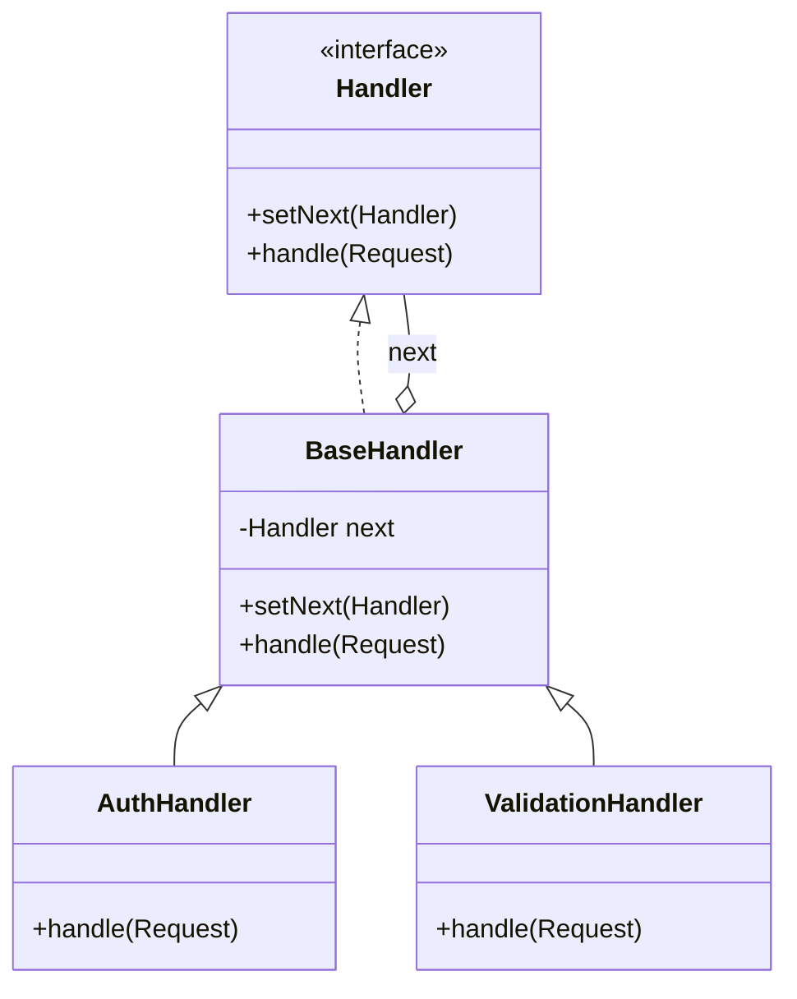

# Chain of Responsibility Pattern

## Introduction
The Chain of Responsibility is a behavioral design pattern that lets you pass requests along a chain of handlers. Upon receiving a request, each handler decides either to process the request or to pass it to the next handler in the chain.

## Problem Statement
Imagine building a web application with various checks before a request reaches the core logic: Authentication, Authorization, Caching, and Validation. If you put all these checks into a single massive `handleRequest()` method, the code becomes tightly coupled and violating the Single Responsibility Principle. If you need to reorder the checks or add new ones (like Rate Limiting), you must modify the core logic.

## Why this exists
To avoid coupling the sender of a request to its receiver by giving multiple objects a chance to handle the request. It dynamically links receiving objects and passes the request along the chain until an object handles it or the chain ends.

## Real-world analogy
Calling customer support:
1. First, you talk to an automated voice system (Handler 1). It tries to solve your issue.
2. If it can't, it passes you to a Tier 1 human operator (Handler 2).
3. If the issue is too complex, they pass you to a Tier 2 technical specialist (Handler 3).
Each handler checks if it can process the request. If not, it forwards the request up the chain.

## Definition
Avoid coupling the sender of a request to its receiver by giving more than one object a chance to handle the request. Chain the receiving objects and pass the request along the chain until an object handles it.

## Key concepts
- **Handler Interface:** Declares an interface for handling requests and usually contains a method to set the next handler in the chain.
- **Base Handler (Optional):** An abstract class implementing the boilerplate code for linking handlers.
- **Concrete Handlers:** Contains the actual processing code. Upon receiving a request, they either handle it or pass it to the next handler.
- **Client:** Composes the chain and sends the request to the first handler.

## Internal working / Mermaid diagram



## Python/Java implementation

### Java Implementation
```java
// 1. Base Handler
public abstract class Middleware {
    private Middleware next;

    public Middleware linkWith(Middleware next) {
        this.next = next;
        return next; // Return next to allow chaining: h1.linkWith(h2).linkWith(h3)
    }

    public boolean check(String email, String password) {
        if (next == null) {
            return true; // Reached the end of the chain, all checks passed
        }
        return next.check(email, password);
    }
}

// 2. Concrete Handlers
public class ThrottlingMiddleware extends Middleware {
    private int requestsPerMinute;
    private int count;

    public ThrottlingMiddleware(int requestsPerMinute) {
        this.requestsPerMinute = requestsPerMinute;
        this.count = 0;
    }

    @Override
    public boolean check(String email, String password) {
        count++;
        if (count > requestsPerMinute) {
            System.out.println("Request limit exceeded!");
            return false; // Break the chain
        }
        return super.check(email, password); // Pass to next handler
    }
}

public class UserExistsMiddleware extends Middleware {
    @Override
    public boolean check(String email, String password) {
        if (!email.equals("admin@example.com")) {
            System.out.println("This email is not registered!");
            return false; // Break the chain
        }
        return super.check(email, password); // Pass to next handler
    }
}

// 3. Client Usage
public class Main {
    public static void main(String[] args) {
        // Compose the chain
        Middleware middleware = new ThrottlingMiddleware(2);
        middleware.linkWith(new UserExistsMiddleware());

        // Test the chain
        middleware.check("admin@example.com", "pass"); // Pass
        middleware.check("admin@example.com", "pass"); // Pass
        middleware.check("admin@example.com", "pass"); // Fail: Rate limited!
    }
}
```

## Step-by-step explanation
1. Define a common interface for handlers, including a method to process the request and set the next handler.
2. Implement concrete handlers. In each handler, decide whether to:
   - Handle the request and stop the chain.
   - Do some processing and pass the request to the next handler.
   - Ignore the request and pass it to the next handler.
3. The client dynamically wires the handlers together to form the chain.
4. The client submits the request to the *first* handler in the chain.

## Multiple real-world examples
1. **Web Middleware (Express.js / Spring Security):** Interceptor chains that perform logging, authentication, CORS checks, and parsing before hitting the controller.
2. **UI Event Bubbling:** In DOM manipulation, if a button doesn't handle a click event, it "bubbles up" to the parent container, and so on up to the document root.
3. **Logger Frameworks:** A logger might pass a message through a chain: ConsoleLogger -> FileLogger -> EmailErrorLogger.

## Pros
- **Single Responsibility Principle:** You can decouple classes that invoke operations from classes that perform operations.
- **Open/Closed Principle:** You can introduce new handlers into the app without breaking existing client code.
- **Dynamic Configuration:** You can control the order of request handling at runtime.

## Cons
- **Un-handled Requests:** If a request reaches the end of the chain and no handler catches it, it might drop silently, leading to hard-to-debug issues.
- **Deep Stack Traces:** A very long chain can lead to performance overhead and complicated stack traces when debugging.

## Interview questions

### Beginner
- **Q: How does a handler in the Chain of Responsibility decide what to do with a request?**
  - **A:** It typically checks if it can process it. If yes, it does so. If no (or if it's a middleware that just does a partial check), it calls the `handle()` method of the `next` handler.

### Intermediate
- **Q: What is the difference between Chain of Responsibility and Decorator?**
  - **A:** Decorator adds behavior to an object but doesn't usually interrupt the flow (the request always reaches the core object). Chain of Responsibility allows any handler to break the chain and stop the request from proceeding.

### Senior
- **Q: How does Java's Servlet Filter architecture relate to this pattern?**
  - **A:** Servlet Filters implement a two-way Chain of Responsibility. A request passes through the chain (`chain.doFilter()`) to reach the Servlet. On the way back, the response passes back through the same chain in reverse order, allowing filters to modify both incoming and outgoing data.

## Common mistakes
- Forgetting to call `super.handle(request)` (or `next.handle()`), inadvertently breaking the chain and blocking all subsequent logic.
- Building cyclic chains (A -> B -> C -> A) resulting in infinite loops.

## Best practices
- Provide a default handler at the end of the chain to catch unhandled requests and return an appropriate error.
- Ensure handlers are completely decoupled and don't rely on the execution order (unless explicitly designed as middleware).

## When NOT to use
- If each request is guaranteed to be handled by exactly one receiver, simple composition or a Factory might be clearer.

## Comparison with similar concepts
- **Chain of Responsibility vs Decorator:** Chain can break the execution flow; Decorators always execute everything.
- **Chain of Responsibility vs Observer:** Chain passes a request sequentially until someone handles it. Observer broadcasts an event to all subscribers simultaneously.

## Summary
The Chain of Responsibility is a powerful pattern for processing requests through a series of decoupled, interchangeable filters or handlers. It is the architectural backbone of modern web framework middleware and UI event propagation.

## Related topics
- [Decorator Pattern](../../structural/decorator)
- [Observer Pattern](../observer)
