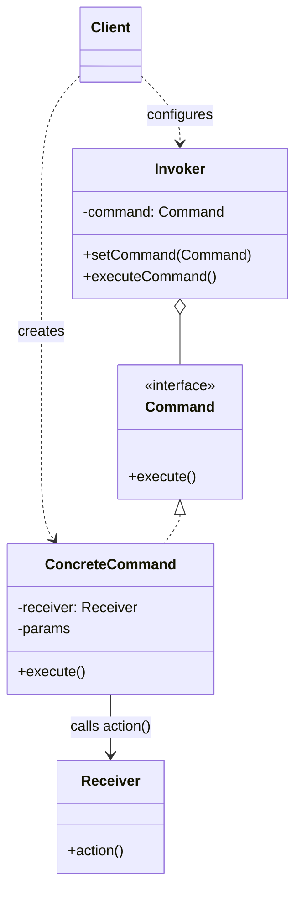

# Command Pattern

## Introduction
The Command is a behavioral design pattern that turns a request into a stand-alone object that contains all information about the request. This transformation lets you parameterize methods with different requests, delay or queue a request's execution, and support undoable operations.

## Problem Statement
Imagine building a text editor with a toolbar. You create a `Button` class. You want the "Save" button to trigger `saveDocument()`, the "Copy" button to trigger `copyText()`, and so on. If you subclass `Button` into `SaveButton` and `CopyButton`, you end up with an enormous number of subclasses. Furthermore, what if the user triggers the "Save" action via a keyboard shortcut (`Ctrl+S`) instead of the button? You'd have to duplicate the save logic in the shortcut handler.

## Why this exists
To decouple the object that invokes the operation from the object that knows how to perform it. By turning the request itself into an object, it can be passed around, queued, or executed by different GUI elements without duplicating code.

## Real-world analogy
Dining at a restaurant:
1. You (Client) give your order to the Waiter (Invoker).
2. The Waiter writes the order on a piece of paper (Command).
3. The Waiter places the paper on the kitchen counter.
4. The Chef (Receiver) reads the paper and cooks the meal.
The Waiter doesn't need to know how to cook, and the Chef doesn't need to know who ordered it. The piece of paper decouples them.

## Definition
Encapsulate a request as an object, thereby letting you parameterize clients with different requests, queue or log requests, and support undoable operations.

## Key concepts
- **Command Interface:** Declares a single method for executing the command (e.g., `execute()`).
- **Concrete Command:** Implements the interface. It holds a reference to the Receiver object and invokes its methods to perform the work.
- **Invoker (Sender):** The class that triggers the command (e.g., a Button). It holds a reference to a Command but doesn't know how it works.
- **Receiver:** The class that actually does the hard work (e.g., Document, Database).
- **Client:** Configures the Concrete Commands, linking them with Receivers, and passes them to Invokers.

## Internal working / Mermaid diagram



## Python/Java implementation

### Java Implementation
```java
// 1. Command Interface
interface Command {
    void execute();
    void undo(); // Added for complete undo capability
}

// 2. Receiver (The object doing the actual work)
class Light {
    private boolean isOn = false;
    
    public void turnOn() { 
        isOn = true;
        System.out.println("Light is ON"); 
    }
    public void turnOff() { 
        isOn = false;
        System.out.println("Light is OFF"); 
    }
}

// 3. Concrete Commands
class TurnOnCommand implements Command {
    private Light light;

    public TurnOnCommand(Light light) {
        this.light = light;
    }

    @Override
    public void execute() {
        light.turnOn();
    }

    @Override
    public void undo() {
        light.turnOff();
    }
}

class TurnOffCommand implements Command {
    private Light light;

    public TurnOffCommand(Light light) {
        this.light = light;
    }

    @Override
    public void execute() {
        light.turnOff();
    }

    @Override
    public void undo() {
        light.turnOn();
    }
}

// 4. Invoker (The object that initiates the request)
class RemoteControl {
    private Command buttonCommand;
    private java.util.Stack<Command> history = new java.util.Stack<>();

    public void setCommand(Command command) {
        this.buttonCommand = command;
    }

    public void pressButton() {
        buttonCommand.execute();
        history.push(buttonCommand);
    }

    public void pressUndo() {
        if (!history.isEmpty()) {
            Command command = history.pop();
            command.undo();
        }
    }
}

// 5. Client
public class Main {
    public static void main(String[] args) {
        // Receiver
        Light livingRoomLight = new Light();

        // Commands
        Command turnOn = new TurnOnCommand(livingRoomLight);
        Command turnOff = new TurnOffCommand(livingRoomLight);

        // Invoker
        RemoteControl remote = new RemoteControl();

        // Wire it up dynamically
        remote.setCommand(turnOn);
        remote.pressButton(); // Output: Light is ON

        remote.setCommand(turnOff);
        remote.pressButton(); // Output: Light is OFF

        System.out.println("Undoing last action...");
        remote.pressUndo();   // Output: Light is ON
    }
}
```

### Python Implementation
```python
from abc import ABC, abstractmethod

# 1. Command Interface
class Command(ABC):
    @abstractmethod
    def execute(self) -> None:
        pass

    @abstractmethod
    def undo(self) -> None:
        pass


# 2. Receiver (The object doing the actual work)
class Light:
    def __init__(self) -> None:
        self.is_on = False

    def turn_on(self) -> None:
        self.is_on = True
        print("Light is ON")

    def turn_off(self) -> None:
        self.is_on = False
        print("Light is OFF")


# 3. Concrete Commands
class TurnOnCommand(Command):
    def __init__(self, light: Light) -> None:
        self._light = light

    def execute(self) -> None:
        self._light.turn_on()

    def undo(self) -> None:
        self._light.turn_off()


class TurnOffCommand(Command):
    def __init__(self, light: Light) -> None:
        self._light = light

    def execute(self) -> None:
        self._light.turn_off()

    def undo(self) -> None:
        self._light.turn_on()


# 4. Invoker (The object that initiates the request)
class RemoteControl:
    def __init__(self) -> None:
        self._button_command: Command | None = None
        self._history: list[Command] = []

    def set_command(self, command: Command) -> None:
        self._button_command = command

    def press_button(self) -> None:
        if self._button_command:
            self._button_command.execute()
            self._history.append(self._button_command)

    def press_undo(self) -> None:
        if self._history:
            command = self._history.pop()
            command.undo()


# 5. Client
if __name__ == "__main__":
    # Receiver
    living_room_light = Light()

    # Commands
    turn_on_cmd = TurnOnCommand(living_room_light)
    turn_off_cmd = TurnOffCommand(living_room_light)

    # Invoker
    remote = RemoteControl()

    # Execute On
    remote.set_command(turn_on_cmd)
    remote.press_button()  # Output: Light is ON

    # Execute Off
    remote.set_command(turn_off_cmd)
    remote.press_button()  # Output: Light is OFF

    # Undo
    print("Undoing last action...")
    remote.press_undo()    # Output: Light is ON
```

## Step-by-step explanation
1. Create a `Command` interface with an `execute()` method.
2. Extract the core business logic into `Receiver` classes.
3. Create `ConcreteCommand` classes that implement `Command`. They should take the `Receiver` as a constructor argument and call its methods inside `execute()`.
4. Create `Invoker` classes (like Buttons or Menus) that store a `Command` reference and call `execute()` when triggered.
5. In the client code, instantiate Receivers, wrap them in Commands, and pass those Commands to the Invokers.

## Multiple real-world examples
1. **GUI Buttons and Menus:** Tying actions to UI elements without hardcoding business logic into the UI class.
2. **Task Queues:** Putting jobs into a queue (like Celery/RabbitMQ). The worker just pops the Command object and calls `execute()`.
3. **Macro Recording:** Recording a series of user actions (Commands) to a list, which can be replayed later by iterating over the list.
4. **Undo/Redo:** By adding an `undo()` method to the Command interface, a history stack can easily reverse actions.
5. **Database Transaction Logging (Write-Ahead Log):** Changes to databases are represented as Command objects (WAL entries) and logged to disk before applying them. If the database crashes, it replays these command logs.

## Pros
- **Single Responsibility Principle:** Decouples the classes that invoke operations from the classes that perform them.
- **Open/Closed Principle:** You can introduce new commands without breaking existing client code.
- **Undo/Redo:** Provides a mathematically sound way to implement reversible actions.
- **Queuing & Macros:** You can easily queue, delay, or group commands together.

## Cons
- **Code Bloat:** Introduces a massive number of small classes (one for every possible action in the system), making the codebase larger and harder to navigate.

## Interview questions

### Beginner
- **Q: What is the main benefit of the Command pattern?**
  - **A:** It decouples the object that triggers the action from the object that performs the action, allowing requests to be passed as objects.
- **Q: What is the role of the Receiver in the Command pattern?**
  - **A:** The Receiver is the object that actually contains the business logic to perform the action. The Command simply delegates its execution to the Receiver.

### Intermediate
- **Q: How would you implement an "Undo" feature using the Command pattern?**
  - **A:** Add an `undo()` method to the Command interface. When a command is executed, push it onto a History Stack. When the user clicks Undo, pop the command from the stack and call its `undo()` method.
- **Q: How can Python's first-class functions (callables) simplify the Command pattern?**
  - **A:** Instead of creating class wrappers for simple actions, you can pass functions directly as callbacks (e.g., `button.set_command(light.turn_on)`). The function itself serves as a lightweight command, avoiding class boilerplate.

### Senior
- **Q: What is the difference between the Command pattern and the Memento pattern for implementing Undo?**
  - **A:** Command stores the *delta* (the exact action taken, e.g., "Add $10"). Memento stores an entire *snapshot* of the state (e.g., "Balance is $100"). Command takes less memory but requires every action to have a perfect inverse operation. Memento uses more memory but is safer if operations are incredibly complex to reverse.
- **Q: How do you design a system where Commands can be serialized and sent over a network to be executed on remote workers (e.g., job queues)?**
  - **A:** Create commands that encapsulate serializable parameters (like IDs or JSON strings) instead of memory references. Use a serializer (like JSON or Protocol Buffers) to turn the Command into a byte stream, push it to a queue, and have worker nodes deserialize the command and resolve the receiver from a database using the ID parameter.

### Staff Engineer
- **Q: How does the Command pattern integrate into Event Sourcing architectures? Discuss Command vs Event.**
  - **A:** In Event Sourcing:
    - **Command:** Represents an *intent* to mutate state (e.g., `CreateOrderCommand`). It can be rejected if it fails validation.
    - **Event:** Represents a *historical fact* that has already occurred (e.g., `OrderCreatedEvent`). It cannot be rejected or modified.
    - The system receives a Command, validates it, runs the business logic, and emits one or more Events that are written to the append-only event store.
- **Q: What is the Command Query Responsibility Segregation (CQRS) pattern, and how does the concept of Command objects differ on the write side versus the read side?**
  - **A:** CQRS splits the application into a **Write Model (Commands)** and a **Read Model (Queries)**. Command objects on the write side capture state mutation intent, perform domain validations, and update the write database. Query objects on the read side represent read requests, bypass the domain layer completely, and retrieve denormalized read-optimized views, maximizing scaling performance and decoupling models.

## Common mistakes
- Creating "dumb" commands that don't hold a receiver and instead implement the business logic directly inside `execute()`. This violates the principle of keeping UI and business logic separated.
- Not storing the necessary parameters inside the command when it's instantiated.

## Best practices
- Commands should be immutable once created. All data required for execution should be passed via the constructor.
- Use Lambda expressions in Java 8+ or Python to implement simple commands without creating dozens of verbose classes.

## When NOT to use
- For very simple applications where UI components directly calling business logic doesn't cause maintenance headaches.

## Comparison with similar concepts
- **Command vs Strategy:** Command is meant to encapsulate a specific *request* (action). Strategy is meant to encapsulate an *algorithm* (how to do something).

## Summary
The Command pattern is the industry standard for implementing complex GUI interactions, task queuing, and undo/redo functionality. By treating requests as independent objects, it creates a highly decoupled, flexible architecture.

## Related topics
- [Memento Pattern](../memento)
- [Strategy Pattern](../strategy)
