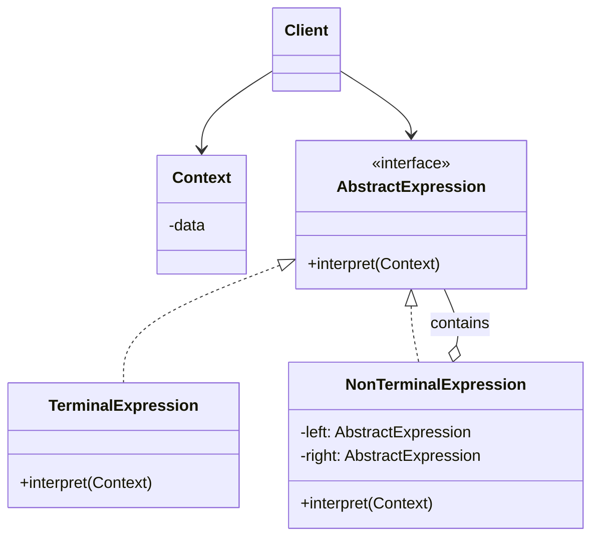

# Interpreter Pattern

## Introduction
The Interpreter is a behavioral design pattern that defines a grammatical representation for a language and provides an interpreter to deal with this grammar.

## Problem Statement
Imagine you are building an application that needs to evaluate mathematical expressions entered by the user as strings (e.g., `(5 + 3) * 2`). Or perhaps you are building a search tool that allows users to input complex boolean queries like `title:pattern AND (author:bob OR year:2020)`. Parsing and evaluating these complex, nested strings using regular expressions or manual string manipulation quickly becomes impossible to maintain.

## Why this exists
To provide an object-oriented way to evaluate sentences in a language. By mapping each grammar rule (or token) to a class, you can build an Abstract Syntax Tree (AST) that evaluates itself.

## Real-world analogy
Musicians reading sheet music.
The sheet music is the "language". The musical notes and symbols (`C major`, `quarter rest`, `forte`) are the grammar rules. The musician's brain acts as the interpreter, reading the symbols one by one and translating them into physical actions (playing notes on an instrument).

## Definition
Given a language, define a representation for its grammar along with an interpreter that uses the representation to interpret sentences in the language.

## Key concepts
- **Abstract Expression:** Declares an `interpret(context)` method.
- **Terminal Expression:** Implements `interpret` for literal/leaf symbols in the grammar (e.g., numbers in math).
- **Non-Terminal Expression:** Implements `interpret` for rules/symbols containing other expressions (e.g., `+`, `-`, `AND`, `OR`). It typically calls `interpret` on its children.
- **Context:** Contains global information/state accessible to the interpreter.
- **Client:** Builds the Abstract Syntax Tree (AST) of Expressions and invokes the `interpret` method.

## Internal working / Mermaid diagram



## Python/Java implementation

### Java Implementation (Boolean Evaluator)
```java
// 1. Context (Optional, holds variables)
class Context {
    // Defines global state if needed
}

// 2. Abstract Expression
interface Expression {
    boolean interpret(String context);
}

// 3. Terminal Expression (Leaf node)
class TerminalExpression implements Expression {
    private String data;

    public TerminalExpression(String data) {
        this.data = data;
    }

    @Override
    public boolean interpret(String context) {
        // Does the context contain the word?
        return context.contains(data);
    }
}

// 4. Non-Terminal Expression (Composite node)
class OrExpression implements Expression {
    private Expression expr1;
    private Expression expr2;

    public OrExpression(Expression expr1, Expression expr2) {
        this.expr1 = expr1;
        this.expr2 = expr2;
    }

    @Override
    public boolean interpret(String context) {
        return expr1.interpret(context) || expr2.interpret(context);
    }
}

class AndExpression implements Expression {
    private Expression expr1;
    private Expression expr2;

    public AndExpression(Expression expr1, Expression expr2) {
        this.expr1 = expr1;
        this.expr2 = expr2;
    }

    @Override
    public boolean interpret(String context) {
        return expr1.interpret(context) && expr2.interpret(context);
    }
}

// 5. Usage
public class Main {
    public static void main(String[] args) {
        // Building the AST for: "Robert AND (John OR Robert)"
        Expression robert = new TerminalExpression("Robert");
        Expression john = new TerminalExpression("John");
        
        Expression johnOrRobert = new OrExpression(john, robert);
        Expression isMale = new AndExpression(robert, johnOrRobert);

        // Evaluate
        System.out.println("Does context match? " + isMale.interpret("John is here"));   // False
        System.out.println("Does context match? " + isMale.interpret("Robert is here")); // True
    }
}
```

### Python Implementation
```python
from abc import ABC, abstractmethod

# 1. Abstract Expression
class Expression(ABC):
    @abstractmethod
    def interpret(self, context: str) -> bool:
        pass


# 2. Terminal Expression (Leaf node)
class TerminalExpression(Expression):
    def __init__(self, data: str) -> None:
        self._data = data

    def interpret(self, context: str) -> bool:
        # Check if the search token is in the context string
        return self._data in context


# 3. Non-Terminal Expressions (Composite nodes)
class OrExpression(Expression):
    def __init__(self, expr1: Expression, expr2: Expression) -> None:
        self._expr1 = expr1
        self._expr2 = expr2

    def interpret(self, context: str) -> bool:
        return self._expr1.interpret(context) or self._expr2.interpret(context)


class AndExpression(Expression):
    def __init__(self, expr1: Expression, expr2: Expression) -> None:
        self._expr1 = expr1
        self._expr2 = expr2

    def interpret(self, context: str) -> bool:
        return self._expr1.interpret(context) and self._expr2.interpret(context)


# 4. Usage
if __name__ == "__main__":
    # Building the AST for: "Robert AND (John OR Robert)"
    robert = TerminalExpression("Robert")
    john = TerminalExpression("John")

    john_or_robert = OrExpression(john, robert)
    is_male = AndExpression(robert, john_or_robert)

    # Evaluate
    print("Does context match John?", is_male.interpret("John is here"))      # False
    print("Does context match Robert?", is_male.interpret("Robert is here"))  # True
```

## Step-by-step explanation
1. Define the grammar of your language.
2. Create an `Expression` interface with an `interpret()` method.
3. Create `TerminalExpression` classes for the basic elements (numbers, variables, simple strings).
4. Create `NonTerminalExpression` classes for operations (add, subtract, AND, OR). These hold references to child expressions.
5. Provide a parser (not strictly part of the pattern) that reads a string and builds the tree of Expressions.
6. Call `interpret()` on the root node of the tree.

## Multiple real-world examples
1. **Regular Expressions:** Evaluating regex patterns like `^[a-z]+$`.
2. **SQL Parsers:** Translating SQL strings into executable database plans.
3. **Template Engines:** Interpreting double curly braces `{{ variable }}` in HTML templates (like Jinja or Handlebars).
4. **Calculators:** Parsing and evaluating mathematical strings.
5. **JSONPath / XPath Evaluators:** Parsing query patterns (like `$.store.book[*].author`) and running them against raw structured XML or JSON documents to filter items.

## Pros
- **Easy to extend:** Adding a new rule to the grammar is as simple as adding a new class.
- **Easy to implement:** The classes map directly to the grammar rules, making implementation straightforward.

## Cons
- **Performance:** Building and traversing an AST for every sentence is slow. Not suitable for performance-critical systems.
- **Class Explosion:** Complex grammars require hundreds of classes (one for every rule).
- **Does not handle parsing:** The pattern assumes you already have the AST. Building the tree from a raw string (Lexing/Parsing) requires additional complex tools.

## Interview questions

### Beginner
- **Q: What is the Interpreter pattern used for?**
  - **A:** It is used to define a grammatical representation for a language and an interpreter to evaluate sentences in that language.
- **Q: What is an Abstract Syntax Tree (AST)?**
  - **A:** An AST is a hierarchical tree representation of the structure of source code or sentences, where each node represents a grammatical construct (operator, token, operand).

### Intermediate
- **Q: What is the difference between Terminal and Non-Terminal expressions?**
  - **A:** Terminal expressions are the "leaves" of the tree; they do not contain other expressions (e.g., a number). Non-Terminal expressions represent rules and contain child expressions (e.g., an addition operator contains a left and right expression).
- **Q: How does the Interpreter pattern leverage the Composite pattern?**
  - **A:** The Interpreter pattern uses the Composite pattern to construct the syntax tree. Terminal expressions are the leaf nodes, while Non-Terminal expressions are the composite nodes containing children of type `Expression`.

### Senior
- **Q: How does the Interpreter pattern compare to using formal parser libraries (like ANTLR or YACC)?**
  - **A:** The Interpreter pattern is suitable only for very simple DSLs (Domain Specific Languages) or query languages. For complex, Turing-complete languages, it suffers from class explosion and poor parsing performance. Formal parser libraries use highly optimized algorithms (like LL(k) or LALR) to parse strings into AST structures efficiently.
- **Q: How would you optimize an Interpreter that evaluates the same AST repeatedly in a loop?**
  - **A:** 
    - Cache intermediate results if the inputs are static.
    - Compile the AST nodes into a flat bytecode instruction format, and use a simple Virtual Machine/loop to execute the bytecode instead of recursively walking the object tree.
    - Share Terminal symbol instances using the Flyweight pattern.

### Staff Engineer
- **Q: In a search filter indexing pipeline (like Elasticsearch query parsing), how do you parse and evaluate boolean filter trees efficiently?**
  - **A:** Combine the Interpreter pattern with the **Builder** or **Factory** patterns. The parser converts a raw query string into a query AST. To optimize execution:
    - Prune dead code (e.g., simplifying `A AND False` to `False` at build time).
    - Sort terms inside `AND` and `OR` nodes dynamically (e.g., evaluating high-cardinality filters first to allow short-circuiting during evaluation).
    - Map the AST nodes directly to database indexes or Lucene index queries rather than executing memory-bound loops.
- **Q: Discuss how the Interpreter pattern maps to compilers. How do they transition from an AST to executable code?**
  - **A:** Compilers build an AST using lexer and parser stages. Instead of directly executing `interpret()` recursively (which is slow), they use the **Visitor Pattern** to walk the AST and generate intermediate representations (IR) or platform-specific bytecodes. This decouples the representation of the language grammar from code generation, optimization, and VM execution.

## Common mistakes
- Trying to parse complex, Turing-complete programming languages using this pattern. For complex languages, use dedicated parser generators (like ANTLR, YACC, or Bison).
- Forgetting to separate the Parsing step from the Interpretation step. The pattern only covers interpretation.

## Best practices
- Use this pattern only for "Little Languages" — simple grammars with a small set of rules.
- Implement the Flyweight pattern to share Terminal symbols if there are thousands of identical leaves (e.g., sharing the number `0`).

## When NOT to use
- For complex grammars (use a parser generator).
- When execution speed is critical.

## Comparison with similar concepts
- **Interpreter vs Composite:** Interpreter utilizes Composite to structure the grammar rules into a tree.
- **Interpreter vs Visitor:** Once the AST is built (Interpreter), you can use the Visitor pattern to define new operations (like pretty-printing or type-checking) over the AST without changing the expression classes.

## Summary
The Interpreter pattern is a specialized tool for evaluating domain-specific languages (DSLs), mathematical formulas, or complex queries. By converting grammatical rules into a tree of objects, it provides an elegant, highly extensible way to evaluate custom syntax, provided the language remains relatively simple.

## Related topics
- [Composite Pattern](../../structural/composite)
- [Visitor Pattern](../visitor)
