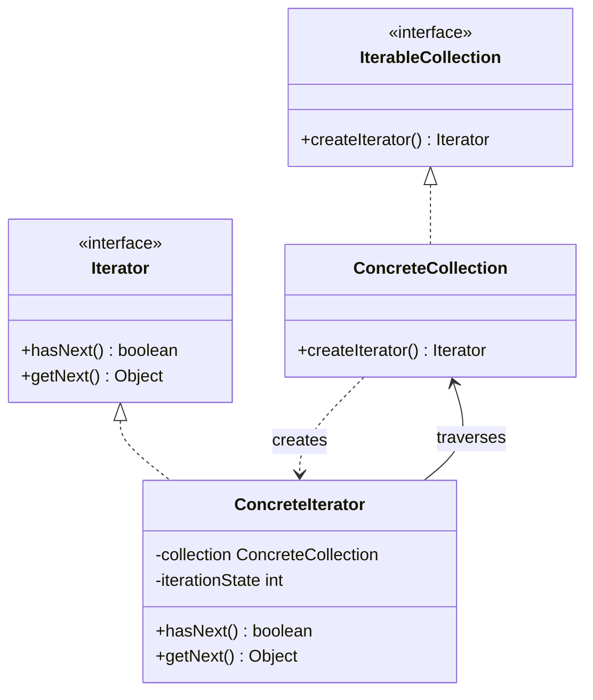

# Iterator Pattern

## Introduction
The Iterator is a behavioral design pattern that lets you traverse elements of a collection without exposing its underlying representation (list, stack, tree, etc.).

## Problem Statement
Collections can store their elements in various ways: arrays, linked lists, trees, or graphs. If you want to traverse these collections, you shouldn't have to know how they are structured internally. If you add tree traversal code to your core application, it becomes tightly coupled to the tree's implementation, making it hard to change the data structure later.

## Why this exists
To extract the traversal behavior of a collection into a separate object called an iterator, providing a standard interface for iterating over various data structures.

## Real-world analogy
Think of a sightseeing tour in Rome.
- You can walk randomly (Graph traversal).
- You can follow a specific path mapped out on your phone (List traversal).
- You can hire a local guide (Iterator). The guide knows exactly how to navigate the city to show you all the attractions. You just say "Next sight, please" without needing to know the city's internal road network.

## Definition
Provide a way to access the elements of an aggregate object sequentially without exposing its underlying representation.

## Key concepts
- **Iterator Interface:** Declares operations required for traversing a collection (e.g., `getNext()`, `hasNext()`).
- **Concrete Iterator:** Implements specific algorithms for traversing a collection.
- **Iterable/Collection Interface:** Declares one or multiple methods for getting iterators compatible with the collection.
- **Concrete Collection:** Returns an instance of a particular concrete iterator.

## Internal working / Mermaid diagram



## Python/Java implementation

### Java Implementation
```java
import java.util.ArrayList;
import java.util.List;

// 1. Iterator Interface
interface Iterator<T> {
    boolean hasNext();
    T getNext();
}

// 2. Collection Interface
interface SocialNetwork {
    Iterator<String> createFriendsIterator(String profileEmail);
}

// 3. Concrete Collection & Iterator
class Facebook implements SocialNetwork {
    private List<String> profiles = new ArrayList<>();

    public Facebook() {
        profiles.add("alice@example.com");
        profiles.add("bob@example.com");
        profiles.add("charlie@example.com");
    }

    public List<String> getProfiles() {
        return profiles;
    }

    @Override
    public Iterator<String> createFriendsIterator(String profileEmail) {
        return new FacebookIterator(this, profileEmail);
    }
}

class FacebookIterator implements Iterator<String> {
    private Facebook facebook;
    private String profileEmail;
    private int currentPosition = 0;

    public FacebookIterator(Facebook facebook, String profileEmail) {
        this.facebook = facebook;
        this.profileEmail = profileEmail;
    }

    @Override
    public boolean hasNext() {
        return currentPosition < facebook.getProfiles().size();
    }

    @Override
    public String getNext() {
        if (!hasNext()) {
            return null;
        }
        String friend = facebook.getProfiles().get(currentPosition);
        currentPosition++;
        return friend;
    }
}

// 4. Usage
public class Main {
    public static void main(String[] args) {
        Facebook fb = new Facebook();
        Iterator<String> iterator = fb.createFriendsIterator("alice@example.com");

        while (iterator.hasNext()) {
            System.out.println("Friend: " + iterator.getNext());
        }
    }
}
```

### Python Implementation
Python has a built-in iterator protocol. A class that defines `__iter__()` and returns an object defining `__next__()` is an iterator. Generators simplify this by using `yield`.

```python
from collections.abc import Iterable, Iterator

# --- GoF Iterator Pattern using Python Protocols ---

class FacebookIterator(Iterator[str]):
    def __init__(self, profiles: list[str]) -> None:
        self._profiles = profiles
        self._current_position = 0

    def __next__(self) -> str:
        """Returns the next element. Raises StopIteration when done."""
        if self._current_position >= len(self._profiles):
            raise StopIteration
        friend = self._profiles[self._current_position]
        self._current_position += 1
        return friend


class Facebook(Iterable[str]):
    def __init__(self) -> None:
        self._profiles = ["alice@example.com", "bob@example.com", "charlie@example.com"]

    def __iter__(self) -> FacebookIterator:
        """Returns the custom iterator."""
        return FacebookIterator(self._profiles)


# --- Pythonic Generator Iterator (Best Practice) ---

class PythonicFacebook:
    def __init__(self) -> None:
        self._profiles = ["alice@example.com", "bob@example.com", "charlie@example.com"]

    def __iter__(self):
        """A generator automatically implements __iter__ and __next__ protocols."""
        for profile in self._profiles:
            yield profile


# --- Usage ---
if __name__ == "__main__":
    print("--- GoF Iterator ---")
    fb = Facebook()
    for friend in fb:  # Python implicitly handles StopIteration
        print(f"Friend: {friend}")

    print("\n--- Generator Iterator ---")
    py_fb = PythonicFacebook()
    for friend in py_fb:
        print(f"Friend: {friend}")
```

## Step-by-step explanation
1. Define the Iterator interface with `hasNext()` and `getNext()` methods (or use language protocols like `__iter__` and `__next__` in Python).
2. Define the Collection interface with a method that returns an Iterator.
3. Create Concrete Collections that hold data.
4. Create Concrete Iterators that take a collection, maintain an internal cursor, and implement the iteration logic.

## Multiple real-world examples
1. **Java Collections Framework:** Every collection (`List`, `Set`) implements `Iterable`, allowing the use of enhanced for-loops.
2. **Database Cursors:** Iterating over result sets row by row without loading the entire table into memory.
3. **File System Traversals:** Iterating over files in a directory tree (e.g., Depth-First or Breadth-First).
4. **Python's `iter()` and `next()` protocol:** Used implicitly by every `for` loop in Python to traverse lists, dicts, generators, and files.
5. **Streaming JSON/CSV Parsers:** Iterating through massive datasets line-by-line via iterators, avoiding loading the entire file into RAM.

## Pros
- **Single Responsibility Principle:** You can clean up the client code and the collections by extracting bulky traversal algorithms into separate classes.
- **Open/Closed Principle:** You can implement new types of collections and iterators and pass them to existing code without breaking anything.
- **Parallel Iteration:** You can iterate over the same collection in parallel because each iterator object contains its own iteration state.

## Cons
- Applying the pattern can be an overkill if your app only works with simple collections.
- Using an iterator might be less efficient than going through elements of some specialized collections directly.

## Interview questions

### Beginner
- **Q: What is the main benefit of the Iterator pattern?**
  - **A:** It hides the internal structure of a collection, providing a uniform way to traverse different types of data structures.
- **Q: What does a `StopIteration` exception do in Python?**
  - **A:** It signals to the iteration context (like a `for` loop) that all elements have been traversed and there are no further items to return, terminating the loop.

### Intermediate
- **Q: How does Iterator support the Single Responsibility Principle?**
  - **A:** It separates the responsibility of storing data (the Collection) from the responsibility of traversing that data (the Iterator).
- **Q: What is the difference between an external iterator and an internal iterator?**
  - **A:** 
    - **External iterator:** The client controls the iteration process (e.g., explicitly calling `next()` or using a `while(hasNext)` loop).
    - **Internal iterator:** The collection itself controls the iteration process by taking a function/callback and applying it to each element (e.g., `list.forEach(item -> ...)` in Java/JS).

### Senior
- **Q: How do you handle concurrent modifications to a collection while an iterator is traversing it?**
  - **A:** This is a classic problem (e.g., `ConcurrentModificationException` in Java). Solutions include:
    1. **Fail-fast iterators:** The collection maintains a modification counter (`modCount`). The iterator checks this count on every `next()` call and throws an exception if the collection has been modified outside the iterator.
    2. **Fail-safe/Weakly-consistent iterators:** The iterator works on a copy or a consistent snapshot of the collection (e.g., Java's `CopyOnWriteArrayList`), allowing modifications during traversal.
- **Q: How do generators and coroutines in modern programming languages map to the Iterator pattern?**
  - **A:** Generators are syntactical sugar for compiling a state machine that implements the Iterator protocol. When `yield` is encountered, the execution frame is suspended, saving local state, and the yielded value is returned via `next()`. Subscriptions and coroutines extend this model to receive values.

### Staff Engineer
- **Q: How does Python's execution model handle generator functions (`yield`) under the hood?**
  - **A:** When a generator function is called, Python compiles the function code, but instead of executing it, it returns a generator object wrapping a stack frame pointer. Each call to `next()` resumes execution of the stack frame until a `yield` statement is hit, where Python freezes the frame state (local variables, instruction pointer) and pops the frame. When the frame returns or raises `StopIteration`, the generator is marked as completed.
- **Q: In a large-scale distributed search system, how would you design a Paginated Cursor/Iterator that consumes data from multiple distributed databases (like Cassandra/DynamoDB) while maintaining sort order?**
  - **A:** Implement a **Sorted Merge Iterator** (Priority Queue/Heap-based Iterator). 
    1. Open a paginated cursor to each partition node (sub-iterators).
    2. Read the first element from each sub-iterator and insert it into a Min-Heap.
    3. The main iterator's `next()` operation pops the smallest element from the heap, reads the next element from that popped item's originating sub-iterator, and pushes it back onto the heap. This maintains $O(\log K)$ sorting complexity (where $K$ is the number of databases) during stream traversal.

## Common mistakes
- Creating complex, custom iterators for simple lists when the language's built-in iterators suffice.
- Modifying the underlying collection directly during iteration without using the iterator's own methods (like `iterator.remove()`), leading to crashes.

## Best practices
- Leverage language-level features (like `Iterable` in Java or generators in Python) rather than writing custom Iterator interfaces from scratch.

## When NOT to use
- If you only use simple arrays or lists and don't require complex, interchangeable traversal algorithms.

## Comparison with similar concepts
- **Iterator vs Visitor:** Iterator lets you traverse a structure and perform actions. Visitor lets you perform actions on the elements of a structure, but the structure itself usually dictates the traversal order.

## Summary
The Iterator pattern provides a standard way to loop through collections of varying complexity without exposing their internal representations. It is foundational to modern programming languages and standard libraries.

## Related topics
- [Composite Pattern](../../structural/composite)
- [Visitor Pattern](../visitor)
