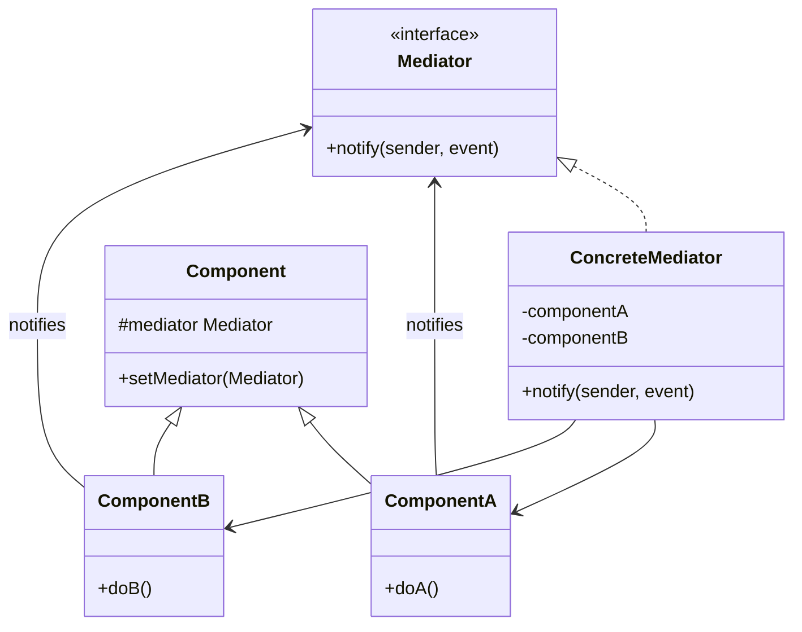

# Mediator Pattern

## Introduction
The Mediator is a behavioral design pattern that reduces chaotic dependencies between objects. The pattern restricts direct communications between the objects and forces them to collaborate only via a mediator object.

## Problem Statement
Imagine building a complex user interface (like an airplane dashboard or a comprehensive booking form). If you check a checkbox, a text field needs to be disabled. If you select a dropdown option, a button needs to be enabled. If every UI component talks directly to every other component, you end up with a massive "spaghetti" web of dependencies. Reusing any component becomes impossible because it is tightly coupled to dozens of others.

## Why this exists
To eliminate mutual dependencies among communicating objects. Instead of many-to-many relationships, components have a many-to-one relationship with a Mediator, making the system easier to decouple and maintain.

## Real-world analogy
Think of an Air Traffic Controller (ATC) at a busy airport.
If airplanes had to talk to every other airplane to coordinate landings, it would be chaos. Instead, all airplanes (Components) communicate only with the ATC tower (Mediator). The ATC tower knows the status of the entire airspace and directs the planes accordingly.

## Definition
Define an object that encapsulates how a set of objects interact. Mediator promotes loose coupling by keeping objects from referring to each other explicitly, and it lets you vary their interaction independently.

## Key concepts
- **Components (Colleagues):** Various classes that contain some business logic. Each component has a reference to a mediator, but not to other components.
- **Mediator Interface:** Declares methods for communication with components, usually a single notification method.
- **Concrete Mediator:** Encapsulates relations between various components. It keeps references to all components and manages their communication.

## Internal working / Mermaid diagram



## Python/Java implementation

### Java Implementation
```java
// 1. Mediator Interface
interface Mediator {
    void notify(Component sender, String event);
}

// 2. Base Component
abstract class Component {
    protected Mediator mediator;

    public void setMediator(Mediator mediator) {
        this.mediator = mediator;
    }
}

// 3. Concrete Components
class Button extends Component {
    public void click() {
        System.out.println("Button clicked.");
        mediator.notify(this, "click");
    }
}

class TextBox extends Component {
    public void disable() {
        System.out.println("TextBox is disabled.");
    }
}

// 4. Concrete Mediator
class DialogMediator implements Mediator {
    private Button button;
    private TextBox textBox;

    // The mediator registers all components
    public DialogMediator(Button button, TextBox textBox) {
        this.button = button;
        this.button.setMediator(this);
        
        this.textBox = textBox;
        this.textBox.setMediator(this);
    }

    @Override
    public void notify(Component sender, String event) {
        // Handle events centrally
        if (sender == button && event.equals("click")) {
            System.out.println("Mediator reacts on Button click and triggers TextBox.");
            textBox.disable();
        }
    }
}

// 5. Usage
public class Main {
    public static void main(String[] args) {
        Button btn = new Button();
        TextBox txt = new TextBox();
        
        // Components don't know about each other, only the mediator does
        DialogMediator dialog = new DialogMediator(btn, txt);
        
        System.out.println("Client clicks the button...");
        btn.click();
        // Output:
        // Button clicked.
        // Mediator reacts on Button click and triggers TextBox.
        // TextBox is disabled.
    }
}
```

### Python Implementation
```python
from abc import ABC, abstractmethod

# 1. Mediator Interface
class Mediator(ABC):
    @abstractmethod
    def notify(self, sender: "Component", event: str) -> None:
        pass


# 2. Base Component
class Component:
    def __init__(self) -> None:
        self._mediator: Mediator | None = None

    def set_mediator(self, mediator: Mediator) -> None:
        self._mediator = mediator


# 3. Concrete Components
class Button(Component):
    def click(self) -> None:
        print("Button clicked.")
        if self._mediator:
            self._mediator.notify(self, "click")


class TextBox(Component):
    def disable(self) -> None:
        print("TextBox is disabled.")


# 4. Concrete Mediator
class DialogMediator(Mediator):
    def __init__(self, button: Button, text_box: TextBox) -> None:
        self._button = button
        self._button.set_mediator(self)

        self._text_box = text_box
        self._text_box.set_mediator(self)

    def notify(self, sender: Component, event: str) -> None:
        # Handle events centrally
        if sender is self._button and event == "click":
            print("Mediator reacts on Button click and triggers TextBox.")
            self._text_box.disable()


# 5. Usage
if __name__ == "__main__":
    btn = Button()
    txt = TextBox()

    # Create mediator coordinating button and text box
    dialog = DialogMediator(btn, txt)

    print("Client clicks the button...")
    btn.click()
```

## Step-by-step explanation
1. Identify a group of tightly coupled classes that would benefit from being independent.
2. Declare the Mediator interface and describe the desired communication protocol.
3. Implement the Concrete Mediator class. It should store references to all components it manages.
4. Add a reference to the mediator in the base component class.
5. Change components so they communicate with the mediator instead of each other.

## Multiple real-world examples
1. **GUI Dialogs:** A login dialog where checking "Remember Me" enables a specific field.
2. **Chat Applications:** Users don't send direct IP packets to other users; they send messages to a Chat Server (Mediator), which routes them to the correct recipients.
3. **Enterprise Service Bus (ESB):** In microservices, an ESB acts as a mediator routing messages between disparate services that don't know about each other.
4. **Air Traffic Control (ATC):** Airplanes landing or taking off coordinate only with the ATC tower instead of talking to each other.
5. **Asynchronous Execution Loops:** Task schedulers (like Python's `asyncio` or Node's event loop) act as mediators coordinating job executions between asynchronous tasks and CPU core resources.

## Pros
- **Single Responsibility Principle:** You can extract the communications between various components into a single place, making it easier to comprehend and maintain.
- **Open/Closed Principle:** You can introduce new mediators without having to change the actual components.
- **Reduces coupling:** Replaces a many-to-many relationship with a one-to-many relationship.

## Cons
- **God Object Anti-Pattern:** Over time, a mediator can evolve into a God Object (a massive class that knows too much and does too much), becoming a maintenance nightmare itself.

## Interview questions

### Beginner
- **Q: What is the primary purpose of the Mediator pattern?**
  - **A:** To reduce tight coupling between classes by forcing them to communicate through a central mediator object rather than directly with each other.
- **Q: How does Mediator improve component reusability?**
  - **A:** Components no longer have references to other specific components. Because they are decoupled, you can easily reuse a component class (like a generic button) in a completely different UI context.

### Intermediate
- **Q: How does the Mediator pattern differ from the Facade pattern?**
  - **A:** Facade defines a simplified interface to a subsystem of objects; the subsystem objects are not aware of the facade. Mediator centralizes communication between objects; the objects *are* aware of the mediator and communicate with it instead of each other.
- **Q: Can we implement a Mediator using the Observer pattern? What are the benefits?**
  - **A:** Yes. Instead of components explicitly calling a method on the mediator, they trigger an event. The mediator (acting as an observer) listens to these events and reacts by updating other components. This further decouples the components from the specific mediator interface.

### Senior
- **Q: How does the Mediator pattern differ from the Observer pattern?**
  - **A:** In Observer, Publishers and Subscribers are completely unaware of each other and communicate via a dynamic event subscription mechanism. In Mediator, components are aware of the central Mediator, and the Mediator contains the hardcoded routing logic. They are often used together: the Mediator can act as a Publisher that Components subscribe to.
- **Q: What is the "God Object" anti-pattern in the context of a Mediator, and how do you prevent it?**
  - **A:** As more components are added, the Mediator's notification methods can expand into massive conditional blocks that know every single detail about every colleague. To prevent this:
    1. Keep the Mediator strictly focused on routing/coordination, leaving business logic inside the components.
    2. Divide the system into smaller, nested mediators instead of having one huge global mediator.

### Staff Engineer
- **Q: In event-driven microservices, how does an Event Broker (like Kafka or RabbitMQ) act as a distributed Mediator?**
  - **A:** Rather than microservices communicating with each other directly via HTTP/gRPC (resulting in a complex mesh of dependencies), they publish and consume events from a centralized broker. The broker acts as a distributed mediator coordinating message routing, queuing, and broadcasting, which isolates services and simplifies service topologies.
- **Q: How does the Mediator pattern apply to modern frontend state management libraries (like Redux)?**
  - **A:** In Redux, components do not update each other directly. Instead, they dispatch **Actions** representing events. The central **Store** (acting as the Mediator) receives these actions, processes them through **Reducers**, updates the state, and notifies the interested components. This keeps UI views completely decoupled from state updates.

## Common mistakes
- Allowing the Mediator to handle business logic. The Mediator should strictly handle *routing and coordination*, while the components should handle the actual business rules.
- Creating a single global mediator for an entire application (God Object).

## Best practices
- Keep the mediator focused purely on coordination.
- Use the Observer pattern inside the Mediator to make it more dynamic (components publish events to the mediator, and the mediator broadcasts them).

## When NOT to use
- If objects are already loosely coupled and communicate simply, adding a mediator is unnecessary overhead.

## Comparison with similar concepts
- **Mediator vs Observer:** Mediator centralizes communication explicitly. Observer decentralizes it through dynamic subscriptions.
- **Mediator vs Facade:** Mediator manages two-way communication between internal components. Facade manages one-way communication from an external client to an internal subsystem.

## Summary
The Mediator pattern is a powerful architectural tool to untangle spaghetti code caused by objects talking directly to one another. By introducing a central hub, it simplifies maintenance and increases component reusability, provided you keep the mediator itself from becoming overly complex.

## Related topics
- [Observer Pattern](../observer)
- [Facade Pattern](../../structural/facade)
