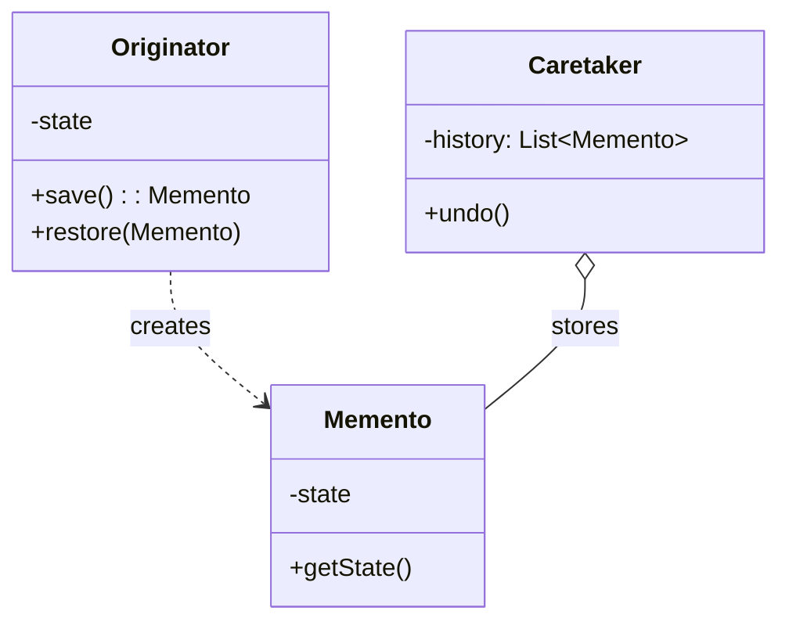

# Memento Pattern

## Introduction
The Memento is a behavioral design pattern that lets you save and restore the previous state of an object without revealing the details of its implementation.

## Problem Statement
Imagine building a text editor. You want to implement an "Undo" feature. To do this, you need to save the state of the text editor before every operation. However, the internal fields of the text editor (like cursor position, text buffer, selection) might be `private`. If you try to save these fields directly from the outside, you break encapsulation. If you make them `public`, you expose the delicate internal workings of the editor to the whole app.

## Why this exists
To capture and externalize an object's internal state without violating encapsulation, so that the object can be restored to this state later.

## Real-world analogy
Think of playing a video game. Before fighting a difficult boss, you perform a "Quick Save". The game engine (Originator) takes a snapshot of your exact position, health, and inventory, and writes it to a save file (Memento). You don't know how the save file is structured; you just hand it back to the game engine to load if you die (Caretaker).

## Definition
Without violating encapsulation, capture and externalize an object's internal state so that the object can be restored to this state later.

## Key concepts
- **Originator:** The object whose state needs to be saved and restored. It produces Mementos and knows how to restore its state from them.
- **Memento:** A value object that acts as a snapshot of the originator's state. It should be immutable.
- **Caretaker:** Knows *when* and *why* to capture the originator's state, and keeps track of the Mementos. It never modifies the Mementos.

## Internal working / Mermaid diagram



## Python/Java implementation

### Java Implementation
```java
import java.util.Stack;

// 1. Memento: Represents a snapshot (immutable)
class EditorMemento {
    private final String content;

    public EditorMemento(String content) {
        this.content = content;
    }

    public String getContent() {
        return content;
    }
}

// 2. Originator: The object whose state we are tracking
class Editor {
    private String content = "";

    public void type(String words) {
        content += words;
    }

    public String getContent() {
        return content;
    }

    // Save state
    public EditorMemento save() {
        return new EditorMemento(content);
    }

    // Restore state
    public void restore(EditorMemento memento) {
        content = memento.getContent();
    }
}

// 3. Caretaker: Manages the history
class History {
    private Stack<EditorMemento> history = new Stack<>();

    public void push(EditorMemento memento) {
        history.push(memento);
    }

    public EditorMemento pop() {
        if (history.isEmpty()) return null;
        return history.pop();
    }
}

// 4. Usage
public class Main {
    public static void main(String[] args) {
        Editor editor = new Editor();
        History history = new History();

        editor.type("Hello ");
        history.push(editor.save()); // Save: "Hello "

        editor.type("World!");
        System.out.println(editor.getContent()); // Output: Hello World!

        // Undo
        editor.restore(history.pop());
        System.out.println(editor.getContent()); // Output: Hello 
    }
}
```

### Python Implementation
```python
# 1. Memento: Represents a snapshot (immutable)
class EditorMemento:
    def __init__(self, content: str) -> None:
        self._content = content

    @property
    def content(self) -> str:
        """Returns the immutable content (Read-Only)."""
        return self._content


# 2. Originator: The object whose state we are tracking
class Editor:
    def __init__(self) -> None:
        self._content = ""

    def type(self, words: str) -> None:
        self._content += words

    @property
    def content(self) -> str:
        return self._content

    def save(self) -> EditorMemento:
        """Saves current state into a Memento."""
        return EditorMemento(self._content)

    def restore(self, memento: EditorMemento) -> None:
        """Restores state from a Memento."""
        self._content = memento.content


# 3. Caretaker: Manages the history
class History:
    def __init__(self) -> None:
        self._history: list[EditorMemento] = []

    def push(self, memento: EditorMemento) -> None:
        self._history.append(memento)

    def pop(self) -> EditorMemento | None:
        if not self._history:
            return None
        return self._history.pop()


# 4. Usage
if __name__ == "__main__":
    editor = Editor()
    history = History()

    editor.type("Hello ")
    history.push(editor.save())  # Save "Hello "

    editor.type("World!")
    print(editor.content)  # Output: Hello World!

    # Perform Undo
    saved_state = history.pop()
    if saved_state:
        editor.restore(saved_state)
    print(editor.content)  # Output: Hello
```

## Step-by-step explanation
1. Create a `Memento` class with fields corresponding to the `Originator`'s state. Make it immutable (no setters).
2. Add a `save()` method to the `Originator` that instantiates a `Memento` with its current state.
3. Add a `restore(Memento)` method to the `Originator` that replaces its internal state with the state inside the `Memento`.
4. The `Caretaker` calls `save()`, stores the result in a stack/list, and calls `restore()` when an undo is requested.

## Multiple real-world examples
1. **Text Editors:** The classic "Undo/Redo" stack.
2. **Database Transactions:** Storing the state before a transaction begins, so you can execute a `ROLLBACK` if something fails.
3. **Browser History:** Navigating back and forth between previous page states.
4. **Drafts / Auto-saves:** Saving a draft of an email, form, or blog post, or quick-saving progress in a video game.
5. **Git Version Control:** Git uses snapshots (mementos) to store project states in commits, utilizing structural sharing to optimize memory.

## Pros
- **Encapsulation:** You can produce snapshots of the object's state without exposing its private fields to other objects.
- **Simplifies Originator:** Lets the Originator focus on its main business logic, delegating the responsibility of maintaining history to the Caretaker.

## Cons
- **High Memory Usage:** If the Originator's state is large, and clients create Mementos too frequently, the app will consume a massive amount of RAM.
- **Garbage Collection:** Caretakers should track the Originator's lifecycle to destroy obsolete mementos.

## Interview questions

### Beginner
- **Q: What is the main purpose of the Memento pattern?**
  - **A:** To save and restore an object's state (implementing an Undo feature) without breaking the object's encapsulation.
- **Q: Who is responsible for storing and managing the list of Memento objects?**
  - **A:** The Caretaker class. It maintains the history and controls when to save or restore state, but never modifies the mementos.

### Intermediate
- **Q: Why must the Memento object be immutable?**
  - **A:** Because a Memento represents a historical snapshot in time. If other classes (like the Caretaker) could modify it, the integrity of the history would be compromised.
- **Q: How does the Memento pattern compare to the Prototype pattern?**
  - **A:** Prototype creates an entirely new clone of an object that can be modified independently. Memento captures a passive, read-only snapshot of an object's state specifically for restoration purposes.

### Senior
- **Q: How does the Memento pattern compare to the Command pattern for implementing "Undo" functionality?**
  - **A:** Memento saves the *entire state* of an object. Command saves the *action* (the exact changes made). Command takes less memory (you only store the delta), but requires every action to be perfectly reversible. Memento is more memory-intensive but much easier to implement if operations are complex and hard to reverse mathematically. They are often used together.
- **Q: How do you handle deep serialization of state in a Memento pattern?**
  - **A:** If the Originator's state references a complex graph of objects, a shallow copy will result in references pointing to active, mutable objects. The Memento must serialize/deep-copy the state. In Python, this can be done using `pickle` or `copy.deepcopy()`; in Java, through serialization or JSON mapper libraries.

### Staff Engineer
- **Q: In collaborative systems like Google Docs, why is the classical Memento pattern not used for Undo/Redo? What is used instead?**
  - **A:** In collaborative editing, multiple users write concurrently. If User A does a Memento restore (Undo), they would overwrite concurrent changes made by User B, destroying collaboration. Instead, these systems use **Operational Transformation (OT)** or **Conflict-Free Replicated Data Types (CRDTs)**. They store operations (inserts/deletes) and use algebraic transformations to merge operations in a decentralized manner without resetting the document state wholesale.
- **Q: When designing an incremental backup system or Git-like VCS, how does the concept of structural sharing optimize the Memento pattern?**
  - **A:** Storing full snapshots (Mementos) for every version takes up $O(N \cdot M)$ space (where $N$ is versions and $M$ is state size). By using persistent, immutable data structures (like Trie structures or Git's hash-addressed directories), you share nodes that haven't changed between snapshots. A new Memento only creates new nodes for the mutated paths, pointing unchanged branches back to the previous snapshot, reducing space complexity to $O(N \cdot \log M)$.

## Common mistakes
- Exposing the internal properties of the Memento to the Caretaker. In strict OOP (like C++), Mementos use `friend` classes to ensure only the Originator can read them.
- Creating deep copies of massive objects on every keystroke, crashing the application with OutOfMemory errors.

## Best practices
- If states are large, store only the "diff" (delta) between the old state and the new state, rather than a full copy.
- Limit the size of the history stack in the Caretaker to prevent memory exhaustion.

## When NOT to use
- If the object's state is perfectly public and simple, you can just copy it directly without a formal pattern.
- If memory is extremely constrained and states are huge.

## Comparison with similar concepts
- **Memento vs Command:** Memento stores state; Command stores an action.
- **Memento vs Prototype:** Prototype creates an entirely new clone of an object. Memento captures the state of an existing object to restore it later.

## Summary
The Memento pattern provides a safe, encapsulated way to implement "Undo" functionality. While it is elegant and respects object-oriented principles, developers must be mindful of its memory implications when dealing with large objects or deep histories.

## Related topics
- [Command Pattern](../command)
- [Prototype Pattern](../../creational/prototype)
