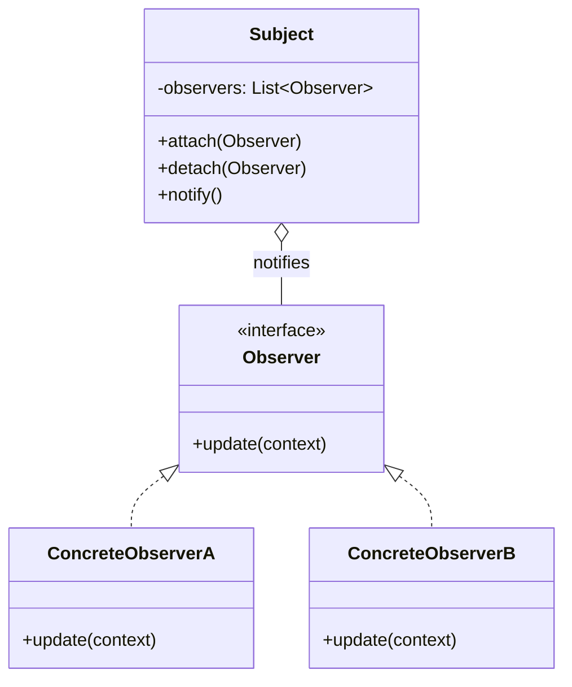

# Observer Pattern

## Introduction
The Observer is a behavioral design pattern that lets you define a subscription mechanism to notify multiple objects about any events that happen to the object they're observing. It is heavily used in event-driven programming.

## Problem Statement
Imagine you have a `Customer` who wants to buy a highly anticipated new `Product` that is out of stock. 
- **Approach 1:** The customer visits the store every day to check availability. This wastes the customer's time (polling).
- **Approach 2:** The store sends millions of emails to all customers every time a new product arrives. This wastes network resources, as most customers don't care about this specific product.

We need a way for interested objects to be notified of changes without polling, and without spamming uninterested objects.

## Why this exists
To establish a one-to-many relationship between objects, so that when one object changes state, all its dependents are notified and updated automatically, promoting loose coupling.

## Real-world analogy
Magazine subscriptions. Instead of you going to the newsstand every day to check if the next issue is out, you subscribe to the publisher. Whenever a new issue is published, the publisher sends it directly to your mailbox. You can unsubscribe at any time.

## Definition
Define a one-to-many dependency between objects so that when one object changes state, all its dependents are notified and updated automatically. (Also known as Publish-Subscribe or Pub-Sub, though Pub-Sub technically implies an intermediate message broker).

## Key concepts
- **Subject (Publisher):** The object that holds the state. It maintains a list of observers and sends notifications when its state changes.
- **Observer (Subscriber):** The interface declaring the update method, which the subject calls.
- **Concrete Observers:** Objects that implement the Observer interface and perform specific actions in response to notifications.

## Internal working / Mermaid diagram



## Python/Java implementation

### Java Implementation
```java
import java.util.ArrayList;
import java.util.List;

// 1. Observer Interface
interface EventListener {
    void update(String eventType, String file);
}

// 2. Subject (Publisher)
class EventManager {
    private List<EventListener> listeners = new ArrayList<>();

    public void subscribe(EventListener listener) {
        listeners.add(listener);
    }

    public void unsubscribe(EventListener listener) {
        listeners.remove(listener);
    }

    public void notify(String eventType, String file) {
        for (EventListener listener : listeners) {
            listener.update(eventType, file);
        }
    }
}

class Editor {
    public EventManager events;
    private String file;

    public Editor() {
        this.events = new EventManager();
    }

    public void openFile(String filePath) {
        this.file = filePath;
        events.notify("open", file);
    }

    public void saveFile() {
        events.notify("save", file);
    }
}

// 3. Concrete Observers
class EmailNotificationListener implements EventListener {
    private String email;

    public EmailNotificationListener(String email) {
        this.email = email;
    }

    @Override
    public void update(String eventType, String file) {
        System.out.println("Email to " + email + ": Someone has performed " + eventType + " on file: " + file);
    }
}

class LogOpenListener implements EventListener {
    @Override
    public void update(String eventType, String file) {
        System.out.println("Save to log: " + file + " was modified with event: " + eventType);
    }
}

// 4. Usage
public class Main {
    public static void main(String[] args) {
        Editor editor = new Editor();
        
        LogOpenListener logger = new LogOpenListener();
        EmailNotificationListener emailAlert = new EmailNotificationListener("admin@example.com");
        
        editor.events.subscribe(logger);
        editor.events.subscribe(emailAlert);

        editor.openFile("test.txt");
        // Output:
        // Save to log: test.txt was modified with event: open
        // Email to admin@example.com: Someone has performed open on file: test.txt
    }
}
```

### Python Implementation
```python
from abc import ABC, abstractmethod

# 1. Observer Interface
class EventListener(ABC):
    @abstractmethod
    def update(self, event_type: str, file_path: str) -> None:
        pass


# 2. Subject (Publisher)
class EventManager:
    def __init__(self) -> None:
        self._listeners: list[EventListener] = []

    def subscribe(self, listener: EventListener) -> None:
        self._listeners.append(listener)

    def unsubscribe(self, listener: EventListener) -> None:
        self._listeners.remove(listener)

    def notify(self, event_type: str, file_path: str) -> None:
        for listener in self._listeners:
            listener.update(event_type, file_path)


class Editor:
    def __init__(self) -> None:
        self.events = EventManager()
        self._file: str = ""

    def open_file(self, file_path: str) -> None:
        self._file = file_path
        self.events.notify("open", self._file)

    def save_file(self) -> None:
        self.events.notify("save", self._file)


# 3. Concrete Observers
class EmailNotificationListener(EventListener):
    def __init__(self, email: str) -> None:
        self._email = email

    def update(self, event_type: str, file_path: str) -> None:
        print(f"Email to {self._email}: Someone performed {event_type} on file: {file_path}")


class LogOpenListener(EventListener):
    def update(self, event_type: str, file_path: str) -> None:
        print(f"Save to log: {file_path} was modified with event: {event_type}")


# 4. Usage
if __name__ == "__main__":
    editor = Editor()

    logger = LogOpenListener()
    email_alert = EmailNotificationListener("admin@example.com")

    editor.events.subscribe(logger)
    editor.events.subscribe(email_alert)

    editor.open_file("metrics.json")
```

## Step-by-step explanation
1. Create an `Observer` interface with an `update()` method.
2. Inside the `Subject` class, add a list field to store references to subscriber objects.
3. Add `subscribe()` and `unsubscribe()` methods to the `Subject` to add/remove observers from the list.
4. When a significant event happens inside the `Subject`, it iterates over the subscriber list and calls the `update()` method on each one.
5. Clients create observer objects and register them with the subject.

## Multiple real-world examples
1. **GUI Event Listeners:** Buttons in Java Swing or React (`onClick`). The button is the Subject, your handler function is the Observer.
2. **News Feeds:** Subscribing to a YouTube channel or RSS feed.
3. **Stock Market Tickers:** Various dashboards (observers) updating instantly when a stock price (subject) changes.
4. **MVC Architecture:** The View acts as an Observer of the Model (Subject). When the Model updates, the View is notified to re-render.
5. **Native Event Handlers:** Node.js's `EventEmitter` or Python's `asyncio` event systems allow developers to bind multiple callbacks (observers) to custom event keys.

## Pros
- **Open/Closed Principle:** You can introduce new subscriber classes without modifying the publisher's code.
- **Loose Coupling:** The Subject only knows that Observers implement a specific interface; it doesn't know their concrete classes.
- **Dynamic Relationships:** You can establish relations between objects at runtime.

## Cons
- **Memory Leaks (Lapsed Listener Problem):** If observers are not explicitly unsubscribed when destroyed, the Subject holds their references, preventing garbage collection.
- **Unpredictable Order:** Subscribers are notified in random order.
- **Performance:** If there are thousands of observers, the `notify()` method can block the thread for a long time.

## Interview questions

### Beginner
- **Q: What problem does the Observer pattern solve?**
  - **A:** It allows objects to be notified of state changes in other objects automatically, eliminating the need for constant, inefficient polling.
- **Q: What is the difference between push and pull models in Observer notifications?**
  - **A:** 
    - **Push model:** The Subject sends detailed information about the change to the observers via parameters in the `update()` call.
    - **Pull model:** The Subject notifies observers that a change occurred, and the observers query the Subject's public API to fetch the exact changed properties they need.

### Intermediate
- **Q: What is the "Lapsed Listener Problem" in the Observer pattern?**
  - **A:** It occurs when an observer is destroyed by the application but forgets to unsubscribe from the subject. The subject's list still holds a strong reference to the observer, preventing the Garbage Collector from freeing the memory, leading to a memory leak.
- **Q: How would you make the Observer pattern thread-safe in a multi-threaded application?**
  - **A:** Ensure access to the listener list is synchronized (e.g., using `synchronized` blocks or `CopyOnWriteArrayList` in Java). Alternatively, use a lock during subscription, unsubscription, and notification loops, or delegate notifications to an event thread queue.

### Senior
- **Q: What is the difference between the Observer pattern and the Publish-Subscribe (Pub/Sub) pattern?**
  - **A:** In the traditional Observer pattern, the Subject and Observer are aware of each other (Subject calls Observer directly). In Pub/Sub, there is an intermediate Event Bus or Message Broker (like Kafka/RabbitMQ) between them. Publishers and Subscribers are completely decoupled and unaware of each other's existence.
- **Q: How do frameworks like RxJava or RxJS build upon the Observer pattern?**
  - **A:** Reactive Extensions (Rx) generalize the Observer pattern to handle data streams. They add a standard way to signal completion (`onComplete()`) and errors (`onError()`), and introduce functional operators (like `map`, `filter`, `flatmap`) to transform and compose event streams dynamically.

### Staff Engineer
- **Q: In reactive microservices architectures, how do you handle event ordering and "at-least-once" delivery semantics across distributed Observers?**
  - **A:** Distributed observers consume events from message partition groups (like Kafka consumer groups). Event ordering is guaranteed by routing events with the same partition key (e.g., `order_id`) to the same partition. At-least-once delivery is achieved by disabling auto-commit, processing the event, and manually committing the offsets only after successful execution. Observers must implement **idempotency** to handle potential duplicate events.
- **Q: How does the Lapsed Listener problem manifest in modern UI libraries like React, and how is it prevented?**
  - **A:** In React, if a component registers a global event listener or subscribes to a store inside a `useEffect` hook, but does not return a cleanup function, that subscription persists even after the component unmounts. The unmounted component remains in memory (a leak) and continues to receive updates (triggering console errors for setting state on unmounted components). Prevent this by returning a cleanup function in `useEffect` that calls `unsubscribe()` or `removeEventListener()`.

## Common mistakes
- **Cascading updates:** If Observer A triggers a state change in the Subject, which notifies Observer B, which triggers another change... this can result in infinite loops.
- **Heavy logic in updates:** Putting slow, blocking network calls inside the `update()` method will freeze the Subject.

## Best practices
- Use weak references for the observer list to automatically prevent the Lapsed Listener Problem.
- For high-performance systems, consider making the `notify()` process asynchronous (putting events in a queue) so the Subject isn't blocked.

## When NOT to use
- If the relationship is entirely static and strictly sequential, simple method calls or a Chain of Responsibility might be clearer.

## Comparison with similar concepts
- **Observer vs Mediator:** Mediator centralizes communication through a single hub with hardcoded routing. Observer distributes communication through dynamic subscriptions.
- **Observer vs Chain of Responsibility:** Chain passes a request to exactly *one* handler. Observer passes an event to *all* subscribers.

## Summary
The Observer pattern is the backbone of reactive programming and event-driven architectures. By decoupling state changes from the reactions to those changes, it allows applications to remain modular, scalable, and highly interactive.

## Related topics
- [Mediator Pattern](../mediator)
- [Chain of Responsibility](../chain-of-responsibility)
