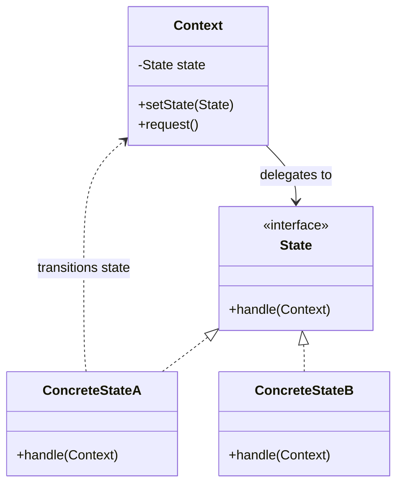

# State Pattern

## Introduction
The State pattern is a behavioral design pattern that allows an object to alter its behavior when its internal state changes. It appears as if the object changed its class.

## Problem Statement
Imagine building a `VendingMachine` class. It behaves differently depending on its state: `Idle`, `HasCoin`, `Dispensing`, or `OutOfStock`. If you try to manage these states using a single class with a giant `switch` statement across all methods (`insertCoin()`, `pressButton()`, `dispense()`), the code becomes a tangled mess. Adding a new state requires changing every single method.

## Why this exists
To replace complex, monolithic state machines governed by large `if-else` blocks with a clean, polymorphic architecture where each state is a separate, self-contained class.

## Real-world analogy
Think of a smartphone. 
- When the state is "Locked", pressing a button wakes the screen.
- When the state is "Unlocked", pressing a button might launch an app.
- When the state is "Low Battery", it might behave differently, refusing to turn on the camera.
The phone's response to the exact same action (pressing a button) completely changes based on its current internal state.

## Definition
Allow an object to alter its behavior when its internal state changes. The object will appear to change its class.

## Key concepts
- **Context:** The class that maintains an instance of a ConcreteState subclass that defines the current state.
- **State Interface:** An interface encapsulating the behavior associated with a particular state of the Context.
- **Concrete States:** Classes that implement a behavior associated with a state of the Context.

## Internal working / Mermaid diagram



## Python/Java implementation

### Java Implementation
```java
// 1. State Interface
public interface VendingMachineState {
    void insertCoin();
    void dispenseItem();
}

// 2. Concrete States
public class IdleState implements VendingMachineState {
    private VendingMachine machine;
    
    public IdleState(VendingMachine machine) {
        this.machine = machine;
    }
    
    public void insertCoin() {
        System.out.println("Coin inserted.");
        machine.setState(machine.getHasCoinState());
    }
    
    public void dispenseItem() {
        System.out.println("Insert a coin first.");
    }
}

public class HasCoinState implements VendingMachineState {
    private VendingMachine machine;
    
    public HasCoinState(VendingMachine machine) {
        this.machine = machine;
    }
    
    public void insertCoin() {
        System.out.println("Coin already inserted.");
    }
    
    public void dispenseItem() {
        System.out.println("Item dispensed.");
        machine.setState(machine.getIdleState());
    }
}

// 3. Context
public class VendingMachine {
    private VendingMachineState idleState;
    private VendingMachineState hasCoinState;
    
    private VendingMachineState currentState;
    
    public VendingMachine() {
        idleState = new IdleState(this);
        hasCoinState = new HasCoinState(this);
        currentState = idleState; // Initial state
    }
    
    public void setState(VendingMachineState state) {
        this.currentState = state;
    }
    
    // Delegate actions to current state
    public void insertCoin() { currentState.insertCoin(); }
    public void dispenseItem() { currentState.dispenseItem(); }
    
    // Getters for states...
    public VendingMachineState getIdleState() { return idleState; }
    public VendingMachineState getHasCoinState() { return hasCoinState; }
}

// 4. Usage
public class Main {
    public static void main(String[] args) {
        VendingMachine machine = new VendingMachine();
        
        machine.dispenseItem(); // "Insert a coin first."
        machine.insertCoin();   // "Coin inserted." (Transitions to HasCoinState)
        machine.insertCoin();   // "Coin already inserted."
        machine.dispenseItem(); // "Item dispensed." (Transitions to IdleState)
    }
}
```

## Step-by-step explanation
1. Identify all possible states of the object.
2. Create a common interface defining all actions that can trigger state transitions.
3. Implement a class for each state. The logic inside these classes dictates what happens in that specific state and how to transition to the next state.
4. The Context class delegates all execution to the currently active State object.

## Multiple real-world examples
1. **Media Player:** Play, Pause, Stop, Fast Forward states.
2. **Document Publishing:** Draft, Review, Published states.
3. **TCP Connection:** Established, Listening, Closed states.
4. **Video Game Characters:** Standing, Jumping, Ducking, Attacking states.

## Pros
- **Single Responsibility Principle:** Organizes code related to particular states into separate classes.
- **Open/Closed Principle:** Introduce new states without changing existing state classes or the context.
- **Eliminates conditionals:** Removes bulky state machine `if-else` blocks.

## Cons
- Can be overkill if a state machine has only a few states or rarely changes.
- Increases the number of classes.

## Interview questions

### Beginner
- **Q: What problem does the State pattern solve?**
  - **A:** It eliminates massive `switch/case` or `if-else` statements that control an object's behavior based on its internal state.

### Intermediate
- **Q: Who handles the state transitions? The Context or the Concrete States?**
  - **A:** Usually, the Concrete States handle the transitions by calling a setter on the Context (e.g., `context.setState(newState)`). However, if the state machine is strictly linear, the Context can handle it.

### Senior
- **Q: What is the primary difference between the Strategy pattern and the State pattern?**
  - **A:** Strategy is meant for interchanging algorithms chosen by the client; the strategies are usually unaware of each other. State is a finite-state machine implementation; the states are often aware of each other and actively trigger transitions from one state to another.

## Common mistakes
- Not sharing state instances. If states have no fields (no local variables), they can be instantiated once as Singletons to save memory.
- Creating a rigid interface where states have to implement dozens of empty methods they don't care about.

## Best practices
- If states carry no data, use the Singleton pattern or flyweight objects to avoid constant instantiation.
- Clearly define which class (Context or State) is responsible for state transitions. Don't mix both approaches.

## When NOT to use
- If the object only has two or three simple, non-expanding states.

## Comparison with similar concepts
- **State vs Strategy:** State objects can change the state of the Context. Strategies are just algorithms; they don't transition the Context into another Strategy.

## Summary
The State pattern is the object-oriented way to build finite-state machines. By encapsulating state-specific behavior into distinct classes, it ensures that your application logic remains clean, scalable, and easy to trace.

## Related topics
- [Strategy Pattern](../strategy)
- [Singleton Pattern](../../creational/singleton)
