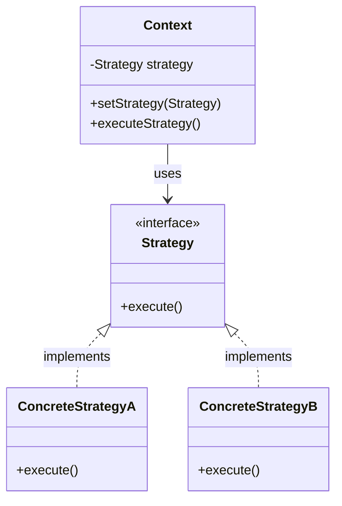

# Strategy Pattern

## Introduction
The Strategy pattern is a behavioral design pattern that lets you define a family of algorithms, put each of them into a separate class, and make their objects interchangeable. It allows the algorithm to vary independently from clients that use it.

## Problem Statement
Imagine you are building a navigation app. Initially, it only routes cars. Later, you add routing for walking, then public transit, then cycling. If you put all this logic into a single `Navigator` class with massive `if-else` or `switch` statements, the class becomes bloated, hard to maintain, and prone to bugs whenever a new routing method is added.

## Why this exists
To adhere to the Open/Closed Principle. By extracting the algorithms into separate classes, you can introduce new strategies without modifying the context class that uses them.

## Real-world analogy
Consider traveling to the airport. You have a specific goal (reach the airport), but you can use different strategies:
- Take a taxi (fast, expensive)
- Take a bus (slower, cheap)
- Ride a bicycle (healthy, carrying luggage is hard)
Depending on your current context (budget, time constraints), you dynamically choose the best transportation "strategy."

## Definition
Define a family of algorithms, encapsulate each one, and make them interchangeable. Strategy lets the algorithm vary independently from clients that use it.

## Key concepts
- **Context:** Maintains a reference to one of the concrete strategies and communicates with this object via the strategy interface.
- **Strategy Interface:** Common interface for all concrete strategies, declaring a method the context uses to execute a strategy.
- **Concrete Strategies:** Implement different variations of an algorithm.

## Internal working / Mermaid diagram



## Python/Java implementation

### Java Implementation
```java
// 1. Strategy Interface
public interface PaymentStrategy {
    void pay(int amount);
}

// 2. Concrete Strategies
public class CreditCardPayment implements PaymentStrategy {
    public void pay(int amount) {
        System.out.println("Paid " + amount + " using Credit Card.");
    }
}

public class PayPalPayment implements PaymentStrategy {
    public void pay(int amount) {
        System.out.println("Paid " + amount + " using PayPal.");
    }
}

// 3. Context
public class ShoppingCart {
    private PaymentStrategy paymentStrategy;
    
    // Set strategy dynamically
    public void setPaymentStrategy(PaymentStrategy strategy) {
        this.paymentStrategy = strategy;
    }
    
    public void checkout(int amount) {
        if (paymentStrategy == null) {
            throw new IllegalStateException("Payment strategy not set");
        }
        paymentStrategy.pay(amount);
    }
}

// 4. Usage
public class Main {
    public static void main(String[] args) {
        ShoppingCart cart = new ShoppingCart();
        
        cart.setPaymentStrategy(new CreditCardPayment());
        cart.checkout(100); // Output: Paid 100 using Credit Card.
        
        cart.setPaymentStrategy(new PayPalPayment());
        cart.checkout(50);  // Output: Paid 50 using PayPal.
    }
}
```

## Step-by-step explanation
1. Define a common interface (`PaymentStrategy`) for the algorithms.
2. Extract the specific algorithms into their own classes implementing the interface (`CreditCardPayment`, `PayPalPayment`).
3. In the main class (`ShoppingCart`), hold a reference to the interface, not a concrete class.
4. Allow the client code to inject the desired strategy into the context at runtime.

## Multiple real-world examples
1. **Sorting Algorithms:** A collection class that can be sorted using Bubble Sort, Quick Sort, or Merge Sort depending on the data size.
2. **Payment Processing:** E-commerce checkout allowing Credit Card, PayPal, or Crypto.
3. **File Compression:** A file archiver tool that can compress files using ZIP, RAR, or TAR strategies.
4. **Authentication:** Logging in via Email/Password, Google OAuth, or Apple ID.

## Pros
- **Open/Closed Principle:** You can introduce new strategies without changing the context.
- **Avoids conditionals:** Replaces massive `if-else` blocks with polymorphism.
- **Runtime switching:** You can swap algorithms at runtime.

## Cons
- **Increased number of classes:** The pattern introduces a lot of new classes, which might complicate simple programs.
- **Client awareness:** The client must be aware of the differences between strategies to select the right one.

## Interview questions

### Beginner
- **Q: What is the main purpose of the Strategy pattern?**
  - **A:** To encapsulate a family of algorithms into separate classes so they can be interchanged at runtime without altering the code that uses them.

### Intermediate
- **Q: How does the Strategy pattern adhere to SOLID principles?**
  - **A:** It adheres to the Open/Closed Principle (you can add new strategies without modifying the context) and the Single Responsibility Principle (each strategy class focuses on one specific algorithm).

### Senior
- **Q: What is the difference between Strategy and State patterns?**
  - **A:** Structurally they are very similar (both use composition). However, their *intent* differs. In Strategy, the client usually dictates which strategy to use, and strategies are generally independent of each other. In State, the context's behavior changes based on its internal state, and states are often aware of each other and handle transitions to other states.

## Common mistakes
- **Over-engineering:** Using Strategy for an algorithm that only has two simple variations that will never change. A simple `if-else` is better in that case.
- **Fat interfaces:** Creating a strategy interface with methods that not all concrete strategies need.

## Best practices
- Use functional interfaces/lambdas in modern languages (like Java 8+ or Python) to implement Strategy without creating verbose classes for simple algorithms.
- Combine with the Factory pattern to let a factory decide which strategy to instantiate based on configuration.

## When NOT to use
- If your algorithms rarely change and you only have a couple of variations, keep it simple with conditionals.

## Comparison with similar concepts
- **Strategy vs Template Method:** Strategy uses composition (delegates to an object). Template Method uses inheritance (base class defines skeleton, subclasses fill in the blanks).

## Summary
The Strategy pattern is the go-to solution for eliminating complex conditional statements that select different algorithms. By encapsulating behavior into interchangeable objects, it makes code highly extensible and testable.

## Related topics
- [State Pattern](../state)
- [Template Method](../template-method)
- [Factory Pattern](../../creational/factory)
