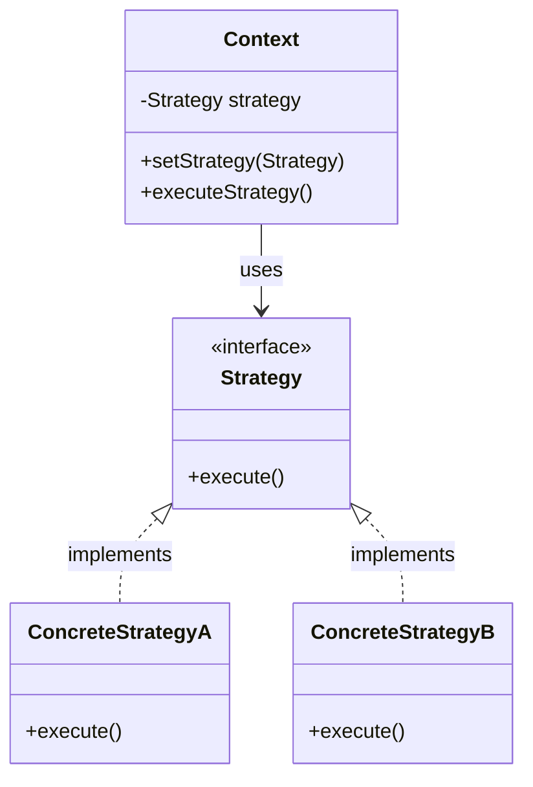

# Strategy Pattern

## Introduction
The Strategy pattern is a behavioral design pattern that lets you define a family of algorithms, put each of them into a separate class, and make their objects interchangeable. It allows the algorithm to vary independently from clients that use it.

## Problem Statement
Imagine you are building a navigation app. Initially, it only routes cars. Later, you add routing for walking, then public transit, then cycling. If you put all this logic into a single `Navigator` class with massive `if-else` or `switch` statements, the class becomes bloated, hard to maintain, and prone to bugs whenever a new routing method is added.

## Why this exists
To adhere to the Open/Closed Principle. By extracting the algorithms into separate classes, you can introduce new strategies without modifying the context class that uses them.

## Real-world analogy
Consider traveling to the airport. You have a specific goal (reach the airport), but you can use different strategies:
- Take a taxi (fast, expensive)
- Take a bus (slower, cheap)
- Ride a bicycle (healthy, carrying luggage is hard)
Depending on your current context (budget, time constraints), you dynamically choose the best transportation "strategy."

## Definition
Define a family of algorithms, encapsulate each one, and make them interchangeable. Strategy lets the algorithm vary independently from clients that use it.

## Key concepts
- **Context:** Maintains a reference to one of the concrete strategies and communicates with this object via the strategy interface.
- **Strategy Interface:** Common interface for all concrete strategies, declaring a method the context uses to execute a strategy.
- **Concrete Strategies:** Implement different variations of an algorithm.

## Internal working / Mermaid diagram



## Python/Java implementation

### Java Implementation
```java
// 1. Strategy Interface
public interface PaymentStrategy {
    void pay(int amount);
}

// 2. Concrete Strategies
public class CreditCardPayment implements PaymentStrategy {
    public void pay(int amount) {
        System.out.println("Paid " + amount + " using Credit Card.");
    }
}

public class PayPalPayment implements PaymentStrategy {
    public void pay(int amount) {
        System.out.println("Paid " + amount + " using PayPal.");
    }
}

// 3. Context
public class ShoppingCart {
    private PaymentStrategy paymentStrategy;
    
    // Set strategy dynamically
    public void setPaymentStrategy(PaymentStrategy strategy) {
        this.paymentStrategy = strategy;
    }
    
    public void checkout(int amount) {
        if (paymentStrategy == null) {
            throw new IllegalStateException("Payment strategy not set");
        }
        paymentStrategy.pay(amount);
    }
}

// 4. Usage
public class Main {
    public static void main(String[] args) {
        ShoppingCart cart = new ShoppingCart();
        
        cart.setPaymentStrategy(new CreditCardPayment());
        cart.checkout(100); // Output: Paid 100 using Credit Card.
        
        cart.setPaymentStrategy(new PayPalPayment());
        cart.checkout(50);  // Output: Paid 50 using PayPal.
    }
}
```

### Python Implementation
Python allows a standard object-oriented approach matching GoF, but we can also use functions as first-class citizens to simplify the pattern.

```python
from abc import ABC, abstractmethod
from typing import Callable

# --- OOP Strategy Pattern ---

# 1. Strategy Interface
class PaymentStrategy(ABC):
    @abstractmethod
    def pay(self, amount: int) -> None:
        pass

# 2. Concrete Strategies
class CreditCardPayment(PaymentStrategy):
    def pay(self, amount: int) -> None:
        print(f"Paid {amount} using Credit Card.")

class PayPalPayment(PaymentStrategy):
    def pay(self, amount: int) -> None:
        print(f"Paid {amount} using PayPal.")

# 3. Context
class ShoppingCart:
    def __init__(self) -> None:
        self._payment_strategy: PaymentStrategy | None = None

    def set_payment_strategy(self, strategy: PaymentStrategy) -> None:
        self._payment_strategy = strategy

    def checkout(self, amount: int) -> None:
        if not self._payment_strategy:
            raise ValueError("Payment strategy not set")
        self._payment_strategy.pay(amount)


# --- Pythonic Strategy Pattern (First-Class Functions) ---

# In Python, we can pass functions directly as strategies, avoiding boilerplate classes.
def pay_with_credit_card(amount: int) -> None:
    print(f"Paid {amount} using Credit Card function.")

def pay_with_paypal(amount: int) -> None:
    print(f"Paid {amount} using PayPal function.")

class PythonicShoppingCart:
    def __init__(self, payment_strategy: Callable[[int], None] | None = None) -> None:
        self._payment_strategy = payment_strategy

    def set_payment_strategy(self, strategy: Callable[[int], None]) -> None:
        self._payment_strategy = strategy

    def checkout(self, amount: int) -> None:
        if not self._payment_strategy:
            raise ValueError("Payment strategy not set")
        self._payment_strategy(amount)


# --- Usage ---
if __name__ == "__main__":
    # OOP Approach
    cart = ShoppingCart()
    cart.set_payment_strategy(CreditCardPayment())
    cart.checkout(100)
    
    # Pythonic Functional Approach
    py_cart = PythonicShoppingCart(pay_with_paypal)
    py_cart.checkout(50)
```

## Step-by-step explanation
1. Define a common interface (`PaymentStrategy`) for the algorithms.
2. Extract the specific algorithms into their own classes implementing the interface (`CreditCardPayment`, `PayPalPayment`).
3. In the main class (`ShoppingCart`), hold a reference to the interface, not a concrete class.
4. Allow the client code to inject the desired strategy into the context at runtime.
5. Alternatively, in languages with first-class functions (like Python), pass callbacks directly as the strategy strategy instead of wrapping them in classes.

## Multiple real-world examples
1. **Sorting Algorithms:** A collection class that can be sorted using Bubble Sort, Quick Sort, or Merge Sort depending on the data size.
2. **Payment Processing:** E-commerce checkout allowing Credit Card, PayPal, or Crypto.
3. **File Compression:** A file archiver tool that can compress files using ZIP, RAR, or TAR strategies.
4. **Authentication:** Logging in via Email/Password, Google OAuth, or Apple ID.
5. **Standard Library Examples:**
   - In Java, `Comparator.compare()` used in `Collections.sort()` is a classic Strategy pattern.
   - In Python, the `key` parameter in `sorted()` or `list.sort()` allows injecting a sorting strategy function.

## Pros
- **Open/Closed Principle:** You can introduce new strategies without changing the context.
- **Avoids conditionals:** Replaces massive `if-else` blocks with polymorphism.
- **Runtime switching:** You can swap algorithms at runtime.

## Cons
- **Increased number of classes:** The pattern introduces a lot of new classes, which might complicate simple programs.
- **Client awareness:** The client must be aware of the differences between strategies to select the right one.

## Interview questions

### Beginner
- **Q: What is the main purpose of the Strategy pattern?**
  - **A:** To encapsulate a family of algorithms into separate classes so they can be interchanged at runtime without altering the code that uses them.
- **Q: How does the Strategy pattern differ from simple if-else blocks?**
  - **A:** If-else blocks hardcode the behavior selection inside the context. The Strategy pattern delegate the decision-making and execution to a separate object, decoupled from the context.

### Intermediate
- **Q: How does the Strategy pattern adhere to SOLID principles?**
  - **A:** It adheres to the Open/Closed Principle (you can add new strategies without modifying the context) and the Single Responsibility Principle (each strategy class focuses on one specific algorithm).
- **Q: How can the Strategy pattern be combined with the Factory pattern?**
  - **A:** You can use a Factory to instantiate the appropriate `Strategy` object based on a dynamic input or configuration parameter, avoiding hardcoding the concrete Strategy in client code.

### Senior
- **Q: What is the difference between Strategy and State patterns?**
  - **A:** Structurally they are very similar (both use composition). However, their *intent* differs. In Strategy, the client usually dictates which strategy to use, and strategies are generally independent of each other. In State, the context's behavior changes based on its internal state, and states are often aware of each other and handle transitions to other states.
- **Q: How does the Strategy pattern leverage delegation over inheritance?**
  - **A:** Rather than subclassing a class to change its behavior (inheritance), the context class maintains a reference to a Strategy interface and delegates the work to it (composition/delegation). This allows behavioral changes at runtime rather than compile time.

### Staff Engineer
- **Q: How does the Strategy pattern scale in a large, distributed plug-in architecture, such as dynamic payment routing?**
  - **A:** In large architectures, concrete strategies are often discovered dynamically (e.g., using Dependency Injection or Service Loader patterns in Java, or plug-in registries). The context accesses these plugins via a unified interface, allowing third-party developers to package and deploy new strategies as separate jars/packages without ever modifying the core application codebase.
- **Q: Can we use first-class functions instead of traditional Strategy classes in languages like Python or JavaScript? What are the tradeoffs?**
  - **A:** Yes. Since functions are first-class, you can pass them directly as callbacks. The tradeoff is:
    - *Pros:* Eliminates class boilerplate, resulting in cleaner and more concise code.
    - *Cons:* Functions cannot hold complex state or support multiple methods easily like a class can (unless you use closures, which can become harder to debug/manage than structured classes).

## Common mistakes
- **Over-engineering:** Using Strategy for an algorithm that only has two simple variations that will never change. A simple `if-else` is better in that case.
- **Fat interfaces:** Creating a strategy interface with methods that not all concrete strategies need.

## Best practices
- Use functional interfaces/lambdas in modern languages (like Java 8+ or Python) to implement Strategy without creating verbose classes for simple algorithms.
- Combine with the Factory pattern to let a factory decide which strategy to instantiate based on configuration.

## When NOT to use
- If your algorithms rarely change and you only have a couple of variations, keep it simple with conditionals.

## Comparison with similar concepts
- **Strategy vs Template Method:** Strategy uses composition (delegates to an object). Template Method uses inheritance (base class defines skeleton, subclasses fill in the blanks).

## Summary
The Strategy pattern is the go-to solution for eliminating complex conditional statements that select different algorithms. By encapsulating behavior into interchangeable objects, it makes code highly extensible and testable.

## Related topics
- [State Pattern](../state)
- [Template Method](../template-method)
- [Factory Pattern](../../creational/factory)
- [Composition vs Inheritance](../../../03-lld/design-principles/composition-vs-inheritance)
