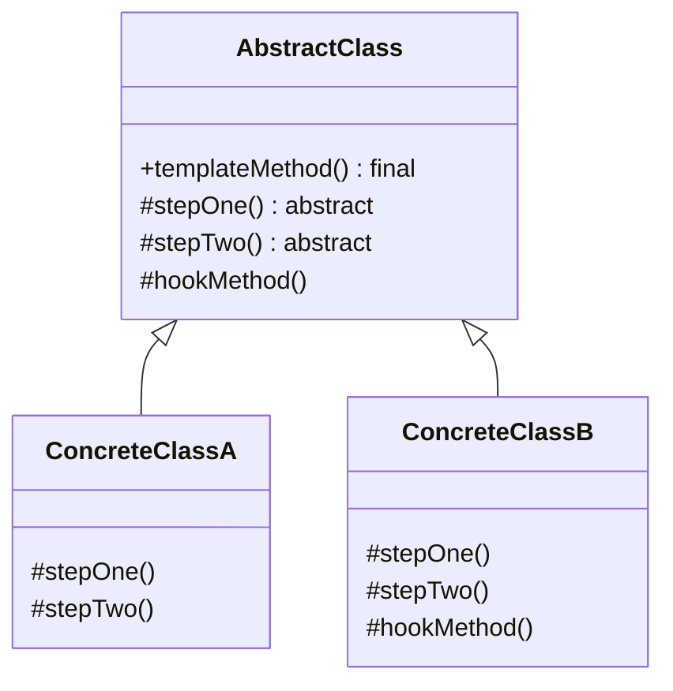

# Template Method Pattern

## Introduction
The Template Method is a behavioral design pattern that defines the skeleton of an algorithm in a superclass but lets subclasses override specific steps of the algorithm without changing its structure.

## Problem Statement
Imagine you are writing a data mining application that analyzes corporate documents. You have different classes to parse PDF, DOC, and CSV files. While the parsing extraction code is wildly different for each format, the steps to open the file, analyze the text, and close the file are identical across all classes. Duplicating this overarching workflow across every class leads to code duplication and maintenance nightmares.

## Why this exists
To eliminate code duplication by pulling the invariant parts of an algorithm into a base class and letting subclasses provide the variant implementations.

## Real-world analogy
Think of building a house. The fundamental steps are always the same:
1. Build foundation
2. Build walls
3. Add roof
This is the "Template Method". However, how these steps are executed varies. A wooden house has wooden walls; a brick house has brick walls. The general contractor (base class) dictates the order, but the specific craftsmen (subclasses) implement the details.

## Definition
Define the skeleton of an algorithm in an operation, deferring some steps to subclasses. Template Method lets subclasses redefine certain steps of an algorithm without changing the algorithm's structure.

## Key concepts
- **Abstract Class:** Defines abstract primitive operations that concrete subclasses define to implement steps of an algorithm. It implements the template method itself.
- **Concrete Class:** Implements the primitive operations to carry out subclass-specific steps of the algorithm.
- **Hooks:** Methods with empty or default implementations in the base class. Subclasses *may* override them if needed, but are not forced to.

## Internal working / Mermaid diagram



## Python/Java implementation

### Java Implementation
```java
// 1. Abstract Base Class
public abstract class DataMiner {
    
    // The Template Method: marked final so subclasses can't change the algorithm structure
    public final void mineData(String path) {
        openFile(path);
        extractData();
        parseData();
        analyzeData();
        sendReport();
        cleanUp(); // Hook
    }
    
    // Common implementations
    private void openFile(String path) { System.out.println("Opening file: " + path); }
    private void analyzeData() { System.out.println("Analyzing data generically."); }
    private void sendReport() { System.out.println("Sending report."); }
    
    // Abstract steps to be implemented by subclasses
    protected abstract void extractData();
    protected abstract void parseData();
    
    // Hook method (optional to override)
    protected void cleanUp() {
        // Default empty implementation
    }
}

// 2. Concrete Classes
public class PDFDataMiner extends DataMiner {
    @Override
    protected void extractData() {
        System.out.println("Extracting data from PDF.");
    }
    
    @Override
    protected void parseData() {
        System.out.println("Parsing PDF structure.");
    }
}

public class CSVDataMiner extends DataMiner {
    @Override
    protected void extractData() {
        System.out.println("Extracting data from CSV.");
    }
    
    @Override
    protected void parseData() {
        System.out.println("Parsing CSV rows and columns.");
    }
    
    @Override
    protected void cleanUp() {
        System.out.println("Closing CSV file handles specifically.");
    }
}
```

## Step-by-step explanation
1. Identify a multi-step algorithm with identical overarching structure but differing detailed steps.
2. Create an abstract base class.
3. Inside the base class, declare the `templateMethod()` containing the algorithm's sequence. Make it `final` to prevent overriding.
4. Extract the differing steps into `abstract` methods.
5. Create subclasses that extend the base class and implement the abstract methods.

## Multiple real-world examples
1. **Web Frameworks:** Servlets in Java (`HttpServlet`). The framework handles the HTTP connection (the template), while you override `doGet()` and `doPost()` (the steps).
2. **UI Frameworks:** React's component lifecycle (`componentDidMount`, `render`, `componentWillUnmount`).
3. **ETL Pipelines:** Extract, Transform, Load processes where the overarching schedule is the same, but data sources/destinations differ.

## Pros
- **Code Reuse:** Pulls common code up into a superclass, eliminating duplication.
- **Inversion of Control:** The superclass calls the subclass's methods, not the other way around (the "Hollywood Principle: Don't call us, we'll call you").
- **Extension Points:** Hooks allow subclasses to easily plug into specific points in the algorithm.

## Cons
- **Rigidity:** Clients are bound to the skeleton provided by the template. If a subclass needs a completely different order of steps, the pattern fails.
- **Liskov Substitution Principle violations:** If subclasses override steps in a way that breaks the base class assumptions.

## Interview questions

### Beginner
- **Q: Why is the template method in the base class usually marked as `final`?**
  - **A:** To ensure that subclasses cannot alter the high-level structure/sequence of the algorithm.

### Intermediate
- **Q: What is a "Hook" in the Template Method pattern?**
  - **A:** A hook is a method in the abstract base class that has an empty or default implementation. It is optional for subclasses to override it, providing a way to "hook" into the algorithm at specific points.

### Senior
- **Q: What is the difference between Template Method and Strategy patterns?**
  - **A:** Template Method is based on **inheritance**; it alters parts of an algorithm at compile time by subclassing. Strategy is based on **composition**; it alters the entire algorithm at runtime by supplying different object instances.

## Common mistakes
- Creating too many abstract steps, which makes implementing a subclass tedious.
- Forgetting to make the template method `final`, allowing subclasses to accidentally break the workflow.

## Best practices
- Keep the number of abstract methods to a minimum.
- Prefix abstract method names intended to be overridden with things like `do` (e.g., `doExtract()`).

## When NOT to use
- If the entire algorithm needs to be swapped dynamically at runtime (use Strategy instead).
- If your language prefers composition over inheritance (like Go or Rust), you might mimic this using higher-order functions instead of class hierarchies.

## Comparison with similar concepts
- **Template Method vs Strategy:** Inheritance (alter parts) vs Composition (alter whole).
- **Template Method vs Factory Method:** Factory Method is often called from within a Template Method to create objects needed for the algorithm.

## Summary
The Template Method pattern establishes a strict sequence of operations while providing flex points for subclasses. It heavily utilizes inheritance and the Hollywood Principle to ensure code reuse and architectural consistency across families of similar workflows.

## Related topics
- [Strategy Pattern](../strategy)
- [Factory Method](../../creational/factory)
