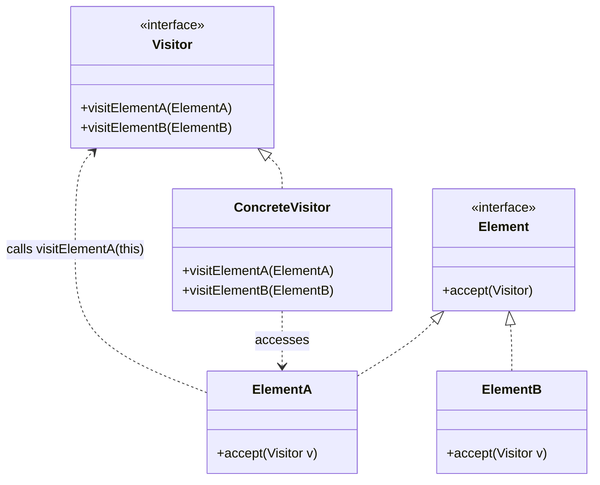

# Visitor Pattern

## Introduction
The Visitor is a behavioral design pattern that lets you separate algorithms from the objects on which they operate. It allows you to add new behaviors to an existing class hierarchy without altering the classes themselves.

## Problem Statement
Imagine your application works with a complex graph of objects representing a geographic map (Nodes include `City`, `Industry`, `Sightseeing`). You need to export this graph to XML. 
If you add an `exportXML()` method to every node class, you violate the Open/Closed Principle (you are constantly modifying existing, tested classes for a tangential feature). Furthermore, next week you might need to export to JSON. Adding `exportJSON()` clutters the domain classes even more with logic entirely unrelated to their primary purpose.

## Why this exists
To execute an operation across a disparate set of objects with different classes, without modifying those classes. 

## Real-world analogy
Think of an insurance agent (Visitor) visiting a neighborhood.
The neighborhood has different buildings (Elements): a `ResidentialBuilding`, a `Bank`, and a `CoffeeShop`. 
When the agent visits a residential building, they offer medical insurance. When visiting a bank, they offer theft insurance. When visiting a coffee shop, they offer fire insurance. 
The buildings don't know anything about insurance policies; they just "accept" the agent at the door.

## Definition
Represent an operation to be performed on the elements of an object structure. Visitor lets you define a new operation without changing the classes of the elements on which it operates.

## Key concepts
- **Visitor Interface:** Declares a set of visiting methods, one for each Concrete Element class (e.g., `visit(City)`, `visit(Industry)`).
- **Concrete Visitor:** Implements specific behaviors for each element type (e.g., `XMLExportVisitor`).
- **Element Interface:** Declares an `accept(Visitor)` method.
- **Concrete Element:** Implements the `accept` method. This method usually just calls `visitor.visit(this)`.

## Internal working / Mermaid diagram



## Python/Java implementation

### Java Implementation
```java
// 1. Element Interface
interface Shape {
    void accept(Visitor visitor);
}

// 2. Concrete Elements
class Circle implements Shape {
    public final int radius = 5;
    
    @Override
    public void accept(Visitor visitor) {
        visitor.visit(this); // "Double Dispatch"
    }
}

class Square implements Shape {
    public final int side = 4;
    
    @Override
    public void accept(Visitor visitor) {
        visitor.visit(this);
    }
}

// 3. Visitor Interface
interface Visitor {
    void visit(Circle circle);
    void visit(Square square);
}

// 4. Concrete Visitor (The new behavior!)
class AreaCalculatorVisitor implements Visitor {
    @Override
    public void visit(Circle circle) {
        System.out.println("Circle area: " + (Math.PI * circle.radius * circle.radius));
    }

    @Override
    public void visit(Square square) {
        System.out.println("Square area: " + (square.side * square.side));
    }
}

// 5. Usage
public class Main {
    public static void main(String[] args) {
        Shape[] shapes = new Shape[]{new Circle(), new Square()};
        
        Visitor areaCalc = new AreaCalculatorVisitor();
        
        for (Shape shape : shapes) {
            // We don't know the exact class of 'shape', but double dispatch 
            // ensures the correct visit() method is called.
            shape.accept(areaCalc);
        }
    }
}
```

## Step-by-step explanation
1. Define a `Visitor` interface with a `visit` method overloaded for every concrete element class.
2. Define an `accept(Visitor)` method in the element hierarchy base class.
3. Implement `accept` in all concrete elements. It must exactly be: `visitor.visit(this)`. This is the crux of **Double Dispatch**: the element tells the visitor what type it is.
4. Create concrete visitors implementing the business logic for the new feature (e.g., XML export, area calculation).
5. The client iterates over the elements and passes the concrete visitor to their `accept` methods.

## Multiple real-world examples
1. **Compilers / Abstract Syntax Trees (AST):** Parsing a code tree where nodes are `Variable`, `Function`, `Expression`. A `TypeCheckingVisitor`, `CodeGenerationVisitor`, and `PrettyPrintVisitor` can traverse the tree without modifying the node classes.
2. **Document Object Model (DOM):** Traversing HTML/XML elements to extract text or apply formatting.
3. **Report Generation:** Iterating over a list of employee objects (`Manager`, `Engineer`, `Sales`) to calculate bonuses without putting bonus logic inside the employee classes.

## Pros
- **Open/Closed Principle:** You can introduce a new behavior that works with objects of different classes without altering those classes.
- **Single Responsibility Principle:** You move multiple versions of the same behavior into the same class.
- **Gathers State:** A visitor can accumulate state as it traverses the object structure (e.g., calculating a total sum).

## Cons
- **Brittle Hierarchy:** If you add a new Element class (e.g., `Triangle`), you must update the `Visitor` interface and *every single Concrete Visitor* class. This is a massive violation of the Open/Closed Principle from the opposite direction.
- **Encapsulation Breakdown:** Visitors often need access to the private fields of elements to do their job, forcing you to expose internal state.

## Interview questions

### Beginner
- **Q: What is the main purpose of the Visitor pattern?**
  - **A:** To add new operations to existing class hierarchies without modifying those classes.

### Intermediate
- **Q: What is "Double Dispatch" in the context of the Visitor pattern?**
  - **A:** In Java/C++, method overloading is resolved at compile time based on the reference type, not runtime type. If you call `visitor.visit(shape)`, it looks for a generic `visit(Shape)` method. By calling `shape.accept(visitor)` (first dispatch), the specific shape class calls `visitor.visit(this)` (second dispatch). Since `this` is strongly typed at compile time inside the specific class, the compiler correctly routes to `visit(Circle)`.

### Senior
- **Q: When should you avoid using the Visitor pattern?**
  - **A:** You should avoid it if the Element class hierarchy changes frequently. Every time you add a new Element type, you have to modify the Visitor interface and all its implementations, making maintenance a nightmare. It is only suited for stable class hierarchies.

## Common mistakes
- Trying to use `instanceof` inside a `for` loop instead of implementing the `accept` method. `instanceof` checks are slow and violate OOP principles; double dispatch is the correct approach.
- Using Visitor when the element hierarchy changes often.

## Best practices
- Use Visitor almost exclusively for operations over complex object structures (like Composite trees or ASTs) where the structure classes are "frozen" but new operations are added frequently.

## When NOT to use
- If the object hierarchy is constantly evolving (adding new types of elements).
- If the logic you are adding only applies to one or two classes, not the whole hierarchy.

## Comparison with similar concepts
- **Visitor vs Iterator:** Iterator only traverses the structure. Visitor traverses *and* applies an operation based on the specific type of each element.

## Summary
The Visitor pattern is a highly specialized tool for adding capabilities to closed, stable class hierarchies (like ASTs). Through the magic of double dispatch, it cleanly separates operations from data objects, though at the cost of tying the Visitor interface tightly to the existing hierarchy.

## Related topics
- [Composite Pattern](../../structural/composite)
- [Iterator Pattern](../iterator)
