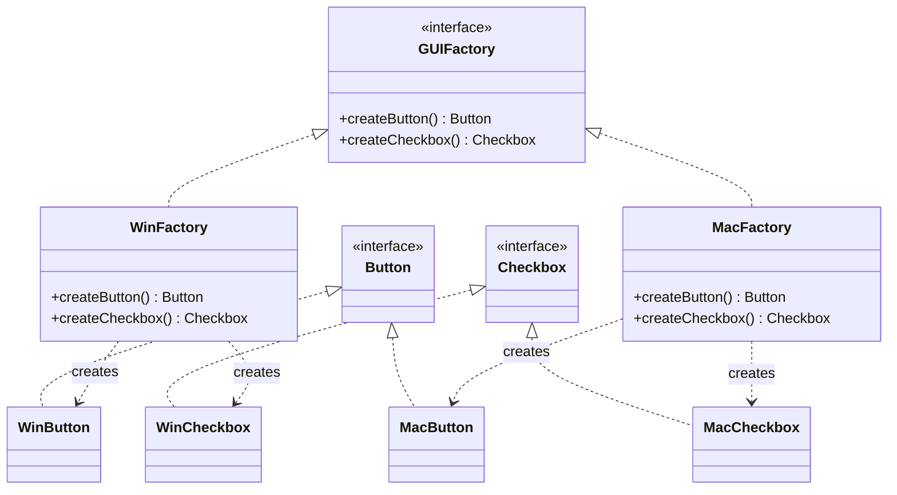

# Abstract Factory Pattern

## Introduction
The Abstract Factory is a creational design pattern that lets you produce families of related objects without specifying their concrete classes. It provides an interface for creating all objects within a family, ensuring that the created objects are compatible with one another.

## Problem Statement
Imagine you are building a cross-platform UI framework. Your UI requires multiple elements—like Buttons, Checkboxes, and TextFields. 
Furthermore, your framework needs to support multiple operating systems (Windows, macOS, Linux). 

If you instantiate these objects directly (`new WindowsButton()`, `new MacCheckbox()`) throughout your business logic, you risk mixing elements from different families (e.g., rendering a Mac Checkbox on a Windows Dialog). Modifying the code to add a new OS later would mean tracing through the entire codebase and modifying countless `if/else` checks.

## Why this exists
To group related object creation into a dedicated interface. The Abstract Factory ensures that a client uses objects that belong to the same family and prevents mismatched combinations.

## Real-world analogy
Consider a **Furniture Shop**. They sell related products that belong to a specific aesthetic "family": Art Deco, Victorian, and Modern.
For each family, there are specific variants of products: a Chair, a Sofa, and a Coffee Table.
When a customer orders a "Modern" living room set, the shop's "Modern Factory" ensures they get a Modern Chair, a Modern Sofa, and a Modern Table. They will never accidentally ship a Victorian Chair with a Modern Sofa.

## Definition
A creational design pattern that provides an interface for creating families of related or dependent objects without specifying their concrete classes.

## Key concepts
- **Abstract Factory:** Declares a set of methods for creating each of the abstract products.
- **Concrete Factory:** Implements the creation methods of the abstract factory. Each concrete factory corresponds to a specific variant/family of products.
- **Abstract Product:** Declares an interface for a distinct type of product (e.g., `Button`).
- **Concrete Product:** The specific implementation of the product, variant-specific (e.g., `WindowsButton`).
- **Client:** Uses only the interfaces declared by the Abstract Factory and Abstract Product classes.

## Internal working / Mermaid diagram



## Java implementation

### Bad implementation
Instantiating objects manually scatters platform-specific conditional logic across the client code.

```java
public class Application {
    public void renderUI(String osType) {
        // The client code is deeply coupled with Concrete classes
        if (osType.equals("Windows")) {
            WindowsButton button = new WindowsButton();
            WindowsCheckbox checkbox = new WindowsCheckbox();
            button.paint();
            checkbox.paint();
        } else if (osType.equals("Mac")) {
            MacButton button = new MacButton();
            // Oops! Developer made a mistake here, causing a visual bug.
            WindowsCheckbox checkbox = new WindowsCheckbox(); 
            button.paint();
            checkbox.paint();
        }
    }
}
```

### Best implementation (Abstract Factory)
We introduce an Abstract Factory. The client is only aware of interfaces, making the application code platform-agnostic.

```java
// 1. Abstract Products
interface Button { void paint(); }
interface Checkbox { void paint(); }

// 2. Concrete Products (Windows)
class WinButton implements Button {
    public void paint() { System.out.println("Rendering Windows Button"); }
}
class WinCheckbox implements Checkbox {
    public void paint() { System.out.println("Rendering Windows Checkbox"); }
}

// 3. Concrete Products (Mac)
class MacButton implements Button {
    public void paint() { System.out.println("Rendering Mac Button"); }
}
class MacCheckbox implements Checkbox {
    public void paint() { System.out.println("Rendering Mac Checkbox"); }
}

// 4. Abstract Factory
interface GUIFactory {
    Button createButton();
    Checkbox createCheckbox();
}

// 5. Concrete Factories
class WinFactory implements GUIFactory {
    public Button createButton() { return new WinButton(); }
    public Checkbox createCheckbox() { return new WinCheckbox(); }
}

class MacFactory implements GUIFactory {
    public Button createButton() { return new MacButton(); }
    public Checkbox createCheckbox() { return new MacCheckbox(); }
}

// 6. Client Code
class Application {
    private Button button;
    private Checkbox checkbox;

    // Client expects a factory interface, completely agnostic of OS.
    public Application(GUIFactory factory) {
        button = factory.createButton();
        checkbox = factory.createCheckbox();
    }

    public void paint() {
        button.paint();
        checkbox.paint();
    }
}

// Bootstrapping the app
public class Main {
    public static void main(String[] args) {
        Application app;
        GUIFactory factory;
        
        String osName = System.getProperty("os.name").toLowerCase();
        if (osName.contains("mac")) {
            factory = new MacFactory();
        } else {
            factory = new WinFactory();
        }
        
        app = new Application(factory);
        app.paint(); // Renders correctly matched elements!
    }
}
```

## Python implementation

### Bad implementation
Directly instantiating platform-specific objects scatters conditionals and risks mixing families.

```python
def render_ui(os_type: str):
    if os_type == "windows":
        button = "Windows Button"
        checkbox = "Windows Checkbox"
    elif os_type == "mac":
        button = "Mac Button"
        # Bug: developer accidentally used wrong family!
        checkbox = "Windows Checkbox"
    else:
        raise ValueError(f"Unknown OS: {os_type}")
    print(f"Rendering {button} and {checkbox}")
```

### Best implementation (Abstract Factory)
Using Python's ABC module and Protocol-based typing for clean abstraction.

```python
from abc import ABC, abstractmethod

# 1. Abstract Products
class Button(ABC):
    @abstractmethod
    def paint(self) -> str:
        pass

class Checkbox(ABC):
    @abstractmethod
    def paint(self) -> str:
        pass

# 2. Concrete Products (Windows)
class WinButton(Button):
    def paint(self) -> str:
        return "Rendering Windows Button"

class WinCheckbox(Checkbox):
    def paint(self) -> str:
        return "Rendering Windows Checkbox"

# 3. Concrete Products (Mac)
class MacButton(Button):
    def paint(self) -> str:
        return "Rendering Mac Button"

class MacCheckbox(Checkbox):
    def paint(self) -> str:
        return "Rendering Mac Checkbox"

# 4. Abstract Factory
class GUIFactory(ABC):
    @abstractmethod
    def create_button(self) -> Button:
        pass

    @abstractmethod
    def create_checkbox(self) -> Checkbox:
        pass

# 5. Concrete Factories
class WinFactory(GUIFactory):
    def create_button(self) -> Button:
        return WinButton()

    def create_checkbox(self) -> Checkbox:
        return WinCheckbox()

class MacFactory(GUIFactory):
    def create_button(self) -> Button:
        return MacButton()

    def create_checkbox(self) -> Checkbox:
        return MacCheckbox()

# 6. Client Code
class Application:
    def __init__(self, factory: GUIFactory):
        self.button = factory.create_button()
        self.checkbox = factory.create_checkbox()

    def paint(self):
        print(self.button.paint())
        print(self.checkbox.paint())

# Bootstrapping
import platform

def main():
    os_name = platform.system().lower()
    factory = MacFactory() if "darwin" in os_name else WinFactory()

    app = Application(factory)
    app.paint()  # Renders correctly matched elements!
```

## Step-by-step explanation
1. Identify the families of products (e.g., Windows UI vs. Mac UI).
2. Extract interfaces for all distinct products making up those families (`Button`, `Checkbox`).
3. Declare the `Abstract Factory` interface detailing a creation method for each abstract product.
4. Create `Concrete Factory` classes implementing the `Abstract Factory` for each specific family variant.
5. Modify client initialization to accept an `Abstract Factory`. Use it to fetch elements.

## Multiple real-world examples
1. **Database Drivers:** JDBC or equivalent libraries where an `Abstract Factory` (Connection) returns matched families of objects (`Statement`, `ResultSet`, `PreparedStatement`) specific to MySQL or PostgreSQL.
2. **Cross-Platform UI Toolkits:** Java AWT/Swing or React Native bridging to iOS/Android native components.
3. **Theme Engines:** Changing an app from "Dark Mode" to "Light Mode" where a factory ensures all icons, backgrounds, and fonts are fetched from the matched theme family.
4. **Cloud Provider SDKs:** An `AbstractCloudFactory` returning `Storage`, `Compute`, and `Messaging` services. `AWSFactory` returns S3/EC2/SQS, while `GCPFactory` returns GCS/GCE/Pub-Sub.
5. **Payment Processing Ecosystems:** A `PaymentFactory` producing matching `Gateway`, `Tokenizer`, and `FraudChecker` objects for Stripe vs. PayPal vs. Razorpay.

## Pros
- **Family Compatibility:** You are guaranteed that products extracted from a factory are perfectly compatible with each other.
- **Loose Coupling:** The client code operates entirely on abstractions and does not rely on concrete implementations.
- **Single Responsibility Principle:** Product creation logic is localized to specific concrete factories.
- **Open/Closed Principle:** Introducing a new variant (e.g., `LinuxFactory`) requires zero changes to the client code.

## Cons
- **High Complexity:** Introduces a massive number of interfaces and classes. If your product family has 4 elements and 3 variants, you are writing 12 product classes and 3 factory classes.
- **Adding New Products is Hard:** If you decide you need a new element (e.g., `createSlider()`), you must modify the `Abstract Factory` interface, which forces you to update *every single* `Concrete Factory` implementation.

## Interview questions

### Beginner
- **Q: How is Abstract Factory different from Factory Method?**
- A: Factory Method creates a *single* product using an overridden method in a subclass. Abstract Factory creates a *family* of related products using an object with multiple creation methods.

- **Q: What design problem does Abstract Factory solve that Factory Method cannot?**
- A: It enforces *family consistency*. Factory Method only guarantees one product per creator. Abstract Factory guarantees that all products from a single factory belong to the same family (e.g., all Windows UI elements together, never mixing Windows and Mac).

### Intermediate
- **Q: When would you definitively choose Abstract Factory over other patterns?**
- A: When my system must be configured with one of multiple families of products, and I need to enforce that objects from different families are not accidentally mixed.

- **Q: How does Abstract Factory relate to the Dependency Inversion Principle?**
- A: Client code depends on the `AbstractFactory` and `AbstractProduct` interfaces (high-level abstractions), never on concrete implementations. The concrete factories and products are injected at runtime, making the system highly modular and testable.

### Senior
- **Q: How does adding a new product type break the Open/Closed Principle in an Abstract Factory?**
- A: To add a new product (e.g., `DialogBox`), you have to modify the `AbstractFactory` interface to add `createDialogBox()`. Because interfaces force implementation, you must then crack open and modify every existing `ConcreteFactory` to implement this new method, violating the Open/Closed Principle.

- **Q: How can you mitigate the "adding new products" problem in Abstract Factory?**
- A: Use a generic `create(type)` method with a type registry, or use the Prototype pattern where the factory stores prototypical instances and clones them. In Java, you can also use default methods in interfaces to provide a no-op fallback.

### Staff Engineer
- **Q: In modern software, dependency injection (DI) containers are heavily used. Does this make Abstract Factory obsolete?**
- A: Abstract Factory and DI are highly synergistic, not mutually exclusive. A DI container often *is* a runtime Abstract Factory. However, when you need dynamic instantiation of groups of objects based on runtime data (rather than app-startup injection), you still explicitly implement the Abstract Factory pattern to encapsulate that dynamic resolution cleanly.

- **Q: How would you implement an Abstract Factory that supports runtime addition of new product families without recompilation?**
- A: Use a registry-based approach where each ConcreteFactory registers itself with a central `FactoryProvider` at startup (via SPI, classpath scanning, or plugin loading). The client asks the `FactoryProvider` for a factory by name/config key. This is how OSGi bundles and Spring profiles effectively implement dynamic Abstract Factories.

## Common mistakes
- **Over-engineering:** Using Abstract Factory when you only have one family of products, or when products are completely unrelated and don't need grouping constraints.
- **Violating Interface Segregation:** Stuffing unrelated creations into a single factory just to reduce the number of factory classes.

## Best practices
- Often, the Concrete Factories themselves are implemented as **Singletons**, because you rarely need more than one factory instance of a specific variant.
- Combine with the **Builder** pattern if the products being generated by the factory are highly complex to construct.

## When NOT to use
- If you have only a single type of product.
- If the system does not need to enforce compatibility between the objects being created.

## Comparison with similar concepts
- **Abstract Factory vs. Factory Method:** Abstract Factory manages *families* of objects; Factory Method focuses on delegating the instantiation of a *single* object to subclasses.
- **Abstract Factory vs. Builder:** Abstract Factory returns an object immediately. Builder constructs a complex object step-by-step and returns it as a final step.

## Summary
The Abstract Factory is a robust mechanism for enforcing consistency among groups of related products. While it scales horizontally well (adding new families is easy), it resists vertical scaling (adding new product types is hard). Use it strictly when product compatibility and strict abstraction are hard requirements.

## Related topics
- [Factory Method](../factory)
- [Builder](../builder)
- [Singleton](../singleton)
- [Prototype](../prototype)
- [Strategy](../../behavioral/strategy)
