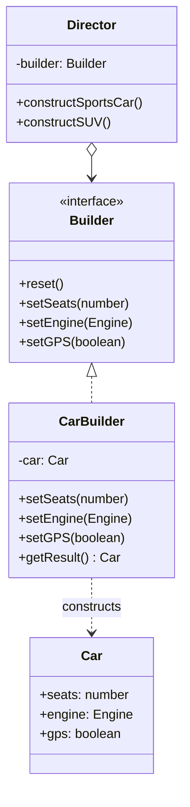

# Builder Pattern

## Introduction
The Builder is a creational design pattern designed to construct complex objects step by step. It allows you to produce different types and representations of an object using the same construction code.

## Problem Statement
Imagine an object that requires complex, step-by-step initialization of many fields and nested objects. 
For instance, a `House` class. To build a simple house, you call `new House(walls, doors)`. But what if you want a house with a swimming pool, a garage, a garden, and statues?

You might end up creating a giant "Telescoping Constructor" like this:
`new House(4, 2, 4, true, false, false, true, false)`. 
It is unreadable, error-prone (mixing up boolean arguments), and most parameters are null or false for simple variations.

## Why this exists
The Builder pattern extracts the object construction code out of its own class and moves it to separate objects called *builders*. It enforces a clear, fluent, step-by-step process for creating objects and completely eliminates the need for giant constructors.

## Real-world analogy
Consider ordering a **Subway Sandwich** or a **Custom PC**. 
You don't just ask for a "Sandwich(true, false, turkey, lettuce)". You go through a process:
1. Pick the bread.
2. Pick the meat.
3. Add cheese.
4. Add vegetables.
5. Add sauces.

The "Builder" executes these steps one by one according to your instructions, and finally hands you the finished product.

## Definition
A creational design pattern that separates the construction of a complex object from its representation, allowing the same construction process to create various representations.

## Key concepts
- **Builder Interface:** Specifies methods for creating the different parts of the Product objects.
- **Concrete Builder:** Implements the Builder interface and provides specific implementations for the construction steps.
- **Product:** The complex object being constructed.
- **Director (Optional):** Defines the order in which to call construction steps, allowing you to reuse specific configurations.

## Internal working / Mermaid diagram



## Java implementation

### Bad implementation (Telescoping Constructor)
Creating objects is incredibly confusing when relying on multiple constructor overloads.

```java
public class User {
    private String firstName;
    private String lastName;
    private int age;
    private String phone;
    private String address;

    // Giant, unreadable constructor
    public User(String firstName, String lastName, int age, String phone, String address) {
        this.firstName = firstName;
        this.lastName = lastName;
        this.age = age;
        this.phone = phone;
        this.address = address;
    }
}

// Client code
User user = new User("John", "Doe", 30, null, null); // Nulls are ugly!
```

### Best implementation (Effective Java Builder / Fluent API)
In modern Java, Joshua Bloch’s static inner class Builder pattern is the standard. It provides immutability and highly readable client code.

```java
public class User {
    // 1. All fields are final (Immutability)
    private final String firstName; // Required
    private final String lastName;  // Required
    private final int age;          // Optional
    private final String phone;     // Optional
    private final String address;   // Optional

    // 2. Private constructor that takes the Builder
    private User(UserBuilder builder) {
        this.firstName = builder.firstName;
        this.lastName = builder.lastName;
        this.age = builder.age;
        this.phone = builder.phone;
        this.address = builder.address;
    }

    // Getters only, no Setters!
    public String getFirstName() { return firstName; }
    public String getPhone() { return phone; }

    // 3. Static Inner Builder Class
    public static class UserBuilder {
        private final String firstName;
        private final String lastName;
        
        private int age = 0;
        private String phone = "";
        private String address = "";

        // Required parameters in Builder constructor
        public UserBuilder(String firstName, String lastName) {
            this.firstName = firstName;
            this.lastName = lastName;
        }

        // Setter methods that return the builder itself (Fluent Interface)
        public UserBuilder age(int age) {
            this.age = age;
            return this;
        }
        public UserBuilder phone(String phone) {
            this.phone = phone;
            return this;
        }
        public UserBuilder address(String address) {
            this.address = address;
            return this;
        }

        // 4. The build() method calls the private outer constructor
        public User build() {
            return new User(this);
        }
    }
}

// Client code
public class Main {
    public static void main(String[] args) {
        // Highly readable, fluent, and results in an Immutable object!
        User user = new User.UserBuilder("John", "Doe")
                            .age(30)
                            .phone("123-456-7890")
                            .build();
    }
}
```

## Step-by-step explanation
1. Clearly define the complex `Product` class. Ideally, make its fields `final` to ensure immutability once built.
2. Make the constructor of the `Product` private so it can only be initialized via the Builder.
3. Create a static nested class named `Builder`. Give it the same fields as the product.
4. Pass the required parameters to the Builder's constructor.
5. Create chainable setter methods for all optional parameters. Have them return `this`.
6. Create a `build()` method inside the Builder that passes itself to the Product's private constructor.

## Multiple real-world examples
1. **Java's `StringBuilder` and `StringBuffer`:** Used to build strings efficiently without generating garbage intermediate string objects.
2. **SQL Query Builders:** Libraries like JOOQ or Hibernate `CriteriaBuilder` let you construct complex SQL queries sequentially (`.select().from().where().orderBy()`).
3. **Testing Data Generation:** Building complex Mock objects in unit tests where only 1 or 2 fields vary from the defaults.
4. **HTTP Client Requests:** The `java.net.http.HttpRequest.newBuilder()` API uses builders to attach URIs, headers, and body payloads sequentially.

## Pros
- **Readability:** Eliminates telescoping constructors. Code reads like natural language.
- **Immutability:** Objects can be perfectly immutable post-creation, improving thread safety.
- **Validation:** You can enforce strict validation rules inside the `build()` method before creating the final object.
- **Step-by-step Control:** Allows for delaying construction or passing the builder around to multiple methods before finalizing.

## Cons
- **Boilerplate Code:** It doubles the number of lines of code because you must duplicate fields in both the Product and the Builder. (Though libraries like Lombok's `@Builder` solve this automatically).

## Interview questions

### Beginner
- **Q: What is a "telescoping constructor" and how does the Builder solve it?**
- A: A telescoping constructor happens when a class has multiple constructor overloads, each taking one more parameter than the last. The Builder solves this by extracting optional parameters into chainable setter methods.

### Intermediate
- **Q: What is the difference between a Factory and a Builder?**
- A: A Factory creates an object in a single step (usually returning an interface). A Builder constructs a complex object step-by-step and returns the concrete product.

### Senior
- **Q: How does the Builder pattern enhance thread safety?**
- A: By using a Builder, you can define all fields in the final Product as `final`. The builder handles the mutable state during construction, and once `build()` is called, the final object is 100% immutable and inherently thread-safe.

### Staff Engineer
- **Q: Explain the role of the "Director" in the GoF Builder pattern. Why is it rarely used in modern Java?**
- A: The GoF Director orchestrates the steps of the Builder to construct predefined configurations (e.g., `buildEconomyCar()`, `buildLuxuryCar()`). Modern development heavily favors the Joshua Bloch (Effective Java) style inner-class builder with fluent APIs. Instead of a dedicated Director class, developers usually rely on simple Factory methods or preset variables to achieve predefined configurations, rendering a formal Director overly verbose.

## Common mistakes
- **Using Builders for everything:** If a class only has 2 or 3 parameters, a standard constructor or static factory method is much simpler.
- **Forgetting Immutability:** A common anti-pattern is leaving setters on the final Product class, defeating half the purpose of the Builder pattern.

## Best practices
- **Use Project Lombok:** In Java, simply annotating a class with `@Builder` auto-generates the entire inner static builder class at compile time, completely eliminating the boilerplate con.
- **Fail Fast in `build()`:** Place your domain validation logic inside the `build()` method to guarantee that an invalid object can never be constructed.

## When NOT to use
- For simple objects with a low number of properties.
- When object fields are likely to change dynamically over their lifespan (meaning they can't be immutable anyway, and setters are already required).

## Comparison with similar concepts
- **Builder vs. Abstract Factory:** Builder focuses on constructing a single *complex* object step by step. Abstract Factory focuses on creating *families* of objects instantly.
- **Builder vs. Prototype:** Builder constructs objects from scratch based on parameters. Prototype creates an object by cloning an existing configured instance.

## Summary
The Builder pattern is the ultimate solution for instantiating complex objects with many optional parameters. While historically reliant on a formal `Director` class, modern programming favors the fluent, static-inner-class approach. It significantly boosts code readability and allows for strict immutability.

## Related topics
- Factory Method
- Abstract Factory