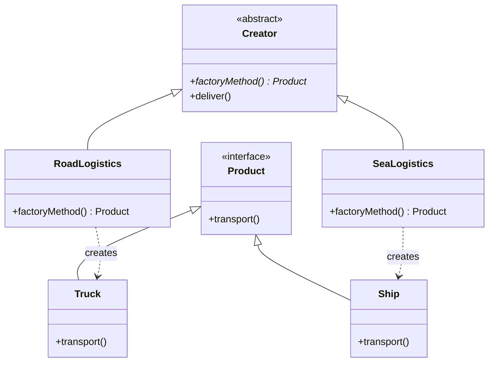

# Factory Method Pattern

## Introduction
The Factory Method is a creational design pattern that provides an interface for creating objects in a superclass, but allows subclasses to alter the type of objects that will be created.

## Problem Statement
Imagine you are creating a logistics management application. Initially, it only handles truck transportation, so most of your code resides in the `Truck` class. 
Later, your app becomes popular and you need to add sea logistics (`Ship`). Your code is deeply coupled to the `Truck` class. Adding `Ship` would require modifying the entire codebase, heavily relying on brittle `if/else` conditionals everywhere to check which transport type to instantiate.

## Why this exists
To decouple the exact object creation process from the business logic that uses those objects. It solves the problem of creating objects without specifying the exact class of object that will be created.

## Real-world analogy
Consider a **Car Manufacturing Plant**. The main company (Creator) decides *when* to build a car and *how* to sell it. However, the exact blueprint of the car is handed down to sub-factories (Concrete Creators). The SUV Factory produces SUVs, and the Sedan Factory produces Sedans. The dealership just asks for a "Car" without caring how the sub-factory built it.

## Definition
A creational design pattern that defines an interface or abstract class for creating an object, but lets subclasses decide which class to instantiate. Factory Method lets a class defer instantiation to subclasses.

## Key concepts
- **Creator:** The abstract class or interface declaring the factory method.
- **Concrete Creator:** Subclasses that override the factory method to return a specific product.
- **Product:** The common interface for all objects the creator and its subclasses can produce.
- **Concrete Product:** The specific implementations of the product interface.

## Internal working / Mermaid diagram



## Java implementation

### Bad implementation
Mixing object instantiation tightly with business logic makes the code rigid and violating the Open/Closed Principle.

```java
public class Logistics {
    public void deliver(String type) {
        if (type.equals("Road")) {
            Truck truck = new Truck();
            truck.transport();
        } else if (type.equals("Sea")) {
            Ship ship = new Ship();
            ship.transport();
        }
        // Adding new types means modifying this core method
    }
}
```

### Better implementation (Simple Factory)
A step up is abstracting the `if/else` logic into a separate factory class. This isn't the true *Factory Method Pattern*, but it's a common stepping stone.

```java
public class SimpleTransportFactory {
    public static Transport createTransport(String type) {
        if (type.equals("Road")) return new Truck();
        if (type.equals("Sea")) return new Ship();
        throw new IllegalArgumentException("Unknown transport type");
    }
}
```

### Best implementation (Factory Method Pattern)
Here we use polymorphism to let the subclasses decide what to create.

```java
// 1. Product Interface
public interface Transport {
    void deliver();
}

// 2. Concrete Products
public class Truck implements Transport {
    public void deliver() { System.out.println("Deliver by land in a box."); }
}
public class Ship implements Transport {
    public void deliver() { System.out.println("Deliver by sea in a container."); }
}

// 3. Creator
public abstract class Logistics {
    // The Factory Method
    public abstract Transport createTransport();
    
    // Core business logic relies purely on abstractions
    public void planDelivery() {
        Transport transport = createTransport();
        transport.deliver();
    }
}

// 4. Concrete Creators
public class RoadLogistics extends Logistics {
    @Override
    public Transport createTransport() {
        return new Truck();
    }
}

public class SeaLogistics extends Logistics {
    @Override
    public Transport createTransport() {
        return new Ship();
    }
}
```

## Python implementation

### Bad implementation
Conditional creation logic scattered in the client. Adding new transport types requires modifying client code.

```python
class Truck:
    def transport(self):
        return "Delivering by land in a box."

class Ship:
    def transport(self):
        return "Delivering by sea in a container."

def deliver(transport_type: str):
    # Bad: Tight coupling to concrete classes
    if transport_type == "road":
        vehicle = Truck()
    elif transport_type == "sea":
        vehicle = Ship()
    else:
        raise ValueError(f"Unknown type: {transport_type}")
    print(vehicle.transport())
```

### Better implementation (Simple Factory)
Extracts the creation logic into a dedicated factory function, but still relies on conditionals.

```python
from typing import Protocol

class Transport(Protocol):
    def transport(self) -> str: ...

class Truck:
    def transport(self) -> str:
        return "Delivering by land in a box."

class Ship:
    def transport(self) -> str:
        return "Delivering by sea in a container."

def create_transport(transport_type: str) -> Transport:
    factories = {
        "road": Truck,
        "sea": Ship,
    }
    if transport_type not in factories:
        raise ValueError(f"Unknown type: {transport_type}")
    return factories[transport_type]()
```

### Best implementation (Factory Method Pattern)
Uses the ABC module and polymorphism. Adding new transport types requires zero changes to existing code.

```python
from abc import ABC, abstractmethod

# 1. Product Interface
class Transport(ABC):
    @abstractmethod
    def deliver(self) -> str:
        pass

# 2. Concrete Products
class Truck(Transport):
    def deliver(self) -> str:
        return "Delivering by land in a box."

class Ship(Transport):
    def deliver(self) -> str:
        return "Delivering by sea in a container."

# 3. Creator (Abstract)
class Logistics(ABC):
    @abstractmethod
    def create_transport(self) -> Transport:
        """Factory method — subclasses decide what to create."""
        pass

    def plan_delivery(self):
        """Core business logic uses only abstractions."""
        transport = self.create_transport()
        print(transport.deliver())

# 4. Concrete Creators
class RoadLogistics(Logistics):
    def create_transport(self) -> Transport:
        return Truck()

class SeaLogistics(Logistics):
    def create_transport(self) -> Transport:
        return Ship()

# Client code — completely decoupled from concrete classes
def main():
    logistics: Logistics = RoadLogistics()
    logistics.plan_delivery()  # Delivering by land in a box.

    logistics = SeaLogistics()
    logistics.plan_delivery()  # Delivering by sea in a container.
```

## Step-by-step explanation
1. Identify common behaviors across objects you need to create and extract them into a `Product` interface.
2. Create concrete implementations of this `Product` interface.
3. Create a `Creator` abstract class (or interface) declaring the `factoryMethod()` which returns the `Product` interface.
4. Create subclass `ConcreteCreators` extending the `Creator` and override the `factoryMethod()` to return a specific `ConcreteProduct`.
5. Use the `Creator` classes to handle the core logic, totally agnostic of what specific product was instantiated.

## Multiple real-world examples
1. **UI Frameworks:** A cross-platform UI framework might have a `Dialog` abstract class. `WindowsDialog` instantiates a `WindowsButton`, while `MacDialog` instantiates a `MacButton`.
2. **Database Connectors:** An abstract `Database` class has a `createConnection()` method. Subclasses like `MySQLDatabase` and `PostgreSQLDatabase` return their respective connection objects.
3. **Document Parsers:** A `DocumentProcessor` might have subclasses `XMLProcessor` and `JSONProcessor` which instantiate different parsing engines.
4. **Payment Gateways:** An `PaymentProcessor` abstract class where `StripeProcessor`, `PayPalProcessor`, and `RazorpayProcessor` each create their own payment handler objects.
5. **Notification Services:** A `NotificationSender` abstract class where `EmailSender`, `SMSSender`, and `PushNotificationSender` create their respective notification dispatchers.

## Pros
- **Loose Coupling:** The code interacts solely with the `Product` interface, ignoring implementation details.
- **Single Responsibility Principle:** Object creation code is moved into one specific place in the hierarchy.
- **Open/Closed Principle:** You can introduce new types of products into the program without breaking existing client code (just add a new Concrete Creator).

## Cons
- **Class Explosion:** The code can become complicated since you need to introduce an extensive hierarchy of creator subclasses to construct the products.
- **Overhead:** Sometimes it is overkill if the creation logic is trivial and unlikely to change.

## Interview questions

### Beginner
- **Q: What is the main difference between Simple Factory and Factory Method?**
- A: Simple Factory is a single class with a big switch statement. Factory Method relies on an abstract class and polymorphism, deferring object creation to its subclasses.

- **Q: What SOLID principle does Factory Method primarily support?**
- A: The Open/Closed Principle — you can add new product types by creating new Creator subclasses without modifying existing code.

### Intermediate
- **Q: How does the Factory Method support the Open/Closed Principle?**
- A: It allows you to add new Product types by creating new ConcreteCreator subclasses without touching the existing abstract Creator or business logic code.

- **Q: Can a Factory Method return a cached instance instead of always creating a new one?**
- A: Yes. The Factory Method pattern doesn’t mandate creating a *new* object every time. It can return existing instances from a pool or cache. Java’s `Integer.valueOf()` is a classic example — it caches frequently-used integers.

### Senior
- **Q: When would you choose an Abstract Factory over a Factory Method?**
- A: Factory Method creates a *single* object. Abstract Factory creates *families* of related objects. If my code needs to ensure a UI gets both a WindowsButton and WindowsCheckbox together, I use Abstract Factory.

- **Q: How would you implement a parameterized Factory Method in Java using functional interfaces?**
- A: Use `Supplier<T>` or `Function<String, T>` to register lightweight factories in a map, avoiding the need for concrete Creator subclasses entirely. Example: `Map<String, Supplier<Transport>> registry` where each entry maps a type string to a lambda like `Truck::new`.

### Staff Engineer
- **Q: How does Dependency Injection conceptually relate to the Factory pattern? Can they be used together?**
- A: Modern DI frameworks (like Spring or Guice) act as ultimate "Factories", eliminating the need for boilerplate factory classes in many contexts. However, Factory Methods are still heavily used *within* DI configurations (e.g., Spring's `@Bean` methods acting as factory methods) to handle complex, dynamic initialization logic that the container can't do natively.

- **Q: In a plugin-based architecture, how does Factory Method enable runtime extensibility?**
- A: Plugins register their ConcreteCreator classes at runtime (e.g., via Java SPI or a plugin registry). The application core only references the abstract Creator interface. When a plugin is loaded, it registers its factory method, allowing new product types to be created without recompiling or modifying the host application.

## Common mistakes
- **Forcing the pattern:** Using a Factory Method for every class creation. If the class structure is not going to expand, a simple `new Object()` or Simple Factory is much better.
- **Violating LSP (Liskov Substitution Principle):** If the client logic needs to cast the returned `Product` interface back to a specific `ConcreteProduct` to access unique methods, the abstraction has failed.

## Best practices
- Make the factory method parameterized if you want to condense the number of concrete creators.
- Rely on standard Java 8+ functional interfaces like `Supplier<T>` to act as lightweight factory methods without full class hierarchies.

## When NOT to use
- For simple objects with minimal initialization logic.
- When object families are required (use Abstract Factory instead).

## Comparison with similar concepts
- **Simple Factory:** An idiom (not a true GoF pattern) where a single class builds objects.
- **Abstract Factory:** Creates entire groups or families of related objects.
- **Builder:** Focuses on step-by-step construction of a *complex* object.

## Summary
The Factory Method pattern manages object instantiation by providing an interface for creating objects, leaving the exact choice of class to its subclasses. It promotes loose coupling and clean scalability.

## Related topics
- [Singleton](../singleton)
- [Abstract Factory](../abstract-factory)
- [Builder](../builder)
- [Strategy](../../behavioral/strategy)
- [Open/Closed Principle](../../../03-lld/solid/open-closed-principle)
