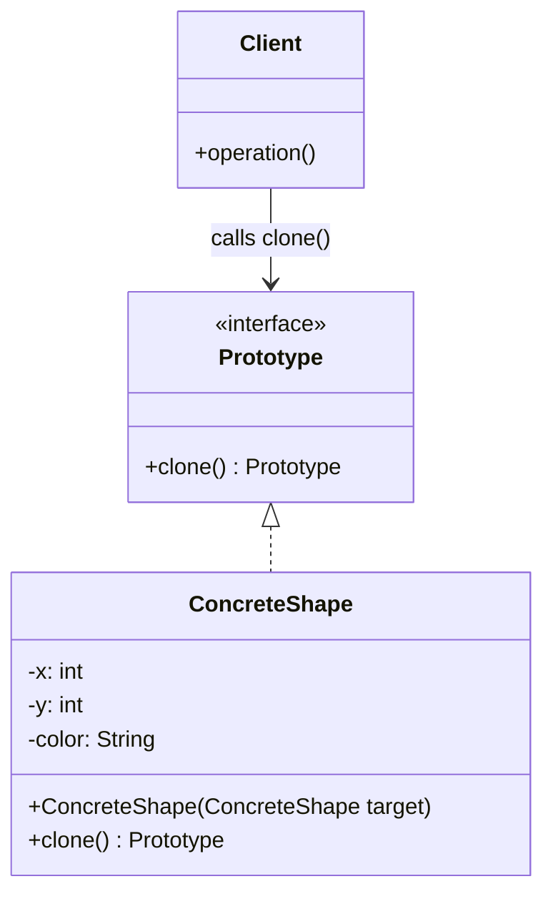

# Prototype Pattern

## Introduction
The Prototype pattern is a creational design pattern that allows you to copy existing objects without making your code dependent on their specific classes. It delegates the cloning process to the actual objects that are being cloned.

## Problem Statement
Imagine you have an object that is extremely complex to construct. It might require heavy database calls, network requests, or intricate calculations to initialize its state. 
If you need a new object that is almost exactly the same (perhaps differing by only one field), creating it from scratch using `new` is a massive performance waste. 
Furthermore, you might only have access to an interface of the object, meaning you don't even know its concrete class, so you *can't* call `new` directly.

## Why this exists
To solve the performance overhead of instantiating complex objects and to decouple client code from the concrete classes it needs to duplicate. By standardizing the cloning process, objects act as templates or "prototypes" for producing new instances.

## Real-world analogy
Consider **Cellular Mitosis**. A cell doesn't build a new cell by gathering raw atoms from scratch. Instead, it acts as a prototype and completely copies itself, splitting into a fully formed replica.
Another analogy is creating a new contract using a **Document Template**. You don't type a new contract from a blank page; you duplicate the template and change the client's name.

## Definition
A creational design pattern that specifies the kinds of objects to create using a prototypical instance, and creates new objects by copying this prototype.

## Key concepts
- **Prototype:** An interface declaring a `clone()` method.
- **Concrete Prototype:** A class implementing the cloning method. It copies its own data into the new object.
- **Client:** Code that triggers the clone operation instead of calling the `new` keyword.
- **Prototype Registry (Optional):** A centralized registry/cache that stores frequently used prototypes for easy retrieval.

## Internal working / Mermaid diagram



## Java implementation

### Bad implementation
Manually copying fields is error-prone, fails when fields are private, and tightly couples the client to the concrete class.

```java
public class Client {
    public void copyShape(Shape original) {
        // Bad: Coupled to Concrete Class. What if `original` is a subclass like Circle?
        Shape copy = new Shape();
        copy.setX(original.getX());
        copy.setY(original.getY());
        // Fails: Private fields that don't have getters cannot be copied!
        // copy.privateData = original.privateData; 
    }
}
```

### Best implementation (Prototype Registry)
Use a `clone()` method so the object duplicates itself, granting access to private fields and ignoring class-coupling.

```java
// 1. Prototype Interface
// (In Java, you can use the built-in Cloneable interface, but custom interfaces are often cleaner)
interface Prototype {
    Prototype clone();
}

// 2. Concrete Prototype
class Monster implements Prototype {
    private String type;
    private int health;
    private int attackPower;

    public Monster(String type, int health, int attackPower) {
        this.type = type;
        this.health = health;
        this.attackPower = attackPower;
    }

    // Copy Constructor utilized by clone()
    protected Monster(Monster target) {
        this.type = target.type;
        this.health = target.health;
        this.attackPower = target.attackPower;
    }

    @Override
    public Monster clone() {
        // The object clones itself! It has full access to its own private fields.
        return new Monster(this);
    }

    public void setHealth(int health) { this.health = health; }
    
    @Override
    public String toString() { return type + " | HP: " + health; }
}

// 3. Prototype Registry (Cache)
class MonsterRegistry {
    private Map<String, Monster> cache = new HashMap<>();

    public MonsterRegistry() {
        // Simulating heavy DB/Network calls
        Monster dragon = new Monster("Dragon", 1000, 50);
        Monster goblin = new Monster("Goblin", 100, 10);
        
        cache.put("Dragon", dragon);
        cache.put("Goblin", goblin);
    }

    public Monster getMonster(String type) {
        // Return a CLONE, not the reference to the cached object!
        return cache.get(type).clone();
    }
}

// Client Code
public class Main {
    public static void main(String[] args) {
        MonsterRegistry spawner = new MonsterRegistry();
        
        // We instantly get a fully formed Dragon without costly initializations
        Monster mob1 = spawner.getMonster("Dragon");
        Monster mob2 = spawner.getMonster("Dragon");
        
        // We modify the clone without affecting the template
        mob2.setHealth(800);
        
        System.out.println(mob1); // Dragon | HP: 1000
        System.out.println(mob2); // Dragon | HP: 800
    }
}
```

## Step-by-step explanation
1. Create the `Prototype` interface declaring the `clone()` method.
2. Implement `clone()` in the concrete class.
3. Create a **copy constructor** in the concrete class. The `clone()` method will simply return `new ConcreteClass(this)`.
4. Ensure the copy constructor handles deep copies for nested reference objects if required.
5. Optionally, create a Prototype Registry map to store pre-configured templates for quick retrieval.

## Multiple real-world examples
1. **Video Games:** Spawning identical enemies or bullets on a screen. Parsing the 3D mesh and textures from disk for every single bullet is fatal to frame rates; cloning an existing loaded bullet is instant.
2. **Configuration objects:** A base `Config` object is read from a file. When a user modifies settings for a specific session, a clone of the base config is created and tweaked.
3. **Java's `Object.clone()`:** Though notoriously flawed in its raw implementation, it represents the native attempt at this pattern.

## Pros
- **Performance:** Eliminates the heavy overhead of initializing complex objects.
- **Convenience:** Allows you to configure complex objects dynamically and use them as templates.
- **Decoupling:** You can clone objects without knowing their concrete classes (relying purely on the interface).

## Cons
- **Deep Copying Hell:** If an object contains references to other objects, which contain references to others, implementing a true deep copy is incredibly difficult and prone to circular reference bugs.
- **Java's `Cloneable` pitfalls:** Java's native `Cloneable` interface and `clone()` method only perform *shallow copies* by default and throw checked exceptions, making it notoriously messy.

## Interview questions

### Beginner
- **Q: What is the main goal of the Prototype pattern?**
- A: To create new objects by copying an existing object (a prototype) instead of instantiating them from scratch, saving performance and setup code.

### Intermediate
- **Q: What is the difference between a Shallow Copy and a Deep Copy?**
- A: A Shallow copy duplicates primitive fields but only copies the *references* to nested objects. Both the original and clone will point to the exact same nested object. A Deep copy duplicates the primitive fields *and* recursively clones all nested reference objects.

### Senior
- **Q: How do you gracefully implement Deep Copying in Java without writing massive boilerplate clone methods?**
- A: Instead of manually writing copy constructors recursively, you can serialize the object (using Java Serialization, JSON (Jackson/Gson), or Kryo) into a byte stream and immediately deserialize it back into a new object. This guarantees a clean, severed deep copy.

### Staff Engineer
- **Q: How does Prototype integrate with the Command pattern?**
- A: In highly dynamic systems (like an undo/redo queue or a macro-recorder), you might need to save the exact state of a Command at a specific moment in time before pushing it to the history stack. The Prototype pattern allows you to clone the Command object preserving its specific state context to ensure perfect reversibility.

## Common mistakes
- **Accidental Shallow Copies:** Relying on Java's `super.clone()` when your object contains a `List` or custom class, leading to shared state bugs where modifying the clone alters the original.
- **Abusing the Registry:** Keeping massive, heavy objects in the Prototype cache indefinitely, causing Memory Leaks.

## Best practices
- Use **Copy Constructors** instead of `Cloneable`. Joshua Bloch highlights that copy constructors (`public Car(Car original)`) are strictly superior to overriding `clone()`.
- Use **Serialization** for complex graph deep-copies if performance overhead permits.

## When NOT to use
- When the object is lightweight, simple, and instantiating it with `new` is fast.
- When your objects have rigid, final external dependencies (like open Socket Connections or Thread Locks) that cannot or should not be duplicated.

## Comparison with similar concepts
- **Prototype vs. Factory Method:** Factory constructs an object from scratch. Prototype clones an already-existing object.
- **Prototype vs. Memento:** Both capture state. Prototype is used to create a completely *new* independent object to work with. Memento is strictly meant for *saving and restoring* the state of the *same* object without exposing its internals.

## Summary
The Prototype pattern provides an efficient alternative to traditional object instantiation by utilizing cloning. It is indispensable in performance-critical applications like game engines or heavy data processors. However, developers must be highly vigilant regarding the dangers of shallow copying nested references.

## Related topics
- Factory Method
- Builder
- Memento