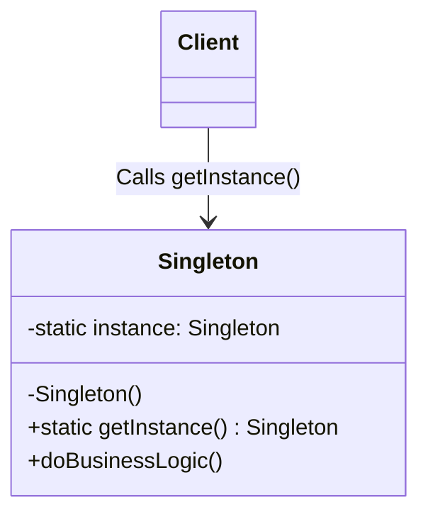

# Singleton Pattern

## Introduction
The Singleton pattern is one of the simplest creational design patterns. It ensures that a class has only one instance while providing a global access point to that instance.

## Problem Statement
In software systems, certain resources must be shared across the entire application to prevent inconsistent states or resource exhaustion. For example, creating multiple database connection pools, configuration managers, or file loggers can lead to redundant memory usage, overwriting of logs, or connection limit errors. 

## Why this exists
The Singleton pattern exists to strictly control object creation. It limits the number of instances of a specific class to exactly one, completely owning the responsibility of instantiating itself and hiding the instantiation logic from external code.

## Real-world analogy
Think of a country's **Government**. A country can have only one official government at any given time. Regardless of the individual identities of the people who form the government, the title "The Government of X" is a global point of access that always identifies the same authoritative body in charge.

## Definition
A creational design pattern that restricts the instantiation of a class to a single object and provides a global point of access to it.

## Key concepts
- **Private Constructor:** Prevents other objects from using the `new` operator with the Singleton class.
- **Static Instance:** Holds the single instance of the class internally.
- **Static Factory Method:** The public method (often `getInstance()`) that acts as a global access point to fetch the single instance.

## Internal working / Mermaid diagram



## Java implementation

### Bad implementation
This implementation uses **Lazy Initialization** but is **not thread-safe**. If two threads call `getInstance()` at exactly the same time, multiple instances can be created.

```java
public class BadSingleton {
    private static BadSingleton instance;
    
    private BadSingleton() {
        // Private constructor
    }
    
    public static BadSingleton getInstance() {
        if (instance == null) {
            instance = new BadSingleton(); // Danger: Race condition here
        }
        return instance;
    }
}
```

### Better implementation
Adding `synchronized` to the method makes it thread-safe, but creates a **severe performance bottleneck**. Every thread calling the method will be blocked, even if the instance has already been safely created.

```java
public class BetterSingleton {
    private static BetterSingleton instance;
    
    private BetterSingleton() {}
    
    public static synchronized BetterSingleton getInstance() {
        if (instance == null) {
            instance = new BetterSingleton();
        }
        return instance;
    }
}
```

### Best implementation
The **Double-Checked Locking** mechanism combined with the `volatile` keyword guarantees thread safety while ensuring synchronization only happens during the very first initialization.

```java
public class BestSingleton {
    // Volatile guarantees visibility of changes to variables across threads
    private static volatile BestSingleton instance;
    
    private BestSingleton() {
        // Protect against instantiation via Reflection
        if (instance != null) {
            throw new IllegalStateException("Already initialized.");
        }
    }
    
    public static BestSingleton getInstance() {
        // First check (no locking)
        if (instance == null) {
            // Lock the class object
            synchronized (BestSingleton.class) {
                // Second check (with locking)
                if (instance == null) {
                    instance = new BestSingleton();
                }
            }
        }
        return instance;
    }
}
```
*(Note: In Java, using an `enum` is arguably an even better implementation because it provides inherent serialization and reflection protection.)*

## Step-by-step explanation
1. **Make the constructor private:** Ensure no external class can directly invoke `new Singleton()`.
2. **Declare a private static variable:** This variable will hold the single instance of the class. Make it `volatile` if using lazy initialization in multithreaded apps.
3. **Provide a public static getter:** Expose a method like `getInstance()`.
4. **Check for existence:** Inside `getInstance()`, check if the instance is `null`. If it is, create it. Otherwise, return the existing one.
5. **Implement locking (Optional but recommended):** Handle multithreaded edge-cases carefully.

## Multiple real-world examples
1. **Database Connection Pool:** Instantiating new DB connections is costly. A singleton connection pool ensures resources are shared globally.
2. **Hardware Interfaces:** Code interfacing with physical hardware (like a printer spooler or GPU) shouldn't allow parallel uncoordinated instructions.
3. **Application Loggers:** A single log file should be accessed by a single logger instance to prevent file-locking crashes.
4. **Configuration Manager:** Application-wide settings parsed from a `.env` or configuration file should be loaded once and kept in a central, globally accessible state.

## Pros
- **Certainty:** You are absolutely sure that a class has only a single instance.
- **Global Access:** You gain a global access point to that instance without passing references deep into the call stack.
- **Lazy Initialization:** The singleton object is only initialized when it's requested for the first time, saving memory.

## Cons
- **Global State:** Disguises bad design, acting similarly to global variables.
- **Testing Difficulty:** Hides dependencies and makes unit testing incredibly difficult because the global state persists across tests.
- **Concurrency Pitfalls:** Extremely easy to get wrong in multithreaded environments.

## Interview questions

### Beginner
- **Q: What is the primary purpose of a Singleton?**
- A: To restrict the instantiation of a class to exactly one object and provide a global point of access to it.

### Intermediate
- **Q: What is the problem with synchronizing the entire `getInstance()` method?**
- A: It causes a huge performance bottleneck because every single read access gets queued up waiting for the lock, even after the object is fully initialized.

### Senior
- **Q: How can you break a Singleton, and how do you prevent it?**
- A: You can break it using **Reflection** (by changing constructor visibility) or **Serialization** (by deserializing into a new object). To prevent this, throw an exception in the constructor if an instance exists, and override the `readResolve()` method to return the existing instance during deserialization.

### Staff Engineer
- **Q: How does the Singleton pattern behave in a distributed microservices environment?**
- A: Singletons are confined to a single JVM/Process. In a distributed system, a "Singleton" class will have one instance per node/service replica. If true system-wide singularity is required, you must use external distributed locks (e.g., via Redis or ZooKeeper) or single-leader architecture.

## Common mistakes
- **Ignoring Thread Safety:** A naive lazy-initialized Singleton is a guaranteed bug in an asynchronous environment.
- **God Objects:** Giving the Singleton too many responsibilities just because it's globally accessible (violating the Single Responsibility Principle).
- **Holding Memory:** Singletons never get garbage collected for the lifetime of the application. Caching huge data in a Singleton causes memory leaks.

## Best practices
- **Use Enums in Java:** Joshua Bloch recommends using an `enum` for Singletons as it guarantees thread safety and serialization safety automatically.
- **Dependency Injection:** Modern frameworks (like Spring) handle Singletons via DI containers automatically. Let the framework manage the lifecycle instead of writing raw Singleton code.

## When NOT to use
- When dealing with multi-tenant architectures where different configurations might be needed per tenant.
- When you prioritize high testability (Singletons inherently resist mocking).

## Comparison with similar concepts
- **Singleton vs. Global Variable:** Global variables can be reassigned; a Singleton prevents reassignment and instantiation of additional objects.
- **Singleton vs. Static Class:** Static classes cannot implement interfaces or inherit from other classes (in most languages). Singletons can be passed around polymorphically.

## Summary
The Singleton pattern is a robust way to ensure exactly one instance of a class exists across the application. While powerful for managing shared resources like loggers and DB connections, it should be used sparingly to avoid introducing tight coupling and hard-to-test global states.

## Related topics
- Factory Method
- Dependency Injection
