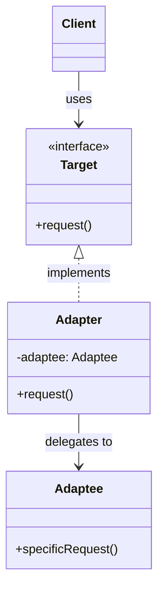

# Adapter Pattern

## Introduction
The Adapter is a structural design pattern that allows objects with incompatible interfaces to collaborate. It acts as a wrapper between two objects, catching calls for one object and transforming them to format and interface recognizable by the second object.

## Problem Statement
Imagine you are building a stock market monitoring app. It downloads XML data from multiple sources and displays nice charts. Later, you want to integrate a 3rd-party analytics library, but it only accepts data in JSON format. You can't change the 3rd-party library, and changing your entire app to use JSON everywhere would break existing code.

## Why this exists
To make existing classes work with others without modifying their source code, acting as a translator between two disparate interfaces.

## Real-world analogy
When you travel from the US to Europe, you can't plug your laptop charger directly into the wall because the power socket shapes are different. You use a power plug adapter. The adapter has an American socket on one end (to fit your charger) and a European plug on the other (to fit the wall). 

## Definition
Convert the interface of a class into another interface clients expect. Adapter lets classes work together that couldn't otherwise because of incompatible interfaces.

## Key concepts
- **Target:** The interface that the client code expects to use.
- **Client:** The class that interacts with the Target interface.
- **Adaptee:** The existing class with an incompatible interface that needs adapting.
- **Adapter:** The class that implements the Target interface and wraps the Adaptee, translating requests from the Target format to the Adaptee format.

## Internal working / Mermaid diagram



## Python/Java implementation

### Java Implementation
```java
// 1. Target Interface (What the client expects)
interface MediaPlayer {
    void play(String audioType, String fileName);
}

// 2. Adaptee (The incompatible 3rd-party class)
class AdvancedMediaPlayer {
    public void playVlc(String fileName) {
        System.out.println("Playing vlc file. Name: " + fileName);
    }
    public void playMp4(String fileName) {
        System.out.println("Playing mp4 file. Name: " + fileName);
    }
}

// 3. Adapter
class MediaAdapter implements MediaPlayer {
    private AdvancedMediaPlayer advancedMusicPlayer;

    public MediaAdapter(String audioType) {
        if(audioType.equalsIgnoreCase("vlc") || audioType.equalsIgnoreCase("mp4")){
            advancedMusicPlayer = new AdvancedMediaPlayer();
        }
    }

    @Override
    public void play(String audioType, String fileName) {
        // Translate the play() call to specific methods in Adaptee
        if(audioType.equalsIgnoreCase("vlc")){
            advancedMusicPlayer.playVlc(fileName);
        } else if(audioType.equalsIgnoreCase("mp4")){
            advancedMusicPlayer.playMp4(fileName);
        }
    }
}

// 4. Client
class AudioPlayer implements MediaPlayer {
    private MediaAdapter mediaAdapter;

    @Override
    public void play(String audioType, String fileName) {
        // Built-in support for mp3
        if(audioType.equalsIgnoreCase("mp3")){
            System.out.println("Playing mp3 file. Name: " + fileName);
        } 
        // MediaAdapter provides support for other formats
        else if(audioType.equalsIgnoreCase("vlc") || audioType.equalsIgnoreCase("mp4")){
            mediaAdapter = new MediaAdapter(audioType);
            mediaAdapter.play(audioType, fileName);
        } else {
            System.out.println("Invalid media. " + audioType + " format not supported");
        }
    }
}

public class Main {
    public static void main(String[] args) {
        AudioPlayer audioPlayer = new AudioPlayer();
        
        audioPlayer.play("mp3", "beyond_the_horizon.mp3");
        audioPlayer.play("mp4", "alone.mp4"); // Handled via Adapter
        audioPlayer.play("vlc", "far_far_away.vlc"); // Handled via Adapter
    }
}
```

## Step-by-step explanation
1. Identify a class (Adaptee) whose interface doesn't match what the client code expects (Target).
2. Create an `Adapter` class that implements the `Target` interface.
3. Inside the `Adapter`, store a reference to the `Adaptee` object.
4. Implement all methods of the `Target` interface in the `Adapter`. These methods should delegate the actual work to the `Adaptee` object, transforming data formats if necessary.

## Multiple real-world examples
1. **Database Drivers:** JDBC (Java) acts as an adapter, translating standard Java SQL commands into the specific proprietary formats required by MySQL, Oracle, or PostgreSQL.
2. **Third-Party Integrations:** Adapting a modern REST API application to communicate with a legacy SOAP XML web service.
3. **UI Components:** Adapting a domain model object so it can be displayed in a generic UI Table component.

## Pros
- **Single Responsibility Principle:** You can separate the interface or data conversion code from the primary business logic of the program.
- **Open/Closed Principle:** You can introduce new types of adapters into the program without breaking the existing client code, as long as they work with the adapters through the client interface.

## Cons
- The overall complexity of the code increases because you need to introduce a set of new interfaces and classes. Sometimes it's simpler just to change the Adaptee class to match the rest of your code.

## Interview questions

### Beginner
- **Q: What is the purpose of the Adapter pattern?**
  - **A:** It allows two objects with incompatible interfaces to work together by wrapping one object inside an adapter that translates the requests.

### Intermediate
- **Q: What is the difference between an Object Adapter and a Class Adapter?**
  - **A:** An Object Adapter uses *composition* (it holds an instance of the Adaptee and delegates to it). A Class Adapter uses *multiple inheritance* (it inherits from both the Target and the Adaptee). Since Java does not support multiple inheritance, Object Adapters are far more common.

### Senior
- **Q: How does the Adapter pattern differ from the Facade pattern?**
  - **A:** An Adapter wraps an *existing* interface to make it compatible with another interface; it doesn't add new behavior, just translates. A Facade defines a *new*, simplified interface to a complex subsystem of many objects.

## Common mistakes
- **Adding logic:** The adapter should only translate/format data and forward the call. It should not contain complex business logic. If it does, you might be looking for a Decorator.
- **Overusing:** If you have access to the source code of both classes and they belong to your domain, just refactor them to share the same interface instead of building unnecessary adapters.

## Best practices
- Keep the adapter simple. Data formatting is acceptable, but heavy computation should be avoided.
- Use dependency injection to pass the Adaptee into the Adapter, making the adapter easier to test.

## When NOT to use
- When you can easily alter the source code of the Adaptee to match the desired interface.

## Comparison with similar concepts
- **Adapter vs Decorator:** Adapter changes the *interface* of an existing object. Decorator enhances an object's *behavior* without changing its interface.
- **Adapter vs Proxy:** Proxy provides the *same* interface as its subject. Adapter provides a *different* interface.

## Summary
The Adapter pattern is a practical, structural patch that saves you from rewriting legacy code or third-party libraries. By acting as a middleman, it bridges the gap between incompatible interfaces, though it comes with a slight increase in architectural complexity.

## Related topics
- [Facade Pattern](../facade)
- [Decorator Pattern](../decorator)
