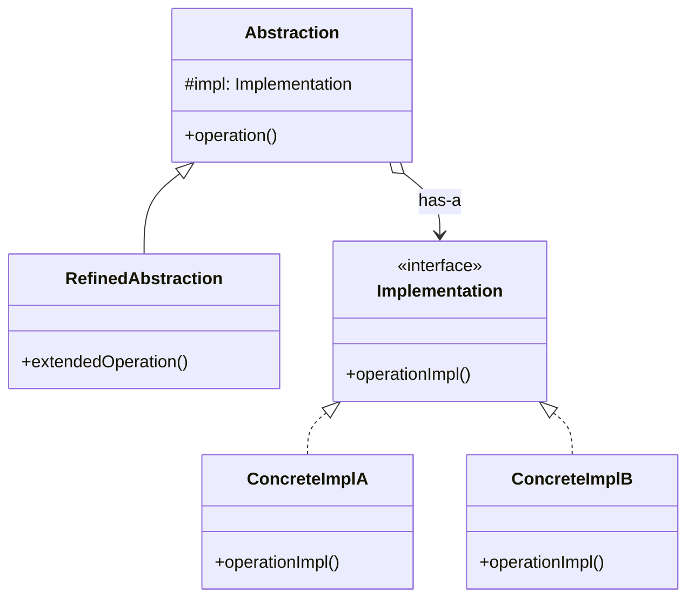

# Bridge Pattern

## Introduction
The Bridge is a structural design pattern that separates an abstraction from its implementation so that the two can vary independently. It avoids a combinatorial explosion of classes that arises when you try to extend a class hierarchy in two independent dimensions.

## Problem Statement
Imagine you have a `Shape` class with two subclasses: `Circle` and `Square`. Now you need to add color variants — `RedCircle`, `BlueCircle`, `RedSquare`, `BlueSquare`. Adding a new shape or a new color doubles the number of classes. With 4 shapes and 5 colors, you need 20 classes. This grows multiplicatively and becomes unmaintainable.

## Why this exists
To decouple an abstraction (what a class does) from its implementation (how it does it), enabling them to evolve independently. Instead of an inheritance explosion, you compose the two dimensions together using aggregation.

## Real-world analogy
Consider a **TV Remote Control and TV**. The remote (Abstraction) provides buttons like power, volume, and channel. The TV (Implementation) handles the actual signal processing. You can use the same remote with a Sony TV or a Samsung TV, and you can have a BasicRemote or an AdvancedRemote — both dimensions change independently.

## Definition
A structural design pattern that decouples an abstraction from its implementation, allowing them to be developed independently using composition instead of inheritance.

## Key concepts
- **Abstraction:** The high-level control layer. Contains a reference to the Implementation.
- **Refined Abstraction:** Extends the Abstraction with additional features.
- **Implementation (Implementor):** The interface for all concrete implementations.
- **Concrete Implementation:** Platform-specific implementations.

## Internal working / Mermaid diagram



## Java implementation

### Bad implementation
Using inheritance to combine two dimensions leads to class explosion.

```java
// Class explosion: 2 shapes × 2 colors = 4 classes. Adding a third color means 6 classes!
class RedCircle extends Circle { /* draw red circle */ }
class BlueCircle extends Circle { /* draw blue circle */ }
class RedSquare extends Square { /* draw red square */ }
class BlueSquare extends Square { /* draw blue square */ }
```

### Best implementation (Bridge Pattern)

```java
// 1. Implementation Interface
interface Color {
    String fill();
}

// 2. Concrete Implementations
class Red implements Color {
    public String fill() { return "Red"; }
}

class Blue implements Color {
    public String fill() { return "Blue"; }
}

// 3. Abstraction
abstract class Shape {
    protected Color color; // Bridge to implementation

    public Shape(Color color) {
        this.color = color;
    }

    abstract void draw();
}

// 4. Refined Abstractions
class Circle extends Shape {
    private int radius;

    public Circle(int radius, Color color) {
        super(color);
        this.radius = radius;
    }

    @Override
    void draw() {
        System.out.println("Drawing Circle [radius: " + radius + ", color: " + color.fill() + "]");
    }
}

class Square extends Shape {
    private int side;

    public Square(int side, Color color) {
        super(color);
        this.side = side;
    }

    @Override
    void draw() {
        System.out.println("Drawing Square [side: " + side + ", color: " + color.fill() + "]");
    }
}

// Client
public class Main {
    public static void main(String[] args) {
        Shape redCircle = new Circle(10, new Red());
        Shape blueSquare = new Square(5, new Blue());

        redCircle.draw();   // Drawing Circle [radius: 10, color: Red]
        blueSquare.draw();  // Drawing Square [side: 5, color: Blue]
    }
}
```

## Python implementation

### Best implementation (Bridge Pattern)

```python
from abc import ABC, abstractmethod

# 1. Implementation Interface
class Color(ABC):
    @abstractmethod
    def fill(self) -> str:
        pass

# 2. Concrete Implementations
class Red(Color):
    def fill(self) -> str:
        return "Red"

class Blue(Color):
    def fill(self) -> str:
        return "Blue"

class Green(Color):
    def fill(self) -> str:
        return "Green"

# 3. Abstraction
class Shape(ABC):
    def __init__(self, color: Color):
        self._color = color  # Bridge to implementation

    @abstractmethod
    def draw(self) -> str:
        pass

# 4. Refined Abstractions
class Circle(Shape):
    def __init__(self, radius: int, color: Color):
        super().__init__(color)
        self._radius = radius

    def draw(self) -> str:
        return f"Drawing Circle [radius: {self._radius}, color: {self._color.fill()}]"

class Square(Shape):
    def __init__(self, side: int, color: Color):
        super().__init__(color)
        self._side = side

    def draw(self) -> str:
        return f"Drawing Square [side: {self._side}, color: {self._color.fill()}]"

# Usage — any shape × any color, no class explosion
shapes = [
    Circle(10, Red()),
    Circle(5, Blue()),
    Square(7, Green()),
]

for shape in shapes:
    print(shape.draw())
# Drawing Circle [radius: 10, color: Red]
# Drawing Circle [radius: 5, color: Blue]
# Drawing Square [side: 7, color: Green]
```

## Step-by-step explanation
1. Identify two independent dimensions in your class hierarchy (e.g., Shape and Color).
2. Extract the second dimension into a separate `Implementation` interface.
3. Create concrete implementations of this interface.
4. Add a reference to the `Implementation` interface inside the `Abstraction` class.
5. The Abstraction delegates implementation-specific work to the linked Implementation object.

## Multiple real-world examples
1. **Cross-Platform UI:** A `Window` abstraction with `WindowsRenderer` and `LinuxRenderer` implementations. The window logic stays the same; only rendering changes per platform.
2. **Database Abstraction Layers:** ORMs like Hibernate/SQLAlchemy where the query abstraction is bridged to database-specific SQL dialects (MySQL, PostgreSQL, SQLite).
3. **Notification Systems:** A `Notification` abstraction (UrgentNotification, RegularNotification) bridged to `Channel` implementations (Email, SMS, Push, Slack).
4. **Device Drivers:** OS kernel abstractions bridged to hardware-specific driver implementations.
5. **Payment Processing:** A `PaymentMethod` abstraction bridged to `PaymentGateway` implementations (Stripe, PayPal).

## Pros
- **Avoid Class Explosion:** Instead of M × N classes, you need only M + N classes.
- **Open/Closed Principle:** You can introduce new abstractions and implementations independently.
- **Single Responsibility:** The abstraction focuses on high-level logic while the implementation handles platform-specific details.
- **Runtime Flexibility:** You can switch implementations at runtime by changing the bridge reference.

## Cons
- **Increased Complexity:** Adds indirection, which can make code harder to follow for simple cases.
- **Over-engineering Risk:** If your class hierarchy only has one dimension of variation, the Bridge pattern is overkill.

## Interview questions

### Beginner
- **Q: What problem does the Bridge pattern solve?**
- A: It prevents a combinatorial explosion of classes that occurs when you try to extend a class hierarchy in two or more independent dimensions using inheritance.

- **Q: How is Bridge different from simple composition?**
- A: Bridge is a specific application of composition where you intentionally decouple an *abstraction* from its *implementation* at a design level. Regular composition is any object holding a reference to another object.

### Intermediate
- **Q: How does the Bridge pattern relate to the Strategy pattern?**
- A: Both use composition to delegate behavior. Strategy typically encapsulates *algorithms* that can be swapped. Bridge separates an entire *abstraction dimension* from its implementation dimension. Bridge is structural; Strategy is behavioral.

- **Q: Can you add a new shape and a new color without modifying existing code?**
- A: Yes, that's the key benefit. Adding a `Triangle` shape requires one new class. Adding `Yellow` color requires one new class. Neither change affects existing Shape or Color classes — perfect Open/Closed Principle compliance.

### Senior
- **Q: When would you prefer Bridge over Adapter?**
- A: Bridge is designed *upfront* to separate abstraction from implementation before the code exists. Adapter is applied *retroactively* to make existing incompatible interfaces work together. Bridge prevents problems; Adapter fixes them.

- **Q: How does JDBC exemplify the Bridge pattern?**
- A: The JDBC API (`Connection`, `Statement`, `ResultSet`) is the Abstraction. Each database vendor (MySQL, PostgreSQL, Oracle) provides a Concrete Implementation via their JDBC Driver. Your application code works with the abstraction, completely unaware of which database is running underneath.

### Staff Engineer
- **Q: How does the Bridge pattern apply to multi-cloud architecture?**
- A: Your application's cloud abstraction layer (storage, compute, messaging) is the Abstraction. Each cloud provider (AWS, GCP, Azure) is a Concrete Implementation. The Bridge allows you to deploy the same application on different clouds by swapping the implementation layer, enabling cloud portability and avoiding vendor lock-in.

- **Q: How does the Bridge pattern interact with Dependency Injection frameworks?**
- A: DI frameworks naturally implement the Bridge. The Abstraction declares a dependency on the Implementation interface, and the DI container injects the appropriate Concrete Implementation at runtime. Spring's `@Qualifier` annotation or profile-based bean selection is essentially runtime Bridge wiring.

## Common mistakes
- **Confusing with Adapter:** Bridge is proactive (designed upfront). Adapter is reactive (applied to existing code). Using Bridge when you actually need to adapt an existing API leads to unnecessary abstraction.
- **Over-abstracting:** Creating a Bridge when there is genuinely only one implementation. YAGNI applies here — don't bridge unless you have or expect multiple implementations.

## Best practices
- Use Bridge when you need to support multiple platforms, rendering engines, or database backends.
- Combine with Abstract Factory to create the correct Abstraction + Implementation pairs at startup.
- Keep the Implementation interface focused on low-level operations that vary across platforms.

## When NOT to use
- When the abstraction has only one implementation and is unlikely to change.
- When the class hierarchy is simple and doesn't exhibit multi-dimensional variation.

## Comparison with similar concepts
- **Bridge vs Adapter:** Bridge separates abstraction from implementation by design. Adapter makes an existing interface work with another after the fact.
- **Bridge vs Strategy:** Strategy swaps algorithms; Bridge separates a full abstraction layer from its implementation. Bridge is broader in scope.
- **Bridge vs Abstract Factory:** Abstract Factory can be used *with* Bridge to create correct Abstraction + Implementation pairs.

## Summary
The Bridge pattern is essential when your class hierarchy threatens to explode along two independent dimensions. By composing an abstraction with its implementation instead of inheriting both, you achieve clean, scalable, and independently evolvable code. It is widely used in cross-platform frameworks, database abstraction layers, and multi-cloud architectures.

## Related topics
- [Adapter](../adapter)
- [Strategy](../../behavioral/strategy)
- [Abstract Factory](../../creational/abstract-factory)
- [Composition vs Inheritance](../../../03-lld/design-principles/composition-vs-inheritance)
