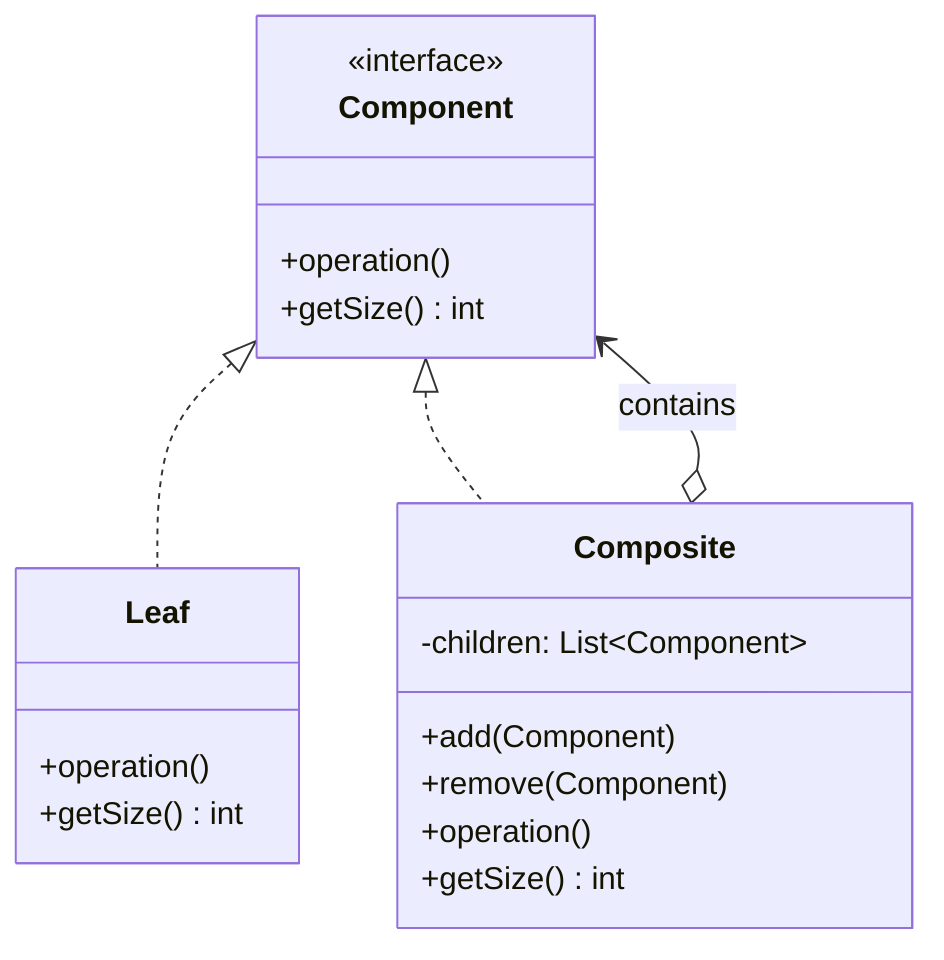

# Composite Pattern

## Introduction
The Composite is a structural design pattern that lets you compose objects into tree structures and then work with these structures as if they were individual objects. It enables clients to treat single objects and compositions of objects uniformly.

## Problem Statement
Imagine building a file system viewer. You have `File` objects and `Folder` objects. A Folder can contain Files and other Folders. When you want to calculate the total size, you need different logic for Files (return their own size) vs. Folders (sum up sizes of all contents recursively). Without Composite, your client code is littered with `instanceof` checks and type-specific handling.

## Why this exists
To eliminate conditional logic that distinguishes between leaf nodes and composite nodes. The client treats everything through a common interface, and the tree structure handles recursion internally.

## Real-world analogy
Consider a **Military Organization**. An army is composed of divisions, which contain brigades, which contain platoons, which contain squads of individual soldiers. When you give an order to the top-level army commander, the order cascades down through the tree. Each level delegates to its children. The general doesn't need to know whether a unit is a single soldier or an entire division — the order propagates uniformly.

## Definition
A structural design pattern that composes objects into tree structures to represent part-whole hierarchies. Composite lets clients treat individual objects and compositions of objects uniformly.

## Key concepts
- **Component:** The common interface for both leaf and composite objects.
- **Leaf:** A basic element with no sub-elements. Does the actual work.
- **Composite:** An element that has sub-elements (children). Delegates work to its children and aggregates results.
- **Client:** Works with all elements through the Component interface.

## Internal working / Mermaid diagram



## Java implementation

### Bad implementation
Client code must check types and handle leaves vs. composites differently.

```java
// Without Composite: client must know the tree structure intimately
public int calculateSize(Object node) {
    if (node instanceof File) {
        return ((File) node).getSize();
    } else if (node instanceof Folder) {
        int total = 0;
        for (Object child : ((Folder) node).getChildren()) {
            total += calculateSize(child); // Recursive, messy type-checking
        }
        return total;
    }
    throw new IllegalArgumentException("Unknown node type");
}
```

### Best implementation (Composite Pattern)

```java
// 1. Component Interface
interface FileSystemComponent {
    int getSize();
    String getName();
    void display(String indent);
}

// 2. Leaf
class File implements FileSystemComponent {
    private String name;
    private int size;

    public File(String name, int size) {
        this.name = name;
        this.size = size;
    }

    public int getSize() { return size; }
    public String getName() { return name; }
    public void display(String indent) {
        System.out.println(indent + "📄 " + name + " (" + size + "KB)");
    }
}

// 3. Composite
class Folder implements FileSystemComponent {
    private String name;
    private List<FileSystemComponent> children = new ArrayList<>();

    public Folder(String name) { this.name = name; }

    public void add(FileSystemComponent component) { children.add(component); }
    public void remove(FileSystemComponent component) { children.remove(component); }

    public int getSize() {
        return children.stream().mapToInt(FileSystemComponent::getSize).sum();
    }

    public String getName() { return name; }

    public void display(String indent) {
        System.out.println(indent + "📁 " + name + " (" + getSize() + "KB)");
        for (FileSystemComponent child : children) {
            child.display(indent + "  ");
        }
    }
}

// Client — treats files and folders uniformly
public class Main {
    public static void main(String[] args) {
        Folder root = new Folder("root");
        Folder src = new Folder("src");
        src.add(new File("Main.java", 10));
        src.add(new File("Utils.java", 5));

        Folder docs = new Folder("docs");
        docs.add(new File("README.md", 3));

        root.add(src);
        root.add(docs);
        root.add(new File("pom.xml", 2));

        root.display("");     // Recursively displays the tree
        System.out.println("Total size: " + root.getSize() + "KB"); // 20KB
    }
}
```

## Python implementation

```python
from abc import ABC, abstractmethod
from typing import List

# 1. Component Interface
class FileSystemComponent(ABC):
    @abstractmethod
    def get_size(self) -> int:
        pass

    @abstractmethod
    def display(self, indent: str = "") -> None:
        pass

# 2. Leaf
class File(FileSystemComponent):
    def __init__(self, name: str, size: int):
        self._name = name
        self._size = size

    def get_size(self) -> int:
        return self._size

    def display(self, indent: str = "") -> None:
        print(f"{indent}📄 {self._name} ({self._size}KB)")

# 3. Composite
class Folder(FileSystemComponent):
    def __init__(self, name: str):
        self._name = name
        self._children: List[FileSystemComponent] = []

    def add(self, component: FileSystemComponent) -> None:
        self._children.append(component)

    def remove(self, component: FileSystemComponent) -> None:
        self._children.remove(component)

    def get_size(self) -> int:
        return sum(child.get_size() for child in self._children)

    def display(self, indent: str = "") -> None:
        print(f"{indent}📁 {self._name} ({self.get_size()}KB)")
        for child in self._children:
            child.display(indent + "  ")

# Usage
root = Folder("root")
src = Folder("src")
src.add(File("main.py", 10))
src.add(File("utils.py", 5))

docs = Folder("docs")
docs.add(File("README.md", 3))

root.add(src)
root.add(docs)
root.add(File("setup.py", 2))

root.display()
# 📁 root (20KB)
#   📁 src (15KB)
#     📄 main.py (10KB)
#     📄 utils.py (5KB)
#   📁 docs (3KB)
#     📄 README.md (3KB)
#   📄 setup.py (2KB)

print(f"Total: {root.get_size()}KB")  # Total: 20KB
```

## Step-by-step explanation
1. Define a `Component` interface with operations common to both simple and complex elements.
2. Create `Leaf` classes representing the terminal objects (no children).
3. Create `Composite` classes that store child components and implement operations by delegating to children.
4. The Composite's methods iterate over children and aggregate results.
5. The client interacts with all objects through the Component interface, never needing to know if it's a leaf or composite.

## Multiple real-world examples
1. **File Systems:** Files (leaves) and directories (composites) form a tree. Operations like `getSize()`, `delete()`, and `search()` work uniformly.
2. **UI Component Trees:** In React, Angular, or Swing, components can contain child components. Rendering cascades through the tree.
3. **Organization Charts:** Employees and departments form a hierarchy. Calculating total salary works uniformly across individuals and teams.
4. **Menu Systems:** A menu can contain menu items (leaves) or sub-menus (composites). Rendering/clicking works uniformly.
5. **Mathematical Expressions:** An expression tree where operands are leaves and operators are composites containing two sub-expressions.

## Pros
- **Uniformity:** Clients treat individual objects and compositions identically, simplifying client code.
- **Open/Closed Principle:** New element types (leaves or composites) can be added without changing existing client code.
- **Natural Recursion:** Tree-structured operations (display, size calculation, search) become naturally recursive.

## Cons
- **Overgeneralization:** Making components too general can make it harder to restrict which children a composite can contain. (e.g., you might not want a `File` to be added to another `File`.)
- **Type Safety:** In languages without generics, enforcing valid compositions at compile time is difficult.

## Interview questions

### Beginner
- **Q: What is the difference between a Leaf and a Composite in this pattern?**
- A: A Leaf is a terminal node with no children — it performs the actual work. A Composite is a container that holds children (both leaves and other composites) and delegates operations to them.

- **Q: Give a real-world example of the Composite pattern.**
- A: A file system: files are leaves, folders are composites. Operations like `getSize()` work uniformly — a file returns its own size, a folder sums up sizes of its contents.

### Intermediate
- **Q: How does Composite support the Open/Closed Principle?**
- A: You can add new Leaf or Composite types without modifying the Component interface or the client code. The client only depends on the Component abstraction.

- **Q: How would you implement a `find()` operation on a Composite tree?**
- A: Leaves check if they match the search criteria and return themselves or null. Composites iterate over their children, calling `find()` recursively, and aggregate all matching results.

### Senior
- **Q: What are the trade-offs of putting child management methods (`add()`, `remove()`) in the Component interface vs. only in the Composite?**
- A: Putting them in Component maximizes transparency (all nodes look the same) but violates ISP — calling `add()` on a Leaf must throw an exception or be a no-op. Putting them only in Composite is type-safe but forces clients to check types before adding children. Most modern implementations prefer type safety.

- **Q: How does the Visitor pattern complement the Composite pattern?**
- A: Visitor lets you define new operations on a Composite tree *without* modifying the Component classes. The tree structure (Composite) handles traversal, and the Visitor handles the operation at each node.

### Staff Engineer
- **Q: How is the Composite pattern used in React's Virtual DOM?**
- A: React components form a Composite tree. Each component can be a leaf (renders HTML) or a composite (renders child components). React's reconciliation algorithm traverses this tree uniformly, computing diffs and applying updates — a perfect Composite pattern application at scale.

- **Q: What are the performance considerations for very deep or wide Composite trees?**
- A: Deep trees cause stack overflow risks with naive recursion (use iterative traversal with an explicit stack). Wide trees with expensive aggregate operations (e.g., `getSize()` on a folder with millions of files) should use caching/memoization to avoid recomputation. Lazy evaluation of children (loading on demand) prevents memory issues.

## Common mistakes
- **Leaf implementing `add()`/`remove()`:** Don't add child-management methods to the Leaf class. It violates the Interface Segregation Principle.
- **Ignoring cycle detection:** If your tree allows references (not strict parent-child), you can accidentally create cycles that cause infinite recursion.

## Best practices
- Keep the Component interface focused on operations that make sense for both leaves and composites.
- Use the Iterator pattern for flexible tree traversal (depth-first, breadth-first).
- Cache aggregate values (like total size) in Composites to avoid recomputing on every access.

## When NOT to use
- When your data structure is flat (not hierarchical).
- When leaves and composites have fundamentally different interfaces with no shared operations.

## Comparison with similar concepts
- **Composite vs Decorator:** Both use recursive composition, but Decorator adds behavior to a single wrapped object. Composite manages a *collection* of children and delegates operations to all of them.
- **Composite vs Iterator:** Composite defines the tree structure. Iterator defines how to traverse it. They are highly complementary.
- **Composite vs Visitor:** Composite owns the structure. Visitor defines operations to execute on each node during traversal.

## Summary
The Composite pattern models part-whole hierarchies by treating individual objects and groups of objects uniformly. It is the foundation of file systems, UI trees, organization charts, and any domain with naturally recursive, tree-like structures. By programming to the Component interface, client code stays clean and extensible.

## Related topics
- [Decorator](../decorator)
- [Iterator](../../behavioral/iterator)
- [Visitor](../../behavioral/visitor)
- [Flyweight](../flyweight)
