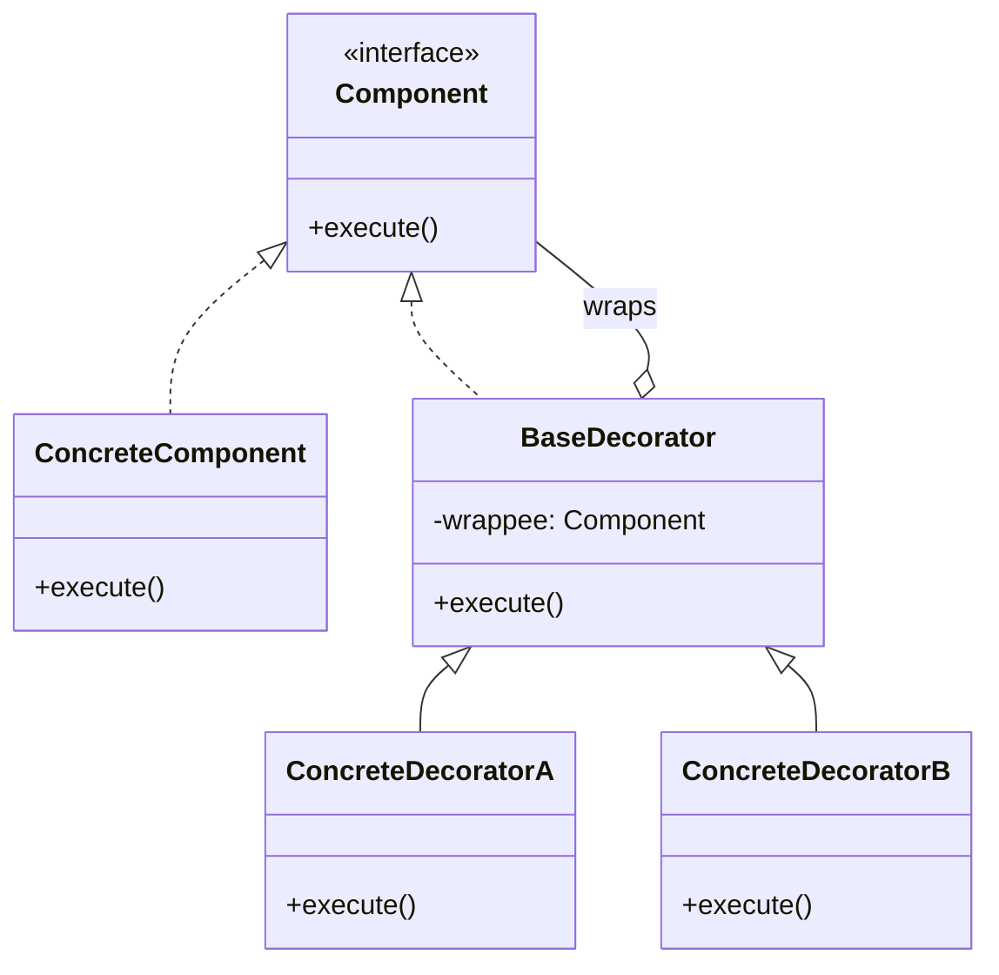

# Decorator Pattern

## Introduction
The Decorator is a structural design pattern that lets you attach new behaviors to objects by placing these objects inside special wrapper objects that contain the behaviors.

## Problem Statement
Imagine building a notification system. Initially, you have a `Notifier` class that sends emails. Later, users want SMS notifications, then Facebook messages, then Slack messages. 
If you use inheritance, you end up with `SMSNotifier`, `FacebookNotifier`, etc. But what if a user wants BOTH SMS and Email? You create `SMSAndEmailNotifier`. The number of subclasses explodes exponentially as you combine different notification channels.

## Why this exists
To dynamically add responsibilities to an object at runtime without altering its underlying class and without creating an exponential explosion of subclasses.

## Real-world analogy
Wearing clothes. 
You are the base object. When it's cold, you wrap yourself in a sweater. If it's raining, you wrap yourself in a raincoat over the sweater. The clothes don't change who you are (your interface), but they add new behaviors (keeping warm, staying dry). You can stack them dynamically.

## Definition
Attach additional responsibilities to an object dynamically. Decorators provide a flexible alternative to subclassing for extending functionality.

## Key concepts
- **Component Interface:** Defines the common interface for both wrappers and wrapped objects.
- **Concrete Component:** The base object being wrapped. It defines the basic behavior.
- **Base Decorator:** Has a field referencing a wrapped object (Component). It delegates all operations to the wrapped object.
- **Concrete Decorators:** Extend the Base Decorator to add extra behaviors before or after calling the wrapped object.

## Internal working / Mermaid diagram



## Python/Java implementation

### Java Implementation
```java
// 1. Component Interface
interface DataSource {
    void writeData(String data);
    String readData();
}

// 2. Concrete Component (The core behavior)
class FileDataSource implements DataSource {
    private String name;

    public FileDataSource(String name) { this.name = name; }

    @Override
    public void writeData(String data) {
        System.out.println("Writing exactly this to " + name + ": " + data);
    }

    @Override
    public String readData() {
        return "Raw data from " + name;
    }
}

// 3. Base Decorator
abstract class DataSourceDecorator implements DataSource {
    protected DataSource wrappee; // Reference to the wrapped object

    public DataSourceDecorator(DataSource source) {
        this.wrappee = source;
    }

    @Override
    public void writeData(String data) {
        wrappee.writeData(data);
    }

    @Override
    public String readData() {
        return wrappee.readData();
    }
}

// 4. Concrete Decorators
class EncryptionDecorator extends DataSourceDecorator {
    public EncryptionDecorator(DataSource source) { super(source); }

    @Override
    public void writeData(String data) {
        String encrypted = "ENCRYPTED(" + data + ")";
        System.out.println("Encrypting data...");
        super.writeData(encrypted);
    }

    @Override
    public String readData() {
        System.out.println("Decrypting data...");
        return "DECRYPTED(" + super.readData() + ")";
    }
}

class CompressionDecorator extends DataSourceDecorator {
    public CompressionDecorator(DataSource source) { super(source); }

    @Override
    public void writeData(String data) {
        String compressed = "COMPRESSED(" + data + ")";
        System.out.println("Compressing data...");
        super.writeData(compressed);
    }

    @Override
    public String readData() {
        System.out.println("Decompressing data...");
        return "DECOMPRESSED(" + super.readData() + ")";
    }
}

// 5. Usage
public class Main {
    public static void main(String[] args) {
        String salaryRecords = "Name,Salary\nJohn Smith,100000";
        
        // Stack decorators: File <- Encryption <- Compression
        DataSource encoded = new CompressionDecorator(
                                new EncryptionDecorator(
                                    new FileDataSource("out.dat")));
        
        // Writes: Compress -> Encrypt -> File
        encoded.writeData(salaryRecords);
        System.out.println("----------------");
        
        // Reads: File -> Decrypt -> Decompress
        encoded.readData();
    }
}
```

### Python Implementation
Python has built-in decorator syntax (`@decorator`), but the GoF Decorator pattern is about wrapping objects with additional behavior via composition.

```python
from abc import ABC, abstractmethod

# 1. Component Interface
class DataSource(ABC):
    @abstractmethod
    def write_data(self, data: str) -> None:
        pass

    @abstractmethod
    def read_data(self) -> str:
        pass

# 2. Concrete Component
class FileDataSource(DataSource):
    def __init__(self, filename: str):
        self._filename = filename
        self._data = ""

    def write_data(self, data: str) -> None:
        self._data = data
        print(f"Writing to {self._filename}: {data}")

    def read_data(self) -> str:
        return f"Raw data from {self._filename}"

# 3. Base Decorator
class DataSourceDecorator(DataSource):
    def __init__(self, source: DataSource):
        self._wrappee = source

    def write_data(self, data: str) -> None:
        self._wrappee.write_data(data)

    def read_data(self) -> str:
        return self._wrappee.read_data()

# 4. Concrete Decorators
class EncryptionDecorator(DataSourceDecorator):
    def write_data(self, data: str) -> None:
        encrypted = f"ENCRYPTED({data})"
        print("Encrypting data...")
        super().write_data(encrypted)

    def read_data(self) -> str:
        print("Decrypting data...")
        return f"DECRYPTED({super().read_data()})"

class CompressionDecorator(DataSourceDecorator):
    def write_data(self, data: str) -> None:
        compressed = f"COMPRESSED({data})"
        print("Compressing data...")
        super().write_data(compressed)

    def read_data(self) -> str:
        print("Decompressing data...")
        return f"DECOMPRESSED({super().read_data()})"

# Usage: Stack decorators dynamically
source = CompressionDecorator(
    EncryptionDecorator(
        FileDataSource("salaries.dat")
    )
)

source.write_data("Name,Salary\nJohn,100000")
# Output:
# Compressing data...
# Encrypting data...
# Writing to salaries.dat: ENCRYPTED(COMPRESSED(Name,Salary\nJohn,100000))

print(source.read_data())
# Output:
# Decompressing data...
# Decrypting data...
# DECOMPRESSED(DECRYPTED(Raw data from salaries.dat))
```

## Step-by-step explanation
1. Ensure your core object and all decorators share the same interface.
2. Create a Base Decorator class that holds a reference to the `Component` interface and delegates all method calls to it.
3. Create Concrete Decorators extending the Base Decorator.
4. In Concrete Decorators, execute the added behavior *before* or *after* calling the `super` method.
5. The client can now wrap objects in multiple layers of decorators dynamically.

## Multiple real-world examples
1. **Java I/O Streams:** `new BufferedReader(new InputStreamReader(new FileInputStream("file.txt")))` is the textbook example of the Decorator pattern.
2. **Web Server Middleware:** Adding logging, authentication, and gzip compression wrappers around an HTTP request handler.
3. **UI Toolkits:** Adding a scrollbar or a border to a text box component by wrapping it in a `ScrollDecorator` or `BorderDecorator`.
4. **Python `@functools.wraps`:** Python function decorators are syntactic sugar for wrapping functions with additional behavior (logging, timing, caching via `@lru_cache`).
5. **Django Middleware:** Each middleware wraps the next one, adding behavior like CSRF protection, session handling, or authentication before/after the view function executes.

## Pros
- **Flexibility:** You can extend an object's behavior without creating a new subclass.
- **Runtime Modification:** You can add or remove responsibilities from an object at runtime.
- **Composition over Inheritance:** You can combine several behaviors by wrapping an object into multiple decorators.
- **Single Responsibility Principle:** You can divide a monolithic class that implements many possible variants of behavior into several smaller classes.

## Cons
- **Lots of small objects:** A design that uses Decorator often results in systems composed of lots of little, identical-looking objects.
- **Ordering matters:** It's hard to implement a decorator in such a way that its behavior doesn't depend on the order in the decorators stack.
- **Ugly configuration:** The initial configuration code of layers might look pretty ugly.

## Interview questions

### Beginner
- **Q: What problem does the Decorator pattern solve?**
  - **A:** It prevents an explosion of subclasses when you need to combine multiple independent behaviors or features on a base object.

- **Q: How does Python's `@decorator` syntax relate to the GoF Decorator pattern?**
  - **A:** Python's `@decorator` syntax is a language-level feature that wraps functions. The GoF Decorator pattern wraps *objects* via composition. They share the same wrapping concept but operate at different levels — functions vs. objects.

### Intermediate
- **Q: How does a Decorator differ from Inheritance?**
  - **A:** Inheritance is static (resolved at compile time) and applies to a whole class. Decorators are dynamic (applied at runtime) and can be attached to individual objects independently of other objects of the same class.

- **Q: Does the order in which you apply decorators matter?**
  - **A:** Yes, critically. If you apply Encryption then Compression, the data is encrypted first, then compressed. If reversed, it’s compressed first, then encrypted. The output differs and one ordering may be more efficient or secure than the other.

### Senior
- **Q: What is the difference between Decorator, Proxy, and Adapter?**
  - **A:** 
    - **Adapter:** Changes the *interface* of an object to make it compatible with something else.
    - **Proxy:** Provides the *same* interface but controls *access* to the object (lazy loading, access control).
    - **Decorator:** Provides the *same* interface but adds new *behavior* (compression, encryption).

- **Q: How would you unit-test a heavily decorated object?**
  - **A:** Test each decorator independently by passing a mock Component. Verify the decorator adds its specific behavior and correctly delegates to the wrappee. Also test the full stack by composing decorators and asserting the combined output.

### Staff Engineer
- **Q: How does the Decorator pattern enable middleware pipelines in web frameworks like Express.js, Django, or Spring?**
  - **A:** Each middleware is a decorator that wraps the next handler in the chain. The request flows through each middleware (authentication → logging → rate-limiting → actual handler), with each middleware adding pre/post processing. This is the Decorator pattern at an architectural scale, enabling pluggable, composable request processing.

- **Q: What are the performance implications of deeply stacked decorators?**
  - **A:** Each decorator adds a method call indirection. With N decorators, every operation traverses N wrapper layers. In hot code paths, this can cause measurable overhead. Mitigation strategies include collapsing decorator chains into a single composite decorator, using bytecode generation (e.g., ASM/Byte Buddy in Java), or caching the decorated result where behavior is idempotent.

## Common mistakes
- **Changing the interface:** A decorator must strictly adhere to the Component interface. If it adds new public methods that clients rely on, it's no longer a pure decorator, and you lose the ability to swap them seamlessly.
- **Decorating large interfaces:** If the Component interface has 20 methods, every decorator has to implement all 20 (or rely on a Base Decorator to forward them). This can be tedious.

## Best practices
- Always use a Base Decorator abstract class to handle the boilerplate of delegating methods to the `wrappee`. Concrete decorators should only override the methods they want to change.
- Keep the Component interface as small and focused as possible.

## When NOT to use
- If the object hierarchy is static and behaviors don't need to be mixed and matched dynamically.

## Comparison with similar concepts
- **Decorator vs Chain of Responsibility:** Decorators usually execute all behaviors in the stack (one after the other). A Chain of Responsibility can break the chain and stop execution at any point.

## Summary
The Decorator pattern is a masterclass in "Composition over Inheritance." It allows you to build complex behaviors dynamically by "wrapping" objects like Russian nesting dolls, all while maintaining a consistent interface for the client code.

## Related topics
- [Adapter Pattern](../adapter)
- [Facade Pattern](../facade)
- [Chain of Responsibility](../../behavioral/chain-of-responsibility)
- [Strategy Pattern](../../behavioral/strategy)
- [Composition vs Inheritance](../../../03-lld/design-principles/composition-vs-inheritance)
