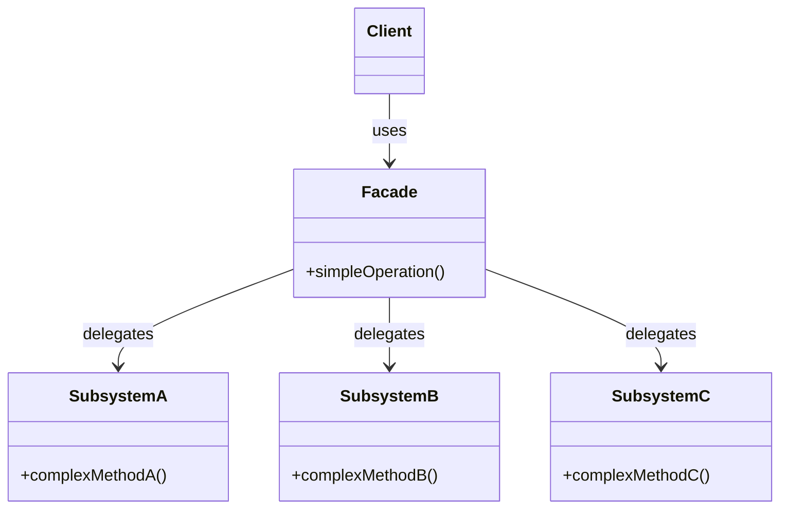

# Facade Pattern

## Introduction
The Facade is a structural design pattern that provides a simplified, higher-level interface to a complex subsystem of classes, libraries, or frameworks.

## Problem Statement
Imagine your application needs to compress a video. Doing this involves interacting with a dozen different classes from a 3rd-party video processing library: `VideoFile`, `OggCompressionCodec`, `MPEG4CompressionCodec`, `CodecFactory`, `BitrateReader`, `AudioMixer`. Your business logic becomes tightly coupled to the intricate details of this 3rd-party library. If the library updates, your core application breaks.

## Why this exists
To hide the structural complexity of a subsystem from the client, making the subsystem easier to use and reducing dependencies.

## Real-world analogy
When you call a restaurant to order pizza for delivery, the person on the phone (the Facade) handles your request. You don't need to talk directly to the dough maker, the cheese grater, the oven operator, and the delivery driver. The operator provides a simple interface to the complex subsystem of the restaurant.

## Definition
Provide a unified interface to a set of interfaces in a subsystem. Facade defines a higher-level interface that makes the subsystem easier to use.

## Key concepts
- **Facade:** A class that offers simple methods, delegating the actual work to the appropriate objects within the subsystem.
- **Additional Facades (Optional):** If a single facade gets too large, you can extract parts of it into another facade.
- **Complex Subsystem:** Consists of dozens of various objects. To make them do something meaningful, you have to dive deep into the subsystem's implementation details.
- **Client:** Uses the facade instead of calling the subsystem objects directly.

## Internal working / Mermaid diagram



## Python/Java implementation

### Java Implementation
```java
// --- Complex Subsystem Classes ---
class VideoFile {
    public VideoFile(String name) { System.out.println("VideoFile: loading " + name); }
}

class CodecFactory {
    public static String extract(VideoFile file) { return "Extracting audio/video..."; }
}

class BitrateReader {
    public static String read(String file, String codec) { return "Reading bitrate..."; }
    public static String convert(String buffer, String codec) { return "Converting video format..."; }
}

class AudioMixer {
    public String fix(String result) { return "Mixing audio... Done."; }
}

// --- The Facade ---
class VideoConversionFacade {
    
    // The facade provides a simple, single method to the client
    public void convertVideo(String fileName, String format) {
        System.out.println("VideoConversionFacade: conversion started.");
        
        VideoFile file = new VideoFile(fileName);
        String sourceCodec = CodecFactory.extract(file);
        
        // Simulating the complex steps required to convert a video
        String buffer = BitrateReader.read(fileName, sourceCodec);
        String intermediateResult = BitrateReader.convert(buffer, format);
        
        AudioMixer mixer = new AudioMixer();
        String finalResult = mixer.fix(intermediateResult);
        
        System.out.println("VideoConversionFacade: conversion completed.");
    }
}

// --- Client ---
public class Main {
    public static void main(String[] args) {
        // The client doesn't need to know about BitrateReaders or AudioMixers
        VideoConversionFacade converter = new VideoConversionFacade();
        converter.convertVideo("funny_cats.ogg", "mp4");
    }
}
```

### Python Implementation
```python
from typing import Optional

# --- Complex Subsystem Classes ---
class VideoFile:
    def __init__(self, name: str):
        self.name = name
        print(f"VideoFile: loading {name}")

class CodecFactory:
    @staticmethod
    def extract(file: VideoFile) -> str:
        return f"codec_for_{file.name}"

class BitrateReader:
    @staticmethod
    def read(file_name: str, codec: str) -> str:
        return f"buffer({file_name}, {codec})"

    @staticmethod
    def convert(buffer: str, format: str) -> str:
        return f"converted({buffer}, {format})"

class AudioMixer:
    def fix(self, result: str) -> str:
        return f"mixed_audio({result})"

# --- The Facade ---
class VideoConversionFacade:
    """Simple, high-level API hiding the complex video subsystem."""

    def convert_video(self, file_name: str, format: str) -> str:
        print("VideoConversionFacade: conversion started.")

        file = VideoFile(file_name)
        source_codec = CodecFactory.extract(file)
        buffer = BitrateReader.read(file_name, source_codec)
        intermediate = BitrateReader.convert(buffer, format)

        mixer = AudioMixer()
        result = mixer.fix(intermediate)

        print("VideoConversionFacade: conversion completed.")
        return result

# --- Client ---
def main():
    converter = VideoConversionFacade()
    result = converter.convert_video("funny_cats.ogg", "mp4")
    print(f"Result: {result}")
```

## Step-by-step explanation
1. Identify a complex subsystem that your client code relies on heavily.
2. Create a `Facade` class.
3. Define simple methods in the `Facade` that encompass the common tasks the client needs.
4. Inside the `Facade` methods, write the complex wiring, instantiation, and orchestration required to make the subsystem perform the task.
5. Have the client call the `Facade` instead of the subsystem directly.

## Multiple real-world examples
1. **API Wrappers:** The `axios` or `fetch` API in JavaScript is essentially a facade over the extremely complex `XMLHttpRequest` object.
2. **Microservices API Gateway:** An API Gateway acts as a facade, hiding the complexity of dozens of underlying microservices from the frontend mobile app.
3. **Computer Startup:** The power button on your computer is a facade. Pressing it triggers the CPU, RAM, Hard Drive, and OS initialization sequence.
4. **Spring's `JdbcTemplate`:** Hides the complexities of JDBC connection management, statement creation, result set parsing, and exception handling behind simple `query()` and `update()` methods.
5. **Python's `requests` Library:** Wraps the complex `urllib3` and `http.client` subsystems into a simple `requests.get(url)` call.

## Pros
- **Loose Coupling:** Isolates your code from the complexity of a subsystem. If the subsystem changes, you only update the Facade, not the rest of your application.
- **Simplicity:** Makes the code significantly easier to read and use for clients who only need a fraction of the subsystem's capabilities.

## Cons
- **God Object Risk:** A facade can become a "God Object" coupled to all classes of an app if you aren't careful about keeping its scope focused.
- **Hides Advanced Features:** If a "power user" client actually needs access to the complex, granular functions of the subsystem, the facade might restrict them. (However, Facade doesn't *prevent* clients from bypassing it and using the subsystem directly).

## Interview questions

### Beginner
- **Q: What is the main benefit of the Facade pattern?**
  - **A:** It hides a complex system behind a simple, easy-to-use interface, reducing coupling and making the system easier to integrate.

- **Q: Does the Facade add new functionality to the subsystem?**
  - **A:** No. The Facade only provides a simplified interface. It delegates all actual work to the subsystem classes. It does not add any new capabilities.

### Intermediate
- **Q: Can a client bypass the Facade and talk to the subsystem directly?**
  - **A:** Yes. The Facade provides a convenient shortcut for common tasks, but it doesn't strictly encapsulate or block access to the subsystem (unlike an Adapter, where the Adaptee is usually completely hidden).

- **Q: When would you use multiple Facades instead of one?**
  - **A:** When the subsystem is very large and the single Facade risks becoming a God Object. Split it into domain-specific facades: `PaymentFacade`, `NotificationFacade`, `ReportingFacade` — each handling a focused set of subsystem operations.

### Senior
- **Q: Compare Facade, Adapter, and Mediator.**
  - **A:** 
    - **Facade:** Simplifies the interface of a complex subsystem for external clients. Unidirectional (Facade -> Subsystem).
    - **Adapter:** Translates an incompatible interface into a compatible one. Unidirectional (Client -> Adapter -> Adaptee).
    - **Mediator:** Centralizes communication between components *within* a system. Bidirectional (`Component <-> Mediator <-> Component`).

- **Q: How does the Facade pattern relate to the Law of Demeter (Principle of Least Knowledge)?**
  - **A:** The Law of Demeter says "only talk to your immediate friends." A Facade is the ultimate embodiment of this — the client talks only to the Facade (one friend), which internally coordinates all the subsystem objects. Without the Facade, the client would be reaching deep into the subsystem’s object graph.

### Staff Engineer
- **Q: When architecting a microservices system, how does the API Gateway relate to the Facade pattern?**
  - **A:** An API Gateway is a distributed Facade. Instead of an external client making 5 separate network calls to Auth, Billing, and Profile services, it makes one call to the Gateway. The Gateway orchestrates downstream calls, aggregates data, and returns a simplified response — exactly like a Facade at the system architecture level.

- **Q: How does the Backend for Frontend (BFF) pattern extend the Facade concept?**
  - **A:** BFF creates multiple, client-specific Facades. Instead of one generic API Gateway, you build a dedicated BFF for the mobile app (returning minimal data) and another for the web app (returning richer data). Each BFF is a Facade tailored to its client's specific needs, optimizing payload size, latency, and API ergonomics.

## Common mistakes
- Putting complex business logic *inside* the Facade. The Facade should only orchestrate and delegate calls to the subsystem, it shouldn't be making business decisions.
- Creating a single monolithic Facade for an entire massive application.

## Best practices
- Create additional Facades to prevent a single Facade from becoming a God Object.
- Ensure the Facade doesn't hold too much state; it should mostly be a stateless router/orchestrator.

## When NOT to use
- If the subsystem is already very simple, a Facade adds unnecessary layers of abstraction.

## Comparison with similar concepts
- **Facade vs Adapter:** Facade defines a new, simpler interface. Adapter uses an existing interface to wrap an incompatible one.

## Summary
The Facade pattern is your best defense against tightly coupling your core application logic to complex, volatile third-party libraries or legacy subsystems. By providing a clean, simple wrapper, it vastly improves code readability and maintainability.

## Related topics
- [Adapter Pattern](../adapter)
- [Decorator Pattern](../decorator)
- [Mediator Pattern](../../behavioral/mediator)
- [API Gateway](../../../02-hld/microservices/api-gateway)
