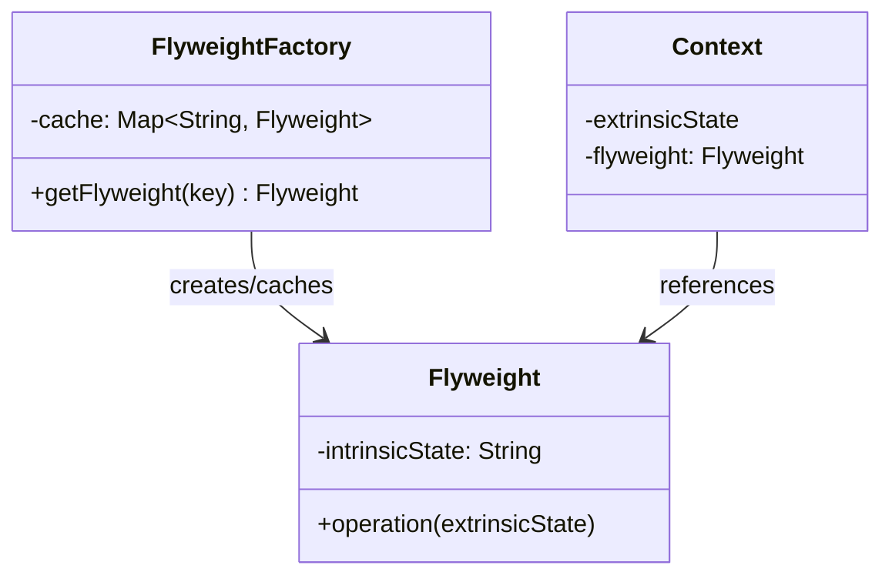

# Flyweight Pattern

## Introduction
The Flyweight is a structural design pattern that lets you fit more objects into the available amount of RAM by sharing common parts of state between multiple objects instead of keeping all of the data in each object.

## Problem Statement
Imagine building a text editor that renders millions of character glyphs on screen. Each character has a font, size, color, and position. If you create a separate object for each character with all its properties, the application will consume gigabytes of RAM for a simple document. Most characters share the same font and size — only position varies.

## Why this exists
To dramatically reduce memory consumption when your application needs to create a very large number of similar objects. It achieves this by extracting the shared (intrinsic) state into a pool of shared objects.

## Real-world analogy
Consider a **Forest in a Video Game**. A forest might contain 10,000 trees, but there are only 5 types of trees (oak, pine, birch, etc.). Instead of storing the mesh data, textures, and colors for all 10,000 trees, you store them once per tree type (5 Flyweight objects). Each rendered tree only stores its unique position coordinates and references the shared data.

## Definition
A structural design pattern that uses sharing to support large numbers of fine-grained objects efficiently by separating intrinsic (shared) state from extrinsic (unique) state.

## Key concepts
- **Intrinsic State:** The shared, immutable data stored inside the Flyweight object (e.g., tree type, mesh, texture).
- **Extrinsic State:** The unique data that varies per context, passed in by the client (e.g., position, scale).
- **Flyweight:** The shared object containing intrinsic state only.
- **Flyweight Factory:** Creates and manages the pool of Flyweight objects, ensuring sharing.
- **Context:** Stores or passes the extrinsic state alongside a reference to the Flyweight.

## Internal working / Mermaid diagram



## Java implementation

### Bad implementation
Creating a full object per tree wastes enormous memory.

```java
// Each tree stores ALL data — for 10,000 trees, this is catastrophic
class Tree {
    private int x, y;              // Unique per tree
    private String name;           // Shared (e.g., "Oak")
    private String color;          // Shared
    private byte[] textureData;    // Shared — 5MB each!
    private byte[] meshData;       // Shared — 10MB each!

    // 10,000 trees × 15MB = 150GB of RAM!
}
```

### Best implementation (Flyweight Pattern)

```java
// 1. Flyweight — stores only INTRINSIC (shared) state
class TreeType {
    private final String name;
    private final String color;
    private final String texture;  // In real code, this would be large data

    public TreeType(String name, String color, String texture) {
        this.name = name;
        this.color = color;
        this.texture = texture;
    }

    public void draw(int x, int y) {
        System.out.println("Drawing " + name + " [" + color + "] at (" + x + "," + y + ")");
    }
}

// 2. Flyweight Factory
class TreeFactory {
    private static final Map<String, TreeType> treeTypes = new HashMap<>();

    public static TreeType getTreeType(String name, String color, String texture) {
        String key = name + "_" + color + "_" + texture;
        if (!treeTypes.containsKey(key)) {
            treeTypes.put(key, new TreeType(name, color, texture));
            System.out.println("Creating new TreeType: " + key);
        }
        return treeTypes.get(key);
    }

    public static int getTotalTypes() { return treeTypes.size(); }
}

// 3. Context — stores EXTRINSIC state + reference to Flyweight
class Tree {
    private final int x, y;           // Extrinsic state (unique per tree)
    private final TreeType type;      // Reference to shared Flyweight

    public Tree(int x, int y, TreeType type) {
        this.x = x; this.y = y; this.type = type;
    }

    public void draw() { type.draw(x, y); }
}

// Client
public class Forest {
    private List<Tree> trees = new ArrayList<>();

    public void plantTree(int x, int y, String name, String color, String texture) {
        TreeType type = TreeFactory.getTreeType(name, color, texture);
        trees.add(new Tree(x, y, type));
    }

    public void draw() {
        for (Tree tree : trees) tree.draw();
    }

    public static void main(String[] args) {
        Forest forest = new Forest();
        // Plant 10,000 trees but only 3 TreeType objects are created
        for (int i = 0; i < 5000; i++) {
            forest.plantTree(i, i * 2, "Oak", "Green", "oak_texture");
        }
        for (int i = 0; i < 3000; i++) {
            forest.plantTree(i, i * 3, "Pine", "DarkGreen", "pine_texture");
        }
        for (int i = 0; i < 2000; i++) {
            forest.plantTree(i, i * 4, "Birch", "White", "birch_texture");
        }

        System.out.println("Total trees: 10,000");
        System.out.println("Unique TreeTypes: " + TreeFactory.getTotalTypes()); // 3
    }
}
```

## Python implementation

```python
from typing import Dict, Tuple

# 1. Flyweight — stores INTRINSIC (shared) state only
class TreeType:
    def __init__(self, name: str, color: str, texture: str):
        self.name = name
        self.color = color
        self.texture = texture  # In real code, this would be large data

    def draw(self, x: int, y: int) -> None:
        print(f"Drawing {self.name} [{self.color}] at ({x},{y})")

# 2. Flyweight Factory
class TreeFactory:
    _cache: Dict[str, TreeType] = {}

    @classmethod
    def get_tree_type(cls, name: str, color: str, texture: str) -> TreeType:
        key = f"{name}_{color}_{texture}"
        if key not in cls._cache:
            cls._cache[key] = TreeType(name, color, texture)
            print(f"Creating new TreeType: {key}")
        return cls._cache[key]

    @classmethod
    def total_types(cls) -> int:
        return len(cls._cache)

# 3. Context — stores EXTRINSIC state + reference to Flyweight
class Tree:
    def __init__(self, x: int, y: int, tree_type: TreeType):
        self.x = x
        self.y = y
        self.type = tree_type

    def draw(self) -> None:
        self.type.draw(self.x, self.y)

# Client
class Forest:
    def __init__(self):
        self._trees = []

    def plant_tree(self, x: int, y: int, name: str, color: str, texture: str):
        tree_type = TreeFactory.get_tree_type(name, color, texture)
        self._trees.append(Tree(x, y, tree_type))

    def draw(self):
        for tree in self._trees:
            tree.draw()

# Usage
forest = Forest()
for i in range(5000):
    forest.plant_tree(i, i * 2, "Oak", "Green", "oak.png")
for i in range(3000):
    forest.plant_tree(i, i * 3, "Pine", "DarkGreen", "pine.png")

print(f"Total trees: {len(forest._trees)}")          # 8000
print(f"Unique TreeTypes: {TreeFactory.total_types()}") # 2
```

## Step-by-step explanation
1. Split the object's fields into **intrinsic** (shared, immutable) and **extrinsic** (unique, context-specific).
2. Keep only intrinsic state inside the Flyweight class. Make it immutable.
3. Create a Flyweight Factory that caches and returns existing Flyweight objects.
4. Move extrinsic state to the client (Context) objects or pass it as method parameters.
5. The Context stores a reference to the shared Flyweight and its own extrinsic state.

## Multiple real-world examples
1. **Video Game Rendering:** Sharing mesh/texture data across thousands of identical objects (trees, bullets, NPCs).
2. **Text Editors:** Sharing font/style objects across millions of characters. Only position and character code are unique.
3. **Java's `Integer.valueOf()`:** Caches Integer objects from -128 to 127. `Integer.valueOf(42) == Integer.valueOf(42)` returns `true` because they share the same Flyweight.
4. **Python's String Interning:** Python automatically interns small strings. `a = "hello"; b = "hello"; a is b` returns `True` — same object in memory.
5. **Browser DOM Rendering:** CSS styles are shared across elements via class selectors rather than inlining styles on every element.

## Pros
- **Memory Savings:** Dramatic reduction in RAM when dealing with large numbers of similar objects.
- **Performance:** Less memory pressure means fewer garbage collections and better cache locality.

## Cons
- **Code Complexity:** Splitting state into intrinsic/extrinsic and managing the factory adds complexity.
- **CPU Trade-off:** Computing extrinsic state or looking up Flyweights trades CPU time for memory savings.
- **Thread Safety:** The Flyweight Factory must be thread-safe if used in concurrent environments.

## Interview questions

### Beginner
- **Q: What is the difference between intrinsic and extrinsic state?**
- A: Intrinsic state is shared and immutable — it's stored inside the Flyweight (e.g., tree type, texture). Extrinsic state is unique per context — it's stored outside the Flyweight (e.g., position coordinates).

- **Q: When should you use the Flyweight pattern?**
- A: When your application creates a very large number of similar objects, and the memory cost is prohibitive. The objects must have significant shared state that can be extracted.

### Intermediate
- **Q: How does Java's `String.intern()` relate to the Flyweight pattern?**
- A: `String.intern()` maintains a pool of unique strings. When you call `intern()`, the JVM returns the pooled instance if it exists, avoiding duplicate String objects. This is the Flyweight pattern applied to string management.

- **Q: Why must Flyweight objects be immutable?**
- A: Because they are shared across multiple contexts. If one context modified the Flyweight's intrinsic state, all other contexts sharing that Flyweight would be affected, causing unpredictable bugs.

### Senior
- **Q: How would you implement a thread-safe Flyweight Factory?**
- A: Use a `ConcurrentHashMap` or synchronize the factory method. In Java, `computeIfAbsent()` on `ConcurrentHashMap` is atomic and ideal: `cache.computeIfAbsent(key, k -> new Flyweight(k))`. In Python, use a `threading.Lock` around the cache check.

- **Q: What is the relationship between Flyweight and the Object Pool pattern?**
- A: Both cache and reuse objects. However, a Flyweight is *shared* — multiple clients reference the *same* Flyweight simultaneously. An Object Pool lends objects *exclusively* — a pooled object is used by one client at a time and returned when done.

### Staff Engineer
- **Q: How do modern game engines implement the Flyweight pattern at scale?**
- A: Game engines use GPU instancing, where a single mesh/texture (Flyweight) is uploaded to the GPU once, and thousands of instances are rendered with different transform matrices (extrinsic state) in a single draw call. This is Flyweight at the hardware level, achieving near-zero CPU overhead per instance.

- **Q: How does the Flyweight pattern apply to caching layers in distributed systems?**
- A: In distributed caching (Redis, Memcached), frequently accessed data structures are stored once and referenced by many services. Each service adds its own context (request-specific data) while sharing the cached entity. This is the Flyweight concept applied across network boundaries.

## Common mistakes
- **Mutating Flyweights:** Modifying intrinsic state of a shared Flyweight corrupts all contexts using it. Always make Flyweight objects immutable.
- **Over-optimizing:** Applying Flyweight when you only have a few objects. The factory overhead isn't worth it unless you have thousands or millions of instances.
- **Ignoring thread safety in the Factory:** In concurrent environments, the factory can create duplicate Flyweights without proper synchronization.

## Best practices
- Make all Flyweight fields `final` (Java) or use `@dataclass(frozen=True)` (Python) to enforce immutability.
- Use `ConcurrentHashMap.computeIfAbsent()` for thread-safe Flyweight factories in Java.
- Profile memory usage before and after applying Flyweight to validate the benefit.

## When NOT to use
- When objects don't have significant shared state.
- When the number of objects is small (hundreds, not thousands).
- When memory is not a constraint (e.g., server-side processing with abundant RAM).

## Comparison with similar concepts
- **Flyweight vs Singleton:** Singleton ensures one instance per class. Flyweight caches multiple shared instances keyed by their intrinsic state.
- **Flyweight vs Object Pool:** Flyweight shares objects simultaneously. Object Pool lends objects exclusively.
- **Flyweight vs Prototype:** Prototype creates *copies* of objects. Flyweight *shares* the same object across multiple contexts.

## Summary
The Flyweight pattern is a memory optimization technique that shares intrinsic state across many objects while keeping extrinsic state external. It is essential in performance-critical domains like game engines, text rendering, and large-scale data processing where millions of similar objects would otherwise exhaust available memory.

## Related topics
- [Singleton](../../creational/singleton)
- [Composite](../composite)
- [Factory Method](../../creational/factory)
- [Prototype](../../creational/prototype)
