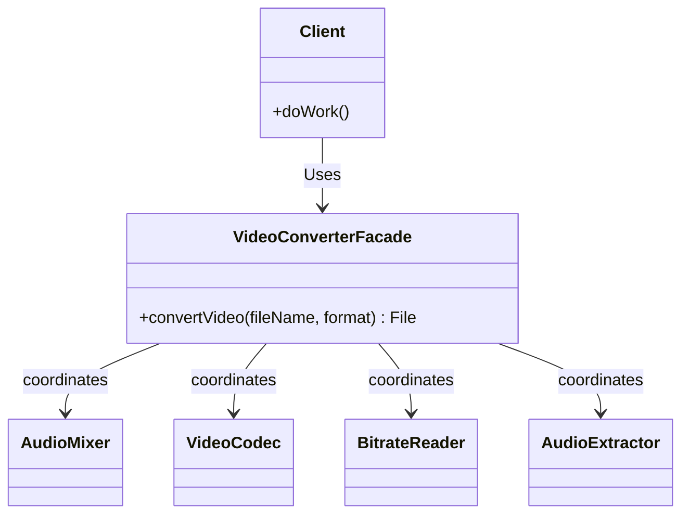

# Facade Pattern

## Introduction
The Facade is a structural design pattern that provides a simplified, higher-level interface to a complex subsystem. It hides the complexities of a larger system and provides a clean, easy-to-use entry point for the client.

## Problem Statement
Imagine your application needs to convert video files. To do this, it must interact with a sophisticated 3rd-party video conversion library.

You have to initialize the framework, select an audio codec, configure video bitrates, map color spaces, allocate memory buffers, and finally invoke the render pipeline. 
Your client code becomes tightly coupled with dozens of classes from the 3rd-party library. Understanding and maintaining this boilerplate everywhere you need to convert a video becomes a nightmare.

## Why this exists
To minimize system complexity and reduce dependencies. A Facade shields clients from the complex internal workings of a subsystem by providing a single, highly readable wrapper class that handles all the intricate initialization and delegation.

## Real-world analogy
Consider **Ordering Food at a Restaurant**.
You don't walk into the kitchen, check the fridge, tell the chef to heat the stove, wait for the soup to boil, and then plate it. 
Instead, you interact with the **Waiter** (the Facade). You simply say, "I want a bowl of soup." The Waiter communicates with the kitchen, the inventory, and the billing system, and brings you your soup.

## Definition
A structural design pattern that provides a unified interface to a set of interfaces in a subsystem. Facade defines a higher-level interface that makes the subsystem easier to use.

## Key concepts
- **Facade:** A class providing a simple interface to the complex logic of one or several subsystems.
- **Subsystem Classes:** Dozens of complex classes that do the actual work. They are completely unaware of the Facade.
- **Client:** Interacts entirely with the Facade rather than calling subsystem objects directly.

## Internal working / Mermaid diagram



## Java implementation

### Bad implementation
Client code interacts directly with the complex subsystem, violating the Principle of Least Knowledge.

```java
public class Client {
    public void processVideo(String filename) {
        // The client is burdened with ALL the initialization logic
        VideoFile file = new VideoFile(filename);
        Codec sourceCodec = CodecFactory.extract(file);
        Codec destinationCodec = new MPEG4CompressionCodec();
        Buffer buffer = BitrateReader.read(filename, sourceCodec);
        Video convertedVideo = BitrateReader.convert(buffer, destinationCodec);
        AudioMixer audioMixer = new AudioMixer();
        File result = audioMixer.fix(convertedVideo);
        
        System.out.println("Video converted.");
    }
}
```

### Best implementation (Facade)
The client delegates to a clean Facade class, decoupling it from the heavy subsystem dependencies.

```java
// 1. Complex Subsystem Classes (Omitted details for brevity)
class VideoFile { public VideoFile(String name) {} }
class CodecFactory { public static Object extract(VideoFile f) { return new Object(); } }
class MPEG4CompressionCodec {}
class BitrateReader {
    public static Object read(String name, Object codec) { return new Object(); }
    public static Object convert(Object buffer, Object codec) { return new Object(); }
}
class AudioMixer { public String fix(Object video) { return "converted.mp4"; } }

// 2. The Facade
public class VideoConverterFacade {
    
    // Provides a single, simple method for the client
    public String convertVideo(String fileName, String format) {
        System.out.println("Facade: Starting conversion process...");
        
        VideoFile file = new VideoFile(fileName);
        Object sourceCodec = CodecFactory.extract(file);
        
        Object destinationCodec;
        if (format.equals("mp4")) {
            destinationCodec = new MPEG4CompressionCodec();
        } else {
            destinationCodec = new Object(); // OGG, etc.
        }
        
        Object buffer = BitrateReader.read(fileName, sourceCodec);
        Object intermediateResult = BitrateReader.convert(buffer, destinationCodec);
        
        AudioMixer mixer = new AudioMixer();
        String finalResult = mixer.fix(intermediateResult);
        
        System.out.println("Facade: Conversion completed.");
        return finalResult;
    }
}

// 3. Client Code
public class Client {
    public static void main(String[] args) {
        // The client only needs to know about the Facade!
        VideoConverterFacade converter = new VideoConverterFacade();
        String result = converter.convertVideo("my_home_video.ogg", "mp4");
        
        System.out.println("Result: " + result);
    }
}
```

## Step-by-step explanation
1. Identify a complex subsystem filled with interdependent classes that clients must frequently configure to do a simple task.
2. Create a new `Facade` class.
3. Define simple methods on the Facade that correspond to the primary tasks the client needs.
4. Inside the Facade methods, instantiate and coordinate the complex subsystem classes to achieve the goal.
5. Update client code to invoke the Facade instead of the subsystem directly.

## Multiple real-world examples
1. **Spring Framework `JdbcTemplate`:** Interacting with native JDBC requires opening connections, creating statements, executing queries, parsing ResultSets, and handling SQL Exceptions manually. `JdbcTemplate` is a Facade that reduces this to a single `.query()` method.
2. **Operating System APIs:** Behind the scenes, saving a file requires spinning up the hard drive disk, mapping file system inodes, checking security permissions, and streaming bytes. The OS provides a Facade: `File.save()`.
3. **E-Commerce Checkout:** When a user clicks "Buy", a `CheckoutFacade` coordinates the PaymentGateway, InventoryManager, ShippingService, and EmailNotifier in the background.

## Pros
- **Loose Coupling:** The client code is isolated from the complexity of the subsystem. If the subsystem's API changes or is upgraded, only the Facade needs to be updated.
- **Better Readability:** The API available to the client becomes significantly cleaner and domain-focused.
- **Enforces Layering:** Acts as an architectural boundary between your business logic and 3rd-party libraries.

## Cons
- **God Object Anti-Pattern:** If not carefully designed, a Facade can grow to encompass too much functionality and become a "God Object" tightly coupled to every single class in the application.
- **Limits Power Users:** By abstracting away complexity, the Facade restricts clients from using advanced, fine-grained features of the subsystem (though they can still bypass the Facade if strictly necessary).

## Interview questions

### Beginner
- **Q: Does a Facade prevent a client from accessing the underlying subsystem?**
- A: No. A Facade provides a convenient shortcut for standard tasks, but it does not encapsulate or hide the subsystem classes entirely. A client can still bypass the Facade if they need advanced functionality.

### Intermediate
- **Q: What's the difference between Facade and Adapter?**
- A: An **Adapter** takes an *incompatible* interface and translates it so it can work with a target interface. A **Facade** takes a *complex* interface (or set of interfaces) and simplifies it. 

### Senior
- **Q: How does Facade relate to the Principle of Least Knowledge (Law of Demeter)?**
- A: The Law of Demeter states a module should not know about the internal details of the objects it manipulates. By using a Facade, the client only talks to "one friend" (the Facade) rather than interacting with the dozens of "friends of friends" in the subsystem.

### Staff Engineer
- **Q: When architecting a microservices system, how does the API Gateway relate to the Facade pattern?**
- A: An API Gateway is essentially a distributed Facade for the entire backend. Instead of an external client (like a mobile app) making 5 separate network calls to the Auth Service, Billing Service, and Profile Service, it makes one call to the API Gateway. The Gateway orchestrates the downstream calls, aggregating the data into a simplified response, perfectly mirroring the Facade pattern at the system architecture level.

## Common mistakes
- **Adding Business Logic to the Facade:** The Facade is meant to be a structural router/orchestrator. It should not contain complex core application business logic.
- **Creating a massive God Class:** Instead of one massive Facade for a giant system, it is better to create multiple, specific Facades (e.g., `PaymentFacade`, `NotificationFacade`).

## Best practices
- Make the Facade an Interface. If you define your Facade as an interface and implement it with a concrete class, you can easily mock it out during unit testing of the Client code.
- Create additional Facades if the main Facade gets too bloated.

## When NOT to use
- When the subsystem is already simple and highly cohesive.
- When the client strictly requires fine-grained control over the subsystem's configuration at all times.

## Comparison with similar concepts
- **Facade:** Simplifies a complex interface of multiple classes.
- **Adapter:** Translates an incompatible interface into a compatible one.
- **Mediator:** Centralizes complex communication *between* components, rather than providing a top-down wrapper. Components in a Mediator are aware of the Mediator, whereas subsystem classes are completely unaware of the Facade.

## Summary
The Facade pattern is an essential architectural tool to manage complexity and reduce coupling. By providing a simplified wrapper over intricate subsystems or 3rd-party libraries, it makes client code infinitely more readable, maintainable, and resilient to downstream API changes.

## Related topics
- [Adapter](/01-design-patterns/structural/adapter)
- API Gateway (HLD)