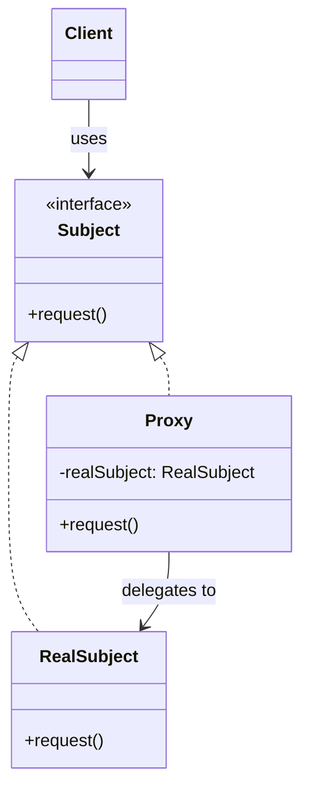

# Proxy Pattern

## Introduction
The Proxy is a structural design pattern that provides a substitute or placeholder for another object. A proxy controls access to the original object, allowing you to perform something either before or after the request gets through to the original object.

## Problem Statement
Imagine you have a massive `DatabaseQuery` object that loads several gigabytes of data from a remote server when initialized. Most of the time, your application only needs this data occasionally. Eagerly initializing it wastes memory and slows startup. You need a way to delay the initialization until the data is actually requested, without changing the client code.

## Why this exists
To control access to an object without changing the client code that uses it. Proxies can add lazy initialization, access control, logging, caching, or remote communication — all transparently.

## Real-world analogy
Consider a **Credit Card**. It acts as a proxy for your bank account (the real subject). The credit card provides the same interface (swipe to pay) but adds access control (credit limit check), logging (transaction history), and remote access (communicating with the bank). The merchant doesn't need to know about your actual bank account.

## Definition
A structural design pattern that provides a surrogate or placeholder for another object to control access to it. The proxy has the same interface as the real object.

## Key concepts
- **Subject Interface:** The common interface for both the RealSubject and the Proxy.
- **RealSubject:** The actual object that does the real work.
- **Proxy:** Holds a reference to the RealSubject and controls access to it. It implements the same interface as the RealSubject.
- **Types of Proxies:**
  - **Virtual Proxy:** Delays expensive object creation until needed (lazy initialization).
  - **Protection Proxy:** Controls access based on permissions.
  - **Remote Proxy:** Represents an object in a different address space (network).
  - **Logging Proxy:** Keeps a log of requests before forwarding them.
  - **Caching Proxy:** Caches results of expensive operations.

## Internal working / Mermaid diagram



## Java implementation

### Bad implementation
Client directly creates expensive objects even when they might not be needed.

```java
// Heavy object always created eagerly
class HeavyDatabaseQuery {
    public HeavyDatabaseQuery() {
        // Simulating expensive initialization
        System.out.println("Loading 5GB of data from remote server...");
        try { Thread.sleep(3000); } catch (Exception e) {}
    }

    public String query(String sql) {
        return "Result of: " + sql;
    }
}

// Client always pays the initialization cost
HeavyDatabaseQuery db = new HeavyDatabaseQuery(); // 3-second delay even if never queried
```

### Best implementation (Proxy Pattern)

```java
// 1. Subject Interface
interface Database {
    String query(String sql);
}

// 2. RealSubject — the expensive object
class RealDatabase implements Database {
    public RealDatabase() {
        System.out.println("RealDatabase: Loading data from server...");
        // Expensive initialization
    }

    public String query(String sql) {
        return "Result of: " + sql;
    }
}

// 3. Virtual Proxy — delays initialization until first use
class DatabaseProxy implements Database {
    private RealDatabase realDatabase; // Lazy

    public String query(String sql) {
        if (realDatabase == null) {
            System.out.println("Proxy: First access — initializing RealDatabase...");
            realDatabase = new RealDatabase();
        }
        System.out.println("Proxy: Forwarding query...");
        return realDatabase.query(sql);
    }
}

// 4. Protection Proxy — adds access control
class SecureDatabaseProxy implements Database {
    private RealDatabase realDatabase;
    private String userRole;

    public SecureDatabaseProxy(String userRole) {
        this.userRole = userRole;
    }

    public String query(String sql) {
        if (!userRole.equals("ADMIN")) {
            System.out.println("Access Denied: Only ADMIN can query.");
            return null;
        }
        if (realDatabase == null) {
            realDatabase = new RealDatabase();
        }
        return realDatabase.query(sql);
    }
}

// Client — uses proxy transparently
public class Main {
    public static void main(String[] args) {
        Database db = new DatabaseProxy();
        // No heavy initialization yet!
        System.out.println("Application started.");

        // Initialization happens only on first query
        System.out.println(db.query("SELECT * FROM users"));
    }
}
```

## Python implementation

```python
from abc import ABC, abstractmethod
from typing import Optional
import time

# 1. Subject Interface
class Database(ABC):
    @abstractmethod
    def query(self, sql: str) -> str:
        pass

# 2. RealSubject — expensive object
class RealDatabase(Database):
    def __init__(self):
        print("RealDatabase: Loading data from server...")
        time.sleep(1)  # Simulating expensive initialization

    def query(self, sql: str) -> str:
        return f"Result of: {sql}"

# 3. Virtual Proxy — lazy initialization
class DatabaseProxy(Database):
    def __init__(self):
        self._real_db: Optional[RealDatabase] = None

    def query(self, sql: str) -> str:
        if self._real_db is None:
            print("Proxy: First access — initializing RealDatabase...")
            self._real_db = RealDatabase()
        print("Proxy: Forwarding query...")
        return self._real_db.query(sql)

# 4. Caching Proxy — caches repeated queries
class CachingDatabaseProxy(Database):
    def __init__(self):
        self._real_db: Optional[RealDatabase] = None
        self._cache: dict = {}

    def query(self, sql: str) -> str:
        if sql in self._cache:
            print(f"Proxy: Cache HIT for '{sql}'")
            return self._cache[sql]

        if self._real_db is None:
            self._real_db = RealDatabase()

        print(f"Proxy: Cache MISS for '{sql}' — querying database...")
        result = self._real_db.query(sql)
        self._cache[sql] = result
        return result

# 5. Protection Proxy — access control
class SecureDatabaseProxy(Database):
    def __init__(self, user_role: str):
        self._real_db: Optional[RealDatabase] = None
        self._user_role = user_role

    def query(self, sql: str) -> str:
        if self._user_role != "ADMIN":
            return "Access Denied: Only ADMIN can query."

        if self._real_db is None:
            self._real_db = RealDatabase()
        return self._real_db.query(sql)

# Usage
print("=== Virtual Proxy ===")
db = DatabaseProxy()
print("Application started. No heavy init yet.")
print(db.query("SELECT * FROM users"))  # Init happens here

print("\n=== Caching Proxy ===")
cache_db = CachingDatabaseProxy()
print(cache_db.query("SELECT * FROM orders"))  # MISS
print(cache_db.query("SELECT * FROM orders"))  # HIT

print("\n=== Protection Proxy ===")
secure_db = SecureDatabaseProxy("VIEWER")
print(secure_db.query("DROP TABLE users"))  # Access Denied
```

## Step-by-step explanation
1. Define a `Subject` interface with the same methods as the RealSubject.
2. Create the `RealSubject` implementing the Subject interface.
3. Create a `Proxy` class that also implements the Subject interface.
4. The Proxy holds a reference to the RealSubject (created lazily or eagerly).
5. The Proxy's methods add pre/post logic (access control, caching, logging) before delegating to the RealSubject.

## Multiple real-world examples
1. **Virtual Proxies (Lazy Loading):** Hibernate's lazy-loaded entities. An entity object is a proxy that only hits the database when you access its fields.
2. **Protection Proxies:** Spring Security's method-level access control. `@PreAuthorize("hasRole('ADMIN')")` creates a proxy around the service method.
3. **Remote Proxies:** Java RMI (Remote Method Invocation) creates client-side proxy stubs that forward method calls over the network to remote objects.
4. **Caching Proxies:** CDN servers act as caching proxies for origin servers. The CDN serves cached content without hitting the origin.
5. **Logging Proxies:** AOP frameworks (AspectJ, Spring AOP) create proxies that log method entry/exit, parameters, and execution time transparently.

## Pros
- **Transparency:** The client uses the Proxy exactly like the RealSubject — no code changes needed.
- **Lazy Initialization:** Expensive objects are created only when actually needed.
- **Access Control:** You can enforce permissions without modifying the RealSubject.
- **Open/Closed Principle:** You can add new proxies without modifying the client or the RealSubject.

## Cons
- **Latency:** The proxy adds an extra layer of indirection, which can slightly slow down response time.
- **Complexity:** More classes and indirection can make debugging harder.
- **Unexpected Behavior:** Clients might not realize they're using a proxy, leading to confusion when lazy-loaded fields trigger unexpected database queries (the "N+1 problem" in ORMs).

## Interview questions

### Beginner
- **Q: What is the difference between Proxy and Decorator?**
- A: Both wrap an object and implement the same interface. A Proxy *controls access* to the object (lazy init, security, caching). A Decorator *adds new behavior* to the object (encryption, compression). The key distinction is intent.

- **Q: Name the main types of proxies.**
- A: Virtual (lazy init), Protection (access control), Remote (network communication), Caching (result memoization), and Logging (audit trail).

### Intermediate
- **Q: How does Spring Framework use the Proxy pattern?**
- A: Spring creates proxies around beans for AOP (Aspect-Oriented Programming). Features like `@Transactional`, `@Cacheable`, and `@PreAuthorize` are implemented by wrapping the bean in a dynamic proxy (JDK Proxy or CGLIB) that adds the cross-cutting concern before/after method execution.

- **Q: What is the difference between a JDK Dynamic Proxy and CGLIB in Java?**
- A: JDK Dynamic Proxy requires the target to implement an interface — it creates a proxy implementing that interface. CGLIB creates a proxy by *subclassing* the target class, so it works even without interfaces but can't proxy `final` classes or methods.

### Senior
- **Q: How does Hibernate implement lazy loading using proxies?**
- A: Hibernate generates a subclass proxy (via CGLIB or Byte Buddy) for each entity. The proxy overrides getter methods. On first access, the getter intercepts the call, fires a SQL query to load the actual data, and replaces the proxy's internal state. This is a Virtual Proxy with byte-code generation.

- **Q: What is the N+1 problem and how is it related to Proxy-based lazy loading?**
- A: When you load a list of N entities, each with a lazily-loaded association, accessing the association on each entity fires a separate SQL query — resulting in N+1 total queries instead of 1. This is a direct consequence of Virtual Proxy lazy loading and is mitigated with eager fetching, batch loading, or `JOIN FETCH` queries.

### Staff Engineer
- **Q: How do service meshes (Istio, Linkerd) implement the Proxy pattern at the infrastructure level?**
- A: Service meshes deploy sidecar proxies (e.g., Envoy) alongside each microservice. The sidecar intercepts all incoming/outgoing network traffic, transparently adding mTLS encryption, load balancing, circuit breaking, retries, and observability — all without modifying the application code. This is the Proxy pattern applied at the network level.

- **Q: Compare static proxies, dynamic proxies (JDK), and bytecode-generated proxies (CGLIB/Byte Buddy). When would you use each?**
- A: Static proxies are hand-written — simple but tedious for many methods. JDK Dynamic Proxies use `java.lang.reflect.Proxy` and require interfaces — ideal for AOP in interface-heavy designs. CGLIB/Byte Buddy generate proxies via subclassing at runtime — work without interfaces but can't proxy final classes. Use JDK proxies when possible (simpler, faster); use CGLIB when the target doesn't implement an interface.

## Common mistakes
- **Confusing Proxy with Decorator:** They look identical structurally, but the intent differs. Proxy controls access; Decorator adds behavior.
- **Overusing lazy proxies:** Lazy-loading everything can lead to the N+1 problem and unexpected latency spikes.
- **Not handling proxy initialization failures:** If the RealSubject initialization fails, the Proxy should handle the error gracefully, not leave the client with a half-initialized object.

## Best practices
- Use interfaces for the Subject so proxies can be swapped easily (and JDK Dynamic Proxies can be used).
- For cross-cutting concerns (logging, security, transactions), prefer AOP frameworks over hand-written proxies.
- Always consider thread safety when implementing lazy-initialized Virtual Proxies.

## When NOT to use
- When the RealSubject is lightweight and doesn't need access control or lazy initialization.
- When the added indirection and complexity outweigh the benefits.

## Comparison with similar concepts
- **Proxy vs Decorator:** Same structure, different intent. Proxy controls *access*; Decorator adds *behavior*.
- **Proxy vs Adapter:** Adapter changes the *interface*; Proxy provides the *same* interface but adds control logic.
- **Proxy vs Facade:** Facade simplifies a complex subsystem; Proxy controls access to a single object.

## Summary
The Proxy pattern is a versatile structural tool for controlling access to objects. From lazy initialization and access control to caching, logging, and remote communication, proxies transparently intercept and enhance object interactions. Modern frameworks like Spring, Hibernate, and service meshes rely heavily on proxies to implement cross-cutting concerns without polluting business logic.

## Related topics
- [Decorator](../decorator)
- [Adapter](../adapter)
- [Facade](../facade)
- [Chain of Responsibility](../../behavioral/chain-of-responsibility)
