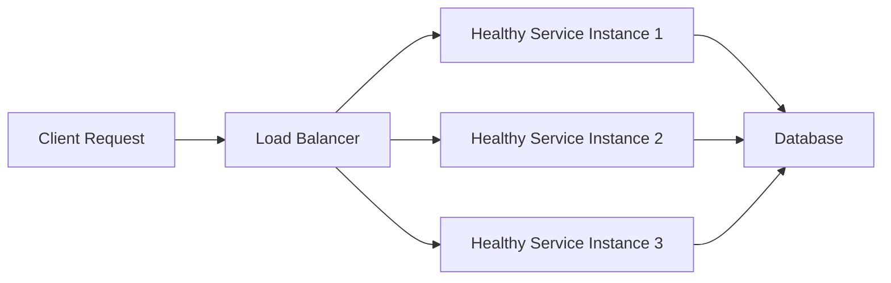

# Availability

## Introduction
Availability is the probability that a system is operational and responsive when clients need it.

## Problem Statement
Modern services must remain reachable even under failures, traffic spikes, and infrastructure faults.

## Why this exists
Users expect digital services to be available 24/7. Design decisions must balance uptime against cost, consistency, and complexity.

## Real-world analogy
A bank ATM network is available when customers can withdraw money. If machines, networks, or bank servers fail, the service must minimize downtime.

## Definition
Availability measures the proportion of time a system is able to serve requests successfully, typically expressed as a percentage or as mean time between failures.

## Key concepts
- **Uptime:** time the system is available.
- **Downtime:** time the system is unavailable.
- **Service Level Objective (SLO):** target availability goal.
- **Fault domain:** scope of a failure.
- **Failover:** switching to standby resources after failure.

## Internal working
Availability is achieved through redundancy, health checks, automatic recovery, graceful degradation, and load balancing.

### Flow diagram


## Python implementation

### Bad implementation
A single server with no redundancy or health checks.

```python
class Service:
    def handle_request(self, request: str) -> str:
        return f"processed {request}"

service = Service()
```

### Better implementation
A simple redundant cluster with basic health check simulation.

```python
from dataclasses import dataclass
from typing import List

@dataclass
class Server:
    name: str
    healthy: bool

class Cluster:
    def __init__(self, nodes: List[Server]):
        self.nodes = nodes

    def route_request(self, request: str) -> str:
        for node in self.nodes:
            if node.healthy:
                return f"{node.name} processed {request}"
        raise RuntimeError("no healthy nodes")
```

### Best implementation
A production-grade availability model with health checks and failover.

```python
from dataclasses import dataclass
from typing import List

@dataclass
class Instance:
    name: str
    healthy: bool = True

class AvailabilityController:
    def __init__(self, instances: List[Instance]):
        self.instances = instances

    def health_check(self) -> None:
        for instance in self.instances:
            # In a real system, perform HTTP/TCAP checks here.
            instance.healthy = self.ping(instance)

    def ping(self, instance: Instance) -> bool:
        return instance.healthy

    def route_request(self, request: str) -> str:
        self.health_check()
        for instance in self.instances:
            if instance.healthy:
                return f"{instance.name} processed {request}"
        raise RuntimeError("all instances are unavailable")
```

## Step-by-step explanation
1. A bad system has a single point of failure.
2. Redundancy adds capacity and failover paths.
3. Health checks ensure the load balancer only routes to live instances.

## Multiple real-world examples
- Kubernetes uses liveness/readiness probes to preserve availability.
- Cloud load balancers automatically remove unhealthy VMs.
- Netflix uses chaos engineering to validate availability.

## Pros
- Better uptime and resilience.
- Reduced customer impact during faults.
- Supports gradual degradation.

## Cons
- Higher operational cost.
- Complexity in stateful services.
- Risk of cascading failure if not designed carefully.

## Interview Questions
### Beginner
- What is availability?
- Answer: The ability of a system to respond to requests successfully over time.

### Intermediate
- How do redundancy and failover improve availability?
- Answer: They eliminate single points of failure and route traffic to healthy resources.

### Senior
- How should availability targets differ for user-facing and internal systems?
- Answer: User-facing APIs often need higher availability, while batch jobs can tolerate lower SLOs.

### Staff Engineer
- Design the availability strategy for a global API with a 99.99% uptime goal.
- Answer: Use multi-region deployment, active-active failover, health checks, circuit breakers, and traffic shifting.

## Common mistakes
- Equating availability with performance.
- Relying on a single instance.
- Ignoring recovery time and not measuring downtime.

## Best practices
- Define clear SLOs and error budgets.
- Use automatic health checks and self-healing.
- Separate control plane from data plane.

## When NOT to use
- High availability is not necessary for prototypes or internal tools with low impact.
- Avoid over-engineering if the cost outweighs business value.

## Comparison with similar concepts
- **Reliability:** availability plus correct behavior over time.
- **Fault tolerance:** surviving failures without downtime.
- **Scalability:** handling growth, not just uptime.

## Summary
Availability is a foundational non-functional requirement for distributed systems. It is built by redundancy, monitoring, and deliberate failure handling.

## Related topics
- [CAP Theorem](../cap-theorem)
- [Fault Tolerance](../fault-tolerance)
- [Load Balancing](../load-balancing)
