# Caching Strategies

## Introduction
Caching is the architectural practice of storing copies of frequently accessed or expensive data in a high-speed, temporary storage layer (usually RAM) to resolve future read requests faster. Selecting the appropriate **Caching Strategy** dictates how the application layer coordinates reads and writes between the client, the caching layer, and the primary persistent database.

---

## Problem Statement
Every persistent storage system (e.g., PostgreSQL, MongoDB) has physical throughput limits bounded by disk speeds, network latency, and query optimization complexity. Under high traffic:
1.  **Database Overload:** Popular or trending data (e.g., a viral post or homepage metadata) causes a high volume of repetitive read requests, exhausting database connection pools.
2.  **Increased Latency:** Complex queries involving multi-table joins or mathematical aggregations take hundreds of milliseconds to execute, slowing down the user experience.
3.  **High Infrastructure Costs:** Scaling databases horizontally with replicas is expensive and introduces replication lag challenges.

---

## Why This Exists
Caching strategies exist to:
*   **Maximize Throughput:** Offload up to 99% of read traffic from the primary database, allowing the system to scale to millions of concurrent requests.
*   **Provide Sub-millisecond Latencies:** Fetching pre-computed or pre-serialized strings from memory takes microseconds.
*   **Balance Consistency and Performance:** Enable developers to choose trade-offs—such as prioritizing write speed (Write-Back), read speed (Cache-Aside), or strict consistency (Write-Through).

---

## Real-world Analogy
Imagine running a busy pizza restaurant.
*   **The Database (Kitchen):** The main kitchen in the back. Preparing a custom gourmet pizza takes 15 minutes.
*   **The Cache (Counter Display Case):** A heated display case at the front counter. It holds 5 pizzas and takes 5 seconds to serve a slice.
*   **Cache-Aside (Lazy Loading):** When a customer orders pepperoni pizza, you check the display case. If empty, you ask the kitchen to bake one, serve a slice, and put the rest in the display case.
*   **Write-Through:** Whenever the kitchen finishes baking a pizza, they place it directly into the display case *before* telling the customer it is ready.
*   **Write-Back:** Customers pay and grab a slice instantly from the display case. The cashier writes down the sales on a notepad and updates the main kitchen inventory database once at the end of the shift.

---

## Definition
A **Caching Strategy** is a design pattern that governs the data flow and synchronization rules between an application, a caching layer (e.g., Redis, Memcached), and a persistent storage engine.

---

## Key Concepts

### 1. Cache Metrics
*   **Cache Hit:** The requested key is found in the cache. The value is returned instantly.
*   **Cache Miss:** The key is not found in the cache. The application must fetch it from the database.
*   **Hit Ratio:** $\frac{\text{Hits}}{\text{Hits} + \text{Misses}}$. A healthy read cache typically targets a Hit Ratio $\ge 80\%$.

### 2. Caching Topologies
*   **Local (In-Memory) Cache:** The cache resides inside the application process heap (e.g., Guava, Caffeine in Java). It is extremely fast but isolated. If you have multiple application nodes, their local caches can drift out of sync.
*   **Distributed Cache:** A dedicated, centralized cluster (e.g., Redis) shared across all application instances. This ensures global consistency but introduces network round-trip overhead.

### 3. Read Strategies
*   **Cache-Aside:** The application queries the cache. On a miss, the application reads from the DB, writes to the cache, and returns. The database and cache are decoupled.
*   **Read-Through:** The application queries the cache directly. On a miss, the *cache itself* retrieves data from the database, populates its store, and returns the data.

### 4. Write Strategies
*   **Write-Through:** Writes update the cache and database synchronously. The write transaction completes only when both are updated.
*   **Write-Around:** Writes bypass the cache entirely and write directly to the database. Cache misses populate the cache later. This avoids filling the cache with data that is rarely read.
*   **Write-Back (Write-Behind):** Writes update the cache instantly. An asynchronous background worker batches these writes and persists them to the database later, reducing write pressure.

---

## Internal Working: Strategy Flow Diagrams

```mermaid
graph TD
    subgraph "Cache-Aside Strategy"
        CA_Start[App Read Request] --> CA_Check{Key in Cache?}
        CA_Check -->|"Yes (Hit)"| CA_Return[Return Value]
        CA_Check -->|"No (Miss)"| CA_ReadDB[(Query Database)]
        CA_ReadDB --> CA_WriteCache[Write to Cache]
        CA_WriteCache --> CA_Return
    end

    subgraph "Write-Through Strategy"
        WT_Start[App Write Request] --> WT_WriteCache[Write to Cache]
        WT_WriteCache --> WT_WriteDB[(Write to Database Synchronously)]
        WT_WriteDB --> WT_Success[Return Success to App]
    end

    subgraph "Write-Back Strategy"
        WB_Start[App Write Request] --> WB_WriteCache[Write to Cache]
        WB_WriteCache --> WB_Ack[Return Success immediately]
        WB_Ack -.-> WB_Queue[Background Buffer Queue]
        WB_Queue -.-> WB_WriteDB[(Async Batch Write to DB)]
    end

    %% Styles
    classDef startEnd fill:#d4edda,stroke:#28a745,stroke-width:2px,color:#155724;
    classDef cache fill:#d1ecf1,stroke:#17a2b8,stroke-width:2px,color:#0c5460;
    classDef db fill:#fff3cd,stroke:#ffc107,stroke-width:2px,color:#856404;
    classDef check fill:#e2e3e5,stroke:#6c757d,stroke-width:2px,color:#383d41;

    class CA_Start,CA_Return,WT_Start,WT_Success,WB_Start,WB_Ack startEnd;
    class CA_Check check;
    class CA_WriteCache,WT_WriteCache,WB_WriteCache,WB_Queue cache;
    class CA_ReadDB,WT_WriteDB,WB_WriteDB db;
```



---

## Java Implementation: Caching Strategies Simulator

The following class simulates Cache-Aside, Write-Through, and Write-Back caching strategies to show their structural differences.

```java
import java.util.*;
import java.util.concurrent.*;

// Mock database simulating slow operations
class MockDatabase {
    private final Map<String, String> data = new ConcurrentHashMap<>();

    public String readFromDisk(String key) {
        try { Thread.sleep(100); } catch (InterruptedException ignored) {} // Simulating I/O
        return data.get(key);
    }

    public void writeToDisk(String key, String val) {
        try { Thread.sleep(100); } catch (InterruptedException ignored) {} // Simulating I/O
        data.put(key, val);
    }
}

// Caching Manager
public class CacheManager {
    private final Map<String, String> cache = new ConcurrentHashMap<>();
    private final MockDatabase database = new MockDatabase();
    
    // Background queue and scheduler for Write-Back
    private final BlockingQueue<Map.Entry<String, String>> writeBackQueue = new LinkedBlockingQueue<>();
    private final ScheduledExecutorService writeBackExecutor = Executors.newSingleThreadScheduledExecutor();

    public CacheManager() {
        // Start background flusher for Write-Back strategy
        writeBackExecutor.scheduleAtFixedRate(this::flushWriteBackQueue, 1, 1, TimeUnit.SECONDS);
    }

    // =====================================================================
    // 1. CACHE-ASIDE (Read Path)
    // =====================================================================
    public String readCacheAside(String key) {
        String val = cache.get(key);
        if (val != null) {
            System.out.println("Cache Hit!");
            return val;
        }
        System.out.println("Cache Miss. Querying DB...");
        val = database.readFromDisk(key);
        if (val != null) {
            cache.put(key, val);
        }
        return val;
    }

    // =====================================================================
    // 2. WRITE-THROUGH (Write Path)
    // =====================================================================
    public void writeThrough(String key, String value) {
        // Update both cache and database synchronously
        cache.put(key, value);
        database.writeToDisk(key, value);
        System.out.println("Write-Through completed for: " + key);
    }

    // =====================================================================
    // 3. WRITE-BACK / WRITE-BEHIND (Write Path)
    // =====================================================================
    public void writeBack(String key, String value) {
        // Update cache instantly
        cache.put(key, value);
        // Queue the write for background execution
        writeBackQueue.offer(new AbstractMap.SimpleEntry<>(key, value));
        System.out.println("Write-Back queued instantly in RAM for: " + key);
    }

    private void flushWriteBackQueue() {
        List<Map.Entry<String, String>> batch = new ArrayList<>();
        writeBackQueue.drainTo(batch);
        if (!batch.isEmpty()) {
            System.out.println("Write-Back: Flushing batch of " + batch.size() + " updates to disk...");
            for (Map.Entry<String, String> entry : batch) {
                database.writeToDisk(entry.getKey(), entry.getValue());
            }
        }
    }

    public void shutdown() {
        writeBackExecutor.shutdown();
    }
}
```

---

## Step-by-Step Explanation: Write-Back Persistence
When executing a Write-Back write:

1.  **RAM Update:** The application calls `writeBack("user:45", "Alice")`. The cache manager writes this key-value pair directly into the local memory/Redis cache in microseconds.
2.  **Fast Acknowledgment:** The system returns a success status back to the client immediately, resulting in near-zero write latency.
3.  **Buffering:** The write event is placed into a memory queue (`writeBackQueue`).
4.  **Asynchronous Batching:** A separate background daemon wakes up periodically, drains all accumulated write events from the queue, aggregates duplicates, and performs a single, batch database update. This converts multiple random disk writes into a single sequential operation.

---

## Multiple Real-world Examples

1.  **Read-Through Cache (Hibernate 2nd Level Cache):** Relational ORMs map entities to caches. When querying entities by primary key, Hibernate reads from the cache. On cache misses, it queries the SQL database and updates the cache.
2.  **Write-Around Cache (Static Asset Host):** When uploading new marketing videos, the video is saved directly to S3 (database). The CDN (cache) is not populated during the upload. The first user to watch the video triggers a cache miss that caches the video file near them.
3.  **Write-Back Cache (Operating System Page Cache):** Operating systems write file edits to RAM memory pages (dirty pages). The OS scheduler commits these pages to physical disk storage (NVMe/SSD) asynchronously using the `fsync` call.
4.  **Cache-Aside (E-Commerce Product Details):** Microservices check Redis for product details. When a product is updated via an admin dashboard, the dashboard service saves the edits to PostgreSQL and deletes the Redis cache key to force a fresh pull on the next request.

---

## Pros & Cons

| Strategy | Read Latency | Write Latency | Data Consistency | Risk of Data Loss |
| :--- | :--- | :--- | :--- | :--- |
| **Cache-Aside** | Low (Hit) / High (Miss) | Medium (Bypasses Cache) | Eventual Consistency (TTL based) | None (DB is source of truth) |
| **Read-Through** | Low (Hit) / High (Miss) | Medium (No write impact) | High (Cache handles loading) | None |
| **Write-Through** | Low | High (2 synchronous writes) | Strong Consistency | None |
| **Write-Around** | Low (Hit) / High (Miss) | Medium | Eventual Consistency | None |
| **Write-Back** | Low | Low (RAM speed) | Temporary Inconsistency | High (Loss of queue on power outage) |

---

## Cache Phenomena & Mitigation

*   **Cache Avalanche:** Occurs when many cached items expire at the same time, causing all traffic to hit the database simultaneously.
    *   *Mitigation:* Add random jitter (e.g., $\pm 5$ minutes) to TTL values so expirations are staggered.
*   **Cache Penetration:** Occurs when queries look for keys that do not exist in either the cache or the database (e.g., malicious requests for non-existent user IDs).
    *   *Mitigation:* Cache empty values with a short TTL, or use a **Bloom Filter** to reject requests for invalid keys before they reach the database.
*   **Cache Stampede (Thundering Herd):** Occurs when a highly popular key (e.g., a breaking news banner) expires. Concurrent requests all trigger cache misses and query the database at the same time.
    *   *Mitigation:* Use mutex locks so only one thread queries the database on a miss, or pre-warm the cache using background cron tasks.

---

## Interview Questions

### Beginner
*   **Q:** What is a cache stampede, and how does it affect a system?
*   **A:** A cache stampede occurs when a hot cache key expires, and multiple concurrent requests all experience a cache miss at the same time. They all attempt to pull the data from the database simultaneously, causing a temporary resource spike or database crash.

### Intermediate
*   **Q:** What is the difference between Cache-Aside and Read-Through caching?
*   **A:** In Cache-Aside, the application code is responsible for managing the cache—it checks the cache, queries the database on a miss, and populates the cache manually. In Read-Through, the application only queries the cache. If a miss occurs, the cache provider's library automatically handles querying the database and updating itself.

### Senior
*   **Q:** If you use Cache-Aside, should you update the cache or invalidate (delete) it when updating database records?
*   **A:** Deleting the key (invalidation) is preferred. If you attempt to update the cache value directly, concurrent transactions can cause race conditions. For example, if two writes occur, they might update the database in order `A -> B`, but the cache might update in order `B -> A` due to network delays, leaving the cache permanently out of sync. Deleting the key guarantees that the next read retrieves the latest database state.

### Staff Engineer
*   **Q:** Under what conditions is Write-Back caching acceptable in an enterprise system? How do you make it resilient?
*   **A:** Write-Back is acceptable when write latency is the critical bottleneck and losing some recent updates is tolerated (e.g., tracking clickstreams or video playback progress). To make it resilient, you can:
    1.  Use a replicated, durable queue (like Kafka) instead of an in-memory queue to buffer writes.
    2.  Write to multiple Redis nodes in different availability zones.
    3.  Implement a reconciliation job to periodically recover lost writes using transaction logs.

---

## Common Mistakes
*   **Using Caching as the Primary Store:** Treating the cache as a persistent database without writing back to disk.
*   **Setting Unreasonable TTLs:** Setting TTLs that are too long (causing stale data to persist) or too short (degrading the cache hit ratio).
*   **Not Monitoring Hit Ratios:** Deploying caching infrastructure without metrics to verify if the cache is actually being utilized.

---

## Best Practices
*   **Prefer Deletes over Updates:** When databases are modified, delete the associated cache keys instead of updating them to avoid race conditions.
*   **Enable Eviction Limits:** Set a memory cap (`maxmemory`) and configure an eviction policy (e.g., LRU) to prevent memory allocation crashes.
*   **Implement Cache Warm-Up:** Populate the cache with frequently accessed data during deployment to prevent early database spikes.

---

## When NOT to Use
*   **Highly Dynamic, Custom Data:** If every query returns completely unique data (e.g., customized real-time dashboard searches), the cache hit ratio will be near 0%, adding overhead without benefit.
*   **High-Consistency Real-Time Inventories:** Systems where data cannot tolerate even milliseconds of latency or inconsistency, such as financial trading ledgers.

---

## Comparison with Similar Concepts

*   **Caching vs. Replication:** Caching stores a subset of frequently accessed data in RAM. Replication copies the entire database to another node (read replica) to distribute query load.
*   **Cache-Aside vs. Write-Through:** Cache-Aside loads data into the cache lazily on demand (read-heavy). Write-Through writes to the cache and DB synchronously on update (write-heavy, high consistency).

---

## Summary
Caching strategies are essential for scaling read and write paths in distributed architectures. Selecting the right combination of Cache-Aside for lazy loading, Write-Through for consistency, or Write-Back for massive write throughput allows designers to optimize system performance while preserving database health.

---

## Related Topics
- [Redis](../../02-hld/caching/redis)
- [Cache Invalidation](../../02-hld/caching/cache-invalidation)
- [Content Delivery Network (CDN)](../../02-hld/caching/cdn)
- [Cache Aside](../../02-hld/caching/cache-aside)
- [Write Through](../../02-hld/caching/write-through)
- [Write Back](../../02-hld/caching/write-back)
