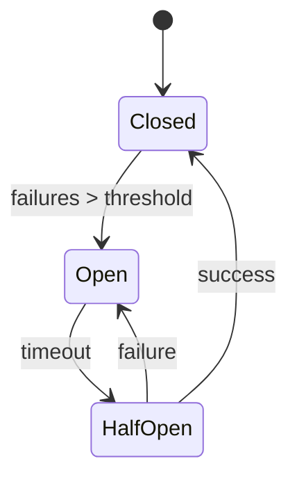

# Circuit Breaker

## Introduction
A circuit breaker protects services from cascading failures by stopping requests to unhealthy dependencies.

## Problem Statement
Repeated calls to a failing service can overwhelm it and propagate failure throughout the system.

## Why this exists
Circuit breakers isolate faults and allow failing services time to recover while preventing system-wide outages.

## Real-world analogy
A physical circuit breaker cuts power when a short circuit occurs to prevent damage.

## Definition
A circuit breaker is a failure-handling pattern that opens after too many errors and closes after the service recovers.

## Key concepts
- **Closed state**
- **Open state**
- **Half-open state**
- **Failure threshold**
- **Reset timeout**

## Internal working
The breaker tracks failures. When failures exceed a threshold, it opens and returns quick failures until a reset timeout triggers a trial.

### Mermaid state diagram


## Python implementation

### Bad implementation
No failure handling when a dependency fails.

```python
class DirectCaller:
    def call(self, dependency):
        return dependency()
```

### Better implementation
Basic failure count with open state.

```python
class CircuitBreaker:
    def __init__(self, threshold):
        self.threshold = threshold
        self.failure_count = 0
        self.open = False

    def call(self, dependency):
        if self.open:
            raise RuntimeError("circuit open")
        try:
            result = dependency()
            self.failure_count = 0
            return result
        except Exception:
            self.failure_count += 1
            if self.failure_count >= self.threshold:
                self.open = True
            raise
```

### Best implementation
A full circuit breaker with state transitions and reset timer.

```python
import time
from enum import Enum
from typing import Callable

class CircuitState(Enum):
    CLOSED = "closed"
    OPEN = "open"
    HALF_OPEN = "half_open"

class CircuitBreaker:
    def __init__(self, threshold: int = 5, reset_timeout: float = 10.0):
        self.threshold = threshold
        self.reset_timeout = reset_timeout
        self.state = CircuitState.CLOSED
        self.failure_count = 0
        self.last_failure_time = 0.0

    def _can_attempt(self) -> bool:
        return time.time() - self.last_failure_time >= self.reset_timeout

    def call(self, dependency: Callable[[], any]) -> any:
        if self.state == CircuitState.OPEN:
            if not self._can_attempt():
                raise RuntimeError("circuit open")
            self.state = CircuitState.HALF_OPEN

        try:
            result = dependency()
            self.state = CircuitState.CLOSED
            self.failure_count = 0
            return result
        except Exception:
            self.failure_count += 1
            self.last_failure_time = time.time()
            if self.failure_count >= self.threshold:
                self.state = CircuitState.OPEN
            else:
                self.state = CircuitState.HALF_OPEN
            raise
```

## Step-by-step explanation
1. In CLOSED state, requests pass through normally.
2. Failures increment a counter.
3. After a threshold, the breaker opens and rejects requests to the dependency.
4. After a timeout, a trial request allows the dependency to recover.

## Multiple real-world examples
- Microservices use circuit breakers to protect downstream APIs.
- API gateways may implement circuit breakers for backend services.
- Netflix Hystrix popularized the pattern.

## Pros
- Prevents failure propagation.
- Improves system availability.
- Reduces retry storms.

## Cons
- Needs tuning of thresholds and timeouts.
- Can reject requests unnecessarily if misconfigured.
- Adds complexity to error handling.

## Interview Questions
### Beginner
- What does a circuit breaker do?
- Answer: It stops sending requests to a failing service once errors exceed a threshold.

### Intermediate
- What is the half-open state?
- Answer: A trial state where a limited number of requests are allowed to test recovery.

### Senior
- How do you choose appropriate timeout values?
- Answer: Base them on service latency, failure patterns, and recovery characteristics.

### Staff Engineer
- Design a service mesh circuit breaker deployment for microservices.
- Answer: Use sidecar-based breakers, centralized metrics, and adaptive thresholding.

## Common mistakes
- Setting thresholds too low or too high.
- Not using metrics to adjust behavior.
- Ignoring the interaction with retries.

## Best practices
- Combine circuit breaker state with a retry policy.
- Expose breaker health metrics.
- Align reset timeouts with backend recovery expectations.

## When NOT to use
- Stable services with low failure likelihood.
- Simple one-off scripts without distributed dependencies.

## Comparison with similar concepts
- **Retry:** retries happen before giving up; circuit breaker stops retries after failures.
- **Bulkhead:** isolates resources; circuit breaker isolates failures.
- **Timeouts:** protect individual calls, while circuit breakers protect repeated failures.

## Summary
Circuit breakers are essential for resilient microservices. They prevent failing dependencies from destabilizing the whole system.

## Related topics
- [Retry](../retry)
- [API Gateway](../api-gateway)
- [Service Discovery](../service-discovery)
