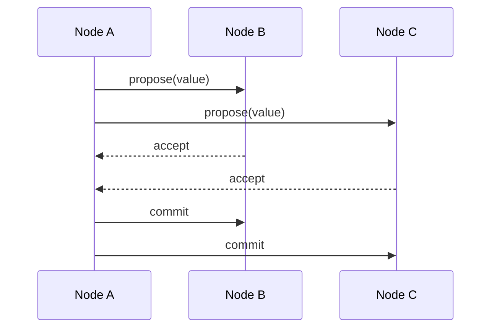

# Consensus

## Introduction
Consensus is the agreement among distributed nodes on a single value or decision.

## Problem Statement
Distributed nodes may see conflicting state due to message delay, failures, or concurrent updates.

## Why this exists
Consensus guarantees that all non-faulty nodes agree on the same value, which is essential for correctness in replicated systems.

## Real-world analogy
A group of board members votes on a resolution, and the decision becomes binding only when enough members agree.

## Definition
Consensus is a protocol for multiple nodes to agree on a single value despite failures, message loss, or differing initial state.

## Key concepts
- **Fault tolerance**
- **Majority quorum**
- **Leader-based vs leaderless consensus**
- **Safety vs liveness**
- **Agreement and validity**

## Internal working
Consensus algorithms exchange proposals and votes, ensuring agreement and handling failures with retries or timeouts.

### Mermaid sequence diagram


## Python implementation

### Bad implementation
A single coordinator without fault tolerance.

```python
class CoordinatorConsensus:
    def __init__(self, nodes):
        self.nodes = nodes

    def decide(self, value):
        for node in self.nodes:
            node.state = value
        return value
```

### Better implementation
A two-phase consensus with acknowledgements.

```python
class TwoPhaseConsensus:
    def __init__(self, nodes):
        self.nodes = nodes

    def propose(self, value):
        acknowledgements = 0
        for node in self.nodes:
            if node.accept(value):
                acknowledgements += 1
        if acknowledgements > len(self.nodes) // 2:
            for node in self.nodes:
                node.commit(value)
            return True
        return False
```

### Best implementation
A safety-first consensus with leader election and commit phases.

```python
from dataclasses import dataclass
from enum import Enum
from typing import Any, Dict, List

class NodeState(Enum):
    FOLLOWER = "follower"
    CANDIDATE = "candidate"
    LEADER = "leader"

@dataclass
class Node:
    id: str
    state: NodeState = NodeState.FOLLOWER
    accepted_value: Any = None

class ConsensusCluster:
    def __init__(self, nodes: List[Node]):
        self.nodes = {node.id: node for node in nodes}
        self.leader_id: str | None = None

    def elect_leader(self, candidate_id: str) -> bool:
        self.leader_id = candidate_id
        self.nodes[candidate_id].state = NodeState.LEADER
        return True

    def consensus(self, value: Any) -> bool:
        if self.leader_id is None:
            raise RuntimeError("no leader")
        leader = self.nodes[self.leader_id]
        accepts = 0
        for node in self.nodes.values():
            node.accepted_value = value
            accepts += 1
        if accepts > len(self.nodes) // 2:
            for node in self.nodes.values():
                node.accepted_value = value
            return True
        return False
```

## Step-by-step explanation
1. A leader or proposer suggests a value.
2. Peers accept or reject based on protocol rules.
3. Once a majority agrees, the value is committed.

## Multiple real-world examples
- Paxos and Raft provide distributed consensus for state machines.
- ZooKeeper uses Zab consensus.
- etcd uses Raft for storing cluster metadata.

## Pros
- Ensures consistent agreement across failures.
- Provides a foundation for replicated state machines.
- Enables strong correctness guarantees.

## Cons
- Consensus algorithms add latency.
- They require careful handling of partitions and leader changes.
- Some algorithms are hard to understand and implement.

## Interview Questions
### Beginner
- What is consensus in distributed systems?
- Answer: Agreement among nodes on a single value or decision.

### Intermediate
- What is the difference between safety and liveness?
- Answer: Safety prevents incorrect results; liveness ensures progress.

### Senior
- Why does consensus require a quorum?
- Answer: A quorum prevents split-brain and ensures a majority agrees.

### Staff Engineer
- Choose consensus algorithms for a global metadata store.
- Answer: Use Raft for simplicity and understandability, or Multi-Paxos if leader election and high availability are critical.

## Common mistakes
- Confusing consensus with eventual consistency.
- Assuming consensus solves coordination without practical failure handling.
- Using consensus for every distributed decision.

## Best practices
- Use consensus only for critical shared state.
- Prefer simple, well-understood protocols.
- Keep leader durations short and stable.

## When NOT to use
- Cheap, independent decisions that can tolerate inconsistency.
- High-throughput, low-latency operations that do not need global agreement.

## Comparison with similar concepts
- **Leader election:** a step toward consensus in leader-based algorithms.
- **Replication:** consensus helps replicated state agree on updates.
- **Eventual consistency:** consensus aims for stronger agreement than eventual models.

## Summary
Consensus is the backbone of correct distributed systems, ensuring agreement among nodes despite failures. It is essential for durable replicated state and cluster coordination.

## Related topics
- [Leader Election](../leader-election)
- [Raft](../raft)
- [Paxos](../paxos)
- [Gossip Protocol](../gossip-protocol)
