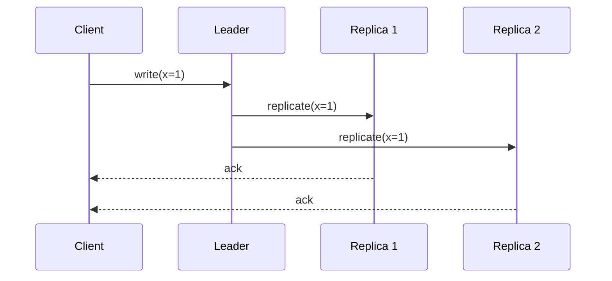

# Consistency Models

## Introduction
Consistency models define how data reads and writes behave across replicas in a distributed system.

## Problem Statement
In distributed systems, the same value can exist on multiple replicas. Clients must know how quickly and reliably a read returns the latest value.

## Why this exists
Different applications require different consistency guarantees. Some systems can sacrifice freshness to gain latency, while others need the latest value at all times.

## Real-world analogy
Imagine an online document shared across multiple editors. If one user saves a change, other users should either see the change immediately or accept a short delay depending on the collaboration model.

## Definition
A consistency model is a contract between the system and the application that defines when reads reflect recent writes. Common models include strong consistency, eventual consistency, and causal consistency.

## Key concepts
- **Strong consistency**: reads always return the most recent write.
- **Eventual consistency**: all replicas converge to the same value eventually.
- **Causal consistency**: operations that are causally related appear in the same order.
- **Read-your-write**: a client always sees its own latest update.

## Internal working
Consistency is implemented through replication, quorum protocols, versioning, and conflict resolution.

### Replica update flow


## Python implementation

### Bad implementation
This bad implementation stores values without any versioning or replication protocol.

```python
class SimpleStore:
    def __init__(self):
        self.store: dict[str, int] = {}

    def write(self, key: str, value: int) -> None:
        self.store[key] = value

    def read(self, key: str) -> int | None:
        return self.store.get(key)
```

### Better implementation
The better approach adds version metadata to detect stale reads.

```python
from dataclasses import dataclass
from typing import Optional

@dataclass
class ValueEntry:
    value: int
    version: int

class VersionedStore:
    def __init__(self):
        self.store: dict[str, ValueEntry] = {}

    def write(self, key: str, value: int) -> None:
        current = self.store.get(key)
        version = (current.version + 1) if current else 1
        self.store[key] = ValueEntry(value=value, version=version)

    def read(self, key: str) -> Optional[ValueEntry]:
        return self.store.get(key)
```

### Best implementation
The best implementation models a quorum-based write and read system for stronger consistency.

```python
from dataclasses import dataclass
from typing import List, Optional

@dataclass
class Replica:
    name: str
    store: dict[str, int]

    def read(self, key: str) -> Optional[int]:
        return self.store.get(key)

    def write(self, key: str, value: int) -> None:
        self.store[key] = value

class QuorumStore:
    def __init__(self, replicas: List[Replica]):
        self.replicas = replicas
        self.quorum = len(replicas) // 2 + 1

    def write(self, key: str, value: int) -> bool:
        acknowledgments = 0
        for replica in self.replicas:
            replica.write(key, value)
            acknowledgments += 1
            if acknowledgments >= self.quorum:
                return True
        return False

    def read(self, key: str) -> Optional[int]:
        responses = [replica.read(key) for replica in self.replicas]
        votes = [value for value in responses if value is not None]
        return max(set(votes), key=votes.count) if votes else None
```

## Step-by-step explanation
1. The bad example offers no coordination and can return stale data.
2. The better example adds versioning so the system can detect outdated values.
3. The best example uses quorum rules to guarantee that the write is visible to enough replicas before acknowledging.

## Multiple real-world examples
- Distributed databases such as MongoDB and Cassandra use tunable consistency.
- DNS is eventually consistent: records propagate over time.
- Spanner uses strong consistency with synchronous replication.

## Pros
- Strong consistency simplifies reasoning for developers.
- Eventual consistency improves availability and latency.
- Causal consistency preserves causal order without requiring full global synchronization.

## Cons
- Strong consistency can increase latency and reduce availability during partitions.
- Eventual consistency can expose stale reads.
- Causal consistency is more complex to implement.

## Interview Questions
### Beginner
- What is eventual consistency?
- Answer: A model where replicas eventually converge to the same data after updates.

### Intermediate
- How does quorum read/write help consistency?
- Answer: It requires a majority of replicas to acknowledge, ensuring overlap between reads and writes.

### Senior
- When would you choose causal consistency over eventual consistency?
- Answer: When preserving the order of related operations matters, such as collaborative editing.

### Staff Engineer
- Design a hybrid model that supports both strong and eventual consistency for different endpoints.
- Answer: Use strong consistency for critical metadata and eventual consistency for user-facing caches, with clear API-level contracts.

## Common mistakes
- Confusing availability with consistency.
- Assuming eventual consistency means data is always stale.
- Omitting version metadata for replicated state.

## Best practices
- Document the consistency model for each API.
- Choose default consistency based on the read/write profile.
- Use version vectors or timestamps for conflict resolution.

## When NOT to use
- Strong consistency is not ideal for high-traffic caches.
- Eventual consistency is not appropriate for bank account balances.

## Comparison with similar concepts
- **CAP Theorem**: consistency is one of the three tradeoff points.
- **Replication**: consistency describes how replicas agree on state.
- **Availability**: a system can be available while relaxing consistency.

## Summary
Consistency models are essential to distributed system design. Choosing the right model is a tradeoff between freshness, latency, and availability.

## Related topics
- [CAP Theorem](../cap-theorem)
- [Availability](../availability)
- [Fault Tolerance](../fault-tolerance)
