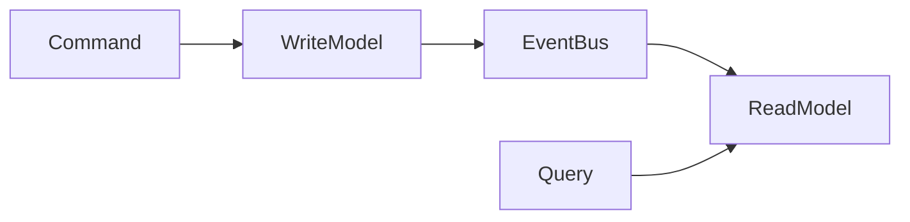

# CQRS

## Introduction
Command Query Responsibility Segregation (CQRS) separates read and write workloads into distinct models.

## Problem Statement
Using the same model for commands and queries can lead to complexity, performance bottlenecks, and conflicting optimizations.

## Why this exists
CQRS allows the system to optimize reads and writes independently, improving scalability and maintainability.

## Real-world analogy
A restaurant has separate staff for order taking and food delivery, each optimized for its role.

## Definition
CQRS is a pattern where commands modify state through one model and queries retrieve state through another model.

## Key concepts
- **Command model**
- **Query model**
- **Eventual consistency**
- **Projection**
- **Read model**

## Internal working
Commands update the write model and may emit events. Projections update read models so queries can be served efficiently.

### Mermaid diagram


## Python implementation

### Bad implementation
A single model handling both reads and writes.

```python
class SingleModel:
    def __init__(self):
        self.store = {}

    def command(self, key, value):
        self.store[key] = value

    def query(self, key):
        return self.store.get(key)
```

### Better implementation
Separate command and query objects with a shared store.

```python
class WriteModel:
    def __init__(self, store):
        self.store = store

    def command(self, key, value):
        self.store[key] = value

class ReadModel:
    def __init__(self, store):
        self.store = store

    def query(self, key):
        return self.store.get(key)
```

### Best implementation
A CQRS system with event publication and read model projection.

```python
from dataclasses import dataclass
from typing import Any, Dict, List

@dataclass
class Event:
    key: str
    value: Any

class WriteModel:
    def __init__(self, event_bus):
        self.event_bus = event_bus

    def command(self, key: str, value: Any) -> None:
        event = Event(key=key, value=value)
        self.event_bus.publish(event)

class EventBus:
    def __init__(self):
        self.subscribers: List[Any] = []

    def publish(self, event: Event) -> None:
        for subscriber in self.subscribers:
            subscriber.handle(event)

class ReadModel:
    def __init__(self):
        self.store: Dict[str, Any] = {}

    def handle(self, event: Event) -> None:
        self.store[event.key] = event.value

    def query(self, key: str) -> Any:
        return self.store.get(key)
```

## Step-by-step explanation
1. Commands modify state through the write model.
2. The write model emits events on successful changes.
3. The read model updates its projection from events and serves queries.

## Multiple real-world examples
- E-commerce systems use CQRS for order writes and product catalog reads.
- Banking systems separate transaction processing from reporting.
- Event-driven systems often use CQRS for scaling read workloads.

## Pros
- Optimizes reads and writes independently.
- Enables specialized storage for query patterns.
- Supports scalable event-driven architectures.

## Cons
- Introduces eventual consistency between read and write models.
- More moving parts to manage.
- More testing complexity.

## Interview Questions
### Beginner
- What does CQRS stand for?
- Answer: Command Query Responsibility Segregation.

### Intermediate
- Why is eventual consistency common in CQRS?
- Answer: Because the read model is updated asynchronously from events.

### Senior
- How do you handle stale read models in a CQRS system?
- Answer: Use versioning, read-after-write consistency options, and audit logs.

### Staff Engineer
- Design a CQRS architecture for an inventory system.
- Answer: Use a write model for stock updates, event bus for publishing changes, and query-optimized read stores for inventory lookups.

## Common mistakes
- Using CQRS for simple CRUD apps.
- Ignoring the replication lag between write and read models.
- Not designing event schemas carefully.

## Best practices
- Use CQRS when read and write workloads have different requirements.
- Keep command and query models separate and clear.
- Monitor read model freshness.

## When NOT to use
- Small applications with a simple data model.
- Systems that require strict immediate consistency.

## Comparison with similar concepts
- **Event Sourcing:** often pairs with CQRS but is not required.
- **Microservices:** CQRS is a pattern often used within distributed services.
- **Transactional model:** CQRS decouples reads and writes from a single transactional store.

## Summary
CQRS separates the responsibilities of command handling and query serving, enabling greater scalability and performance. It works well when read and write workloads diverge.

## Related topics
- [Saga Pattern](../saga-pattern)
- [Event Sourcing](../event-sourcing)
- [API Gateway](../api-gateway)
