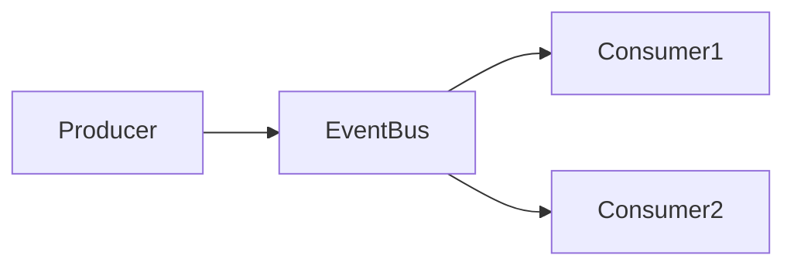

# Event-Driven Architecture

## Introduction
Event-driven architecture (EDA) is a design paradigm where services communicate by emitting and consuming events rather than invoking each other directly.

## Problem Statement
Tightly coupled service interactions slow development and make systems brittle when dependencies change.

## Why this exists
EDA decouples producers and consumers, enabling more resilient, scalable, and extensible systems.

## Real-world analogy
A marketplace where sellers post updates to a shared bulletin board and buyers respond whenever they choose.

## Definition
Event-driven architecture is an architectural style in which services exchange state changes or events through asynchronous messaging.

## Key concepts
- **Events**
- **Producers**
- **Consumers**
- **Event bus**
- **Event sourcing**
- **Publish/subscribe**

## Internal working
Producers emit events to a broker or bus. Consumers subscribe to event types and react when events arrive.

### Mermaid diagram


## Python implementation

### Bad implementation
Services calling each other directly without decoupling.

```python
class ServiceA:
    def process(self):
        ServiceB().handle()

class ServiceB:
    def handle(self):
        print("handled")
```

### Better implementation
A simple event bus with publish/subscribe semantics.

```python
from collections import defaultdict
from typing import Callable, Dict, List, Any

class EventBus:
    def __init__(self):
        self.subscribers: Dict[str, List[Callable[[Any], None]]] = defaultdict(list)

    def subscribe(self, event_type: str, handler: Callable[[Any], None]) -> None:
        self.subscribers[event_type].append(handler)

    def publish(self, event_type: str, payload: Any) -> None:
        for handler in self.subscribers[event_type]:
            handler(payload)
```

### Best implementation
An event-driven design with decoupled producers, durable event storage, and retry handling.

```python
from collections import defaultdict
from dataclasses import dataclass, field
from typing import Any, Callable, Dict, List

@dataclass
class Event:
    type: str
    payload: Any

class DurableEventBus:
    def __init__(self):
        self.subscribers: Dict[str, List[Callable[[Any], None]]] = defaultdict(list)
        self.events: List[Event] = []

    def subscribe(self, event_type: str, handler: Callable[[Any], None]) -> None:
        self.subscribers[event_type].append(handler)

    def publish(self, event: Event) -> None:
        self.events.append(event)
        self._dispatch(event)

    def _dispatch(self, event: Event) -> None:
        for handler in self.subscribers[event.type]:
            try:
                handler(event.payload)
            except Exception:
                self._retry(event, handler)

    def _retry(self, event: Event, handler: Callable[[Any], None], retries: int = 3) -> None:
        for _ in range(retries):
            try:
                handler(event.payload)
                return
            except Exception:
                continue
        print("event delivery failed")
```

## Step-by-step explanation
1. Services publish events when state changes.
2. The event bus routes events to subscribers asynchronously.
3. Consumers react independently and can scale separately.

## Multiple real-world examples
- Order service emits events for inventory, shipping, and billing.
- Analytics systems consume events for metrics.
- Notification services process user activity events.

## Pros
- Loose coupling between services.
- Better scalability and extensibility.
- Easier integration of new consumers.

## Cons
- Harder debugging and tracing.
- Eventual consistency can complicate data flows.
- Requires careful event schema and versioning.

## Interview Questions
### Beginner
- What is an event-driven architecture?
- Answer: A system design where services communicate via events instead of direct calls.

### Intermediate
- What are the benefits of decoupling producers and consumers?
- Answer: It lowers dependencies, allows independent scaling, and improves resilience.

### Senior
- How do you handle schema evolution for events?
- Answer: Use versioned event contracts, backward-compatible payloads, and schema registries.

### Staff Engineer
- Architect an event-driven order processing system.
- Answer: Use events for order created, payment completed, inventory reserved, and shipping scheduled; implement durable bus, retries, and idempotent consumers.

## Common mistakes
- Emitting too many fine-grained events.
- Ignoring event contracts and versioning.
- Relying on synchronous processing in an async flow.

## Best practices
- Use idempotent event handlers.
- Define clear event schemas.
- Implement observability and correlation IDs for tracing.

## When NOT to use
- Simple synchronous workflows with low scale.
- Systems that need strict request-response semantics.

## Comparison with similar concepts
- **Message queue:** focused on point-to-point message delivery.
- **Event sourcing:** stores events as the source of truth.
- **Microservices:** EDA is a common integration style for microservices.

## Summary
Event-driven architecture enables flexible, scalable systems through asynchronous event exchange. It requires discipline in event design, routing, and observability.

## Related topics
- [Kafka](../kafka)
- [RabbitMQ](../rabbitmq)
- [SQS](../sqs)
