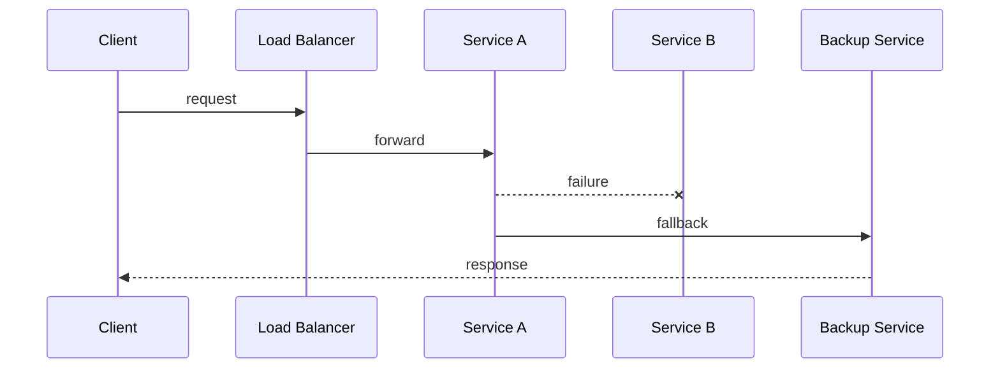

# Fault Tolerance

## Introduction
Fault tolerance is a system’s ability to continue operating correctly even when components fail.

## Problem Statement
Hardware, software, and network failures happen frequently. Systems must survive these faults without total collapse.

## Why this exists
Users expect services to keep functioning during failures. Fault tolerance prevents outages and enables graceful degradation.

## Real-world analogy
An airplane has redundant engines, avionics, and control systems so it can safely continue flight if one component fails.

## Definition
Fault tolerance is the capacity of a system to detect failures and continue functioning by switching to backup resources or degraded workflows.

## Key concepts
- **Redundancy**: duplicate components.
- **Graceful degradation**: reduced functionality instead of complete failure.
- **Failover**: automatic recovery to a standby unit.
- **Isolation**: preventing failure propagation.

## Internal working
Fault tolerance uses multiple replicas, retries, circuit breakers, and fallback logic.

### Mermaid Sequence Diagram


## Python implementation

### Bad implementation
A direct call without failure handling.

```python
class Service:
    def call(self) -> str:
        raise RuntimeError("failure")
```

### Better implementation
A fallback method that catches some failures.

```python
class ResilientService:
    def __init__(self, primary):
        self.primary = primary

    def call(self) -> str:
        try:
            return self.primary.call()
        except RuntimeError:
            return "fallback response"
```

### Best implementation
A fault-tolerant service with a circuit breaker and fallback.

```python
import time
from enum import Enum

class State(Enum):
    CLOSED = "closed"
    OPEN = "open"
    HALF_OPEN = "half_open"

class CircuitBreaker:
    def __init__(self, threshold: int = 3, reset_timeout: float = 5.0):
        self.threshold = threshold
        self.reset_timeout = reset_timeout
        self.failures = 0
        self.state = State.CLOSED
        self.last_failure = 0.0

    def allow_request(self) -> bool:
        if self.state == State.OPEN and time.time() - self.last_failure < self.reset_timeout:
            return False
        return True

    def record_success(self) -> None:
        self.failures = 0
        self.state = State.CLOSED

    def record_failure(self) -> None:
        self.failures += 1
        self.last_failure = time.time()
        if self.failures >= self.threshold:
            self.state = State.OPEN

class FaultTolerantService:
    def __init__(self, primary, fallback):
        self.primary = primary
        self.fallback = fallback
        self.breaker = CircuitBreaker()

    def call(self) -> str:
        if not self.breaker.allow_request():
            return self.fallback.call()
        try:
            result = self.primary.call()
            self.breaker.record_success()
            return result
        except RuntimeError:
            self.breaker.record_failure()
            return self.fallback.call()
```

## Step-by-step explanation
1. Poor systems fail hard without fallback.
2. Fallbacks allow reduced functionality when dependencies fail.
3. Circuit breakers prevent repeated load on failing components.

## Multiple real-world examples
- Database replicas provide failover if the primary crashes.
- Microservices use circuit breakers and retries to survive outages.
- CDN nodes serve cached content when origin servers are down.

## Pros
- Improves service continuity.
- Limits failure domains.
- Builds confidence in complex environments.

## Cons
- Adds engineering complexity.
- Fallback behavior may lead to reduced user experience.
- Requires careful testing.

## Interview Questions
### Beginner
- What is fault tolerance?
- Answer: The ability of a system to keep functioning despite failures.

### Intermediate
- How does graceful degradation support fault tolerance?
- Answer: It preserves partial service instead of full outage.

### Senior
- Explain the role of redundancy in fault tolerance.
- Answer: Duplicate components ensure that if one fails, another can take over.

### Staff Engineer
- Architect a service that remains usable during a regional outage.
- Answer: Use multi-region active-active deployment, data replication, health checks, and degraded APIs.

## Common mistakes
- Hiding failures without monitoring.
- Creating complex fallback logic that is hard to maintain.
- Assuming retries fix all faults.

## Best practices
- Design failure modes explicitly.
- Test fault tolerance with chaos experiments.
- Keep fallback logic simple and observable.

## When NOT to use
- Simple one-off utilities that do not need high uptime.
- Early-stage prototypes where speed of development matters more than resilience.

## Comparison with similar concepts
- **Availability:** fault tolerance supports availability by masking failures.
- **Reliability:** a fault-tolerant system is more reliable.
- **Resilience:** often used interchangeably with fault tolerance.

## Summary
Fault tolerance is a practical design strategy for building systems that survive component failures. It relies on redundancy, monitoring, and safe degradation.

## Related topics
- [Availability](../availability)
- [Reliability](../reliability)
- [Load Balancing](../load-balancing)
