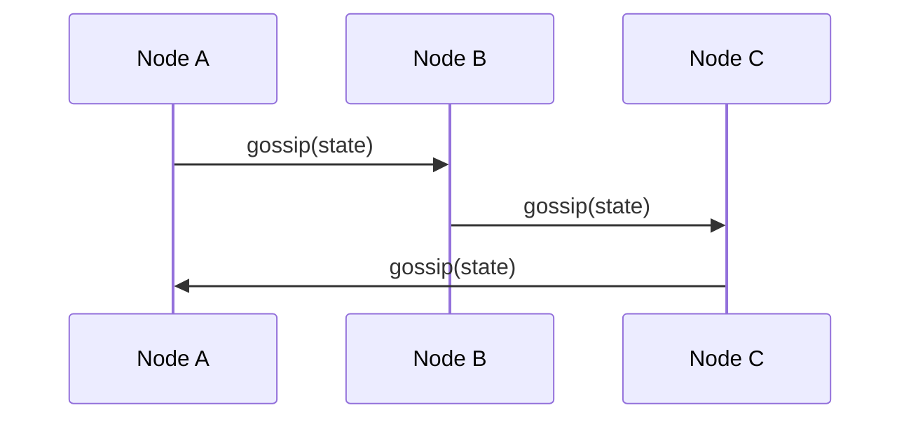

# Gossip Protocol

## Introduction
Gossip protocol is a communication protocol for spreading information in a distributed system using random peer-to-peer exchanges.

## Problem Statement
Large clusters need a scalable way to disseminate membership, configuration, and state without centralized coordination.

## Why this exists
Gossip provides a lightweight, fault-tolerant method to eventually propagate updates across many nodes.

## Real-world analogy
Information spreads through a group of people by word of mouth: each person tells a few others until everyone knows.

## Definition
A gossip protocol uses probabilistic peer selection and periodic communication to disseminate updates across a cluster.

## Key concepts
- **Rumor mongering**
- **Push and pull gossip**
- **Anti-entropy**
- **Convergence**
- **Gossip fanout**

## Internal working
Nodes randomly exchange state with peers. Each exchange updates nodes with newer information and eventually reaches full convergence.

### Mermaid sequence diagram


## Python implementation

### Bad implementation
A broadcast loop that sends state to every node each round.

```python
class Broadcast:
    def __init__(self, nodes):
        self.nodes = nodes

    def gossip(self, state):
        for node in self.nodes:
            node.receive(state)
```

### Better implementation
A random peer selection approach.

```python
import random

class GossipNode:
    def __init__(self, id, peers):
        self.id = id
        self.peers = peers
        self.state = {}

    def gossip(self):
        peer = random.choice(self.peers)
        peer.receive(self.state)

    def receive(self, state):
        self.state.update(state)
```

### Best implementation
A push-pull gossip process with versioned updates.

```python
import random
from dataclasses import dataclass, field
from typing import Any, Dict, List

@dataclass
class GossipState:
    data: Dict[str, Any] = field(default_factory=dict)
    version: Dict[str, int] = field(default_factory=dict)

class GossipNode:
    def __init__(self, id: str, peers: List['GossipNode']):
        self.id = id
        self.peers = peers
        self.state = GossipState()

    def update(self, key: str, value: Any) -> None:
        self.state.data[key] = value
        self.state.version[key] = self.state.version.get(key, 0) + 1

    def gossip(self) -> None:
        peer = random.choice(self.peers)
        self._exchange(peer)

    def _exchange(self, peer: 'GossipNode') -> None:
        for key, value in peer.state.data.items():
            if self.state.version.get(key, 0) < peer.state.version.get(key, 0):
                self.state.data[key] = value
                self.state.version[key] = peer.state.version[key]
        for key, value in self.state.data.items():
            if peer.state.version.get(key, 0) < self.state.version.get(key, 0):
                peer.state.data[key] = value
                peer.state.version[key] = self.state.version[key]
```

## Step-by-step explanation
1. Nodes choose random peers periodically.
2. They exchange state or digests.
3. New updates spread and eventually converge across all nodes.

## Multiple real-world examples
- Cassandra uses gossip for cluster membership and state maintenance.
- Consul uses gossip for failure detection.
- Amazon Dynamo-style systems rely on gossip for eventual convergence.

## Pros
- Highly scalable and decentralized.
- Fault-tolerant to node failures.
- Simple peer-to-peer communication.

## Cons
- Eventual consistency only.
- Convergence time is probabilistic.
- Harder to debug than deterministic protocols.

## Interview Questions
### Beginner
- What is a gossip protocol?
- Answer: A protocol where nodes randomly share information with peers.

### Intermediate
- How does gossip convergence work?
- Answer: Repeated exchanges spread updates until all nodes eventually learn them.

### Senior
- What are the tradeoffs of gossip compared to centralized coordination?
- Answer: Gossip scales well and tolerates failures, but is eventually consistent and probabilistic.

### Staff Engineer
- Use gossip for cluster membership in a large service mesh.
- Answer: Employ gossip for heartbeats and state dissemination, combined with stronger consensus for critical decisions.

## Common mistakes
- Using gossip for strongly consistent state.
- Underestimating the number of rounds required for convergence.
- Not versioning state updates.

## Best practices
- Keep gossip messages small.
- Use push-pull exchanges to accelerate convergence.
- Track version numbers or digests to avoid stale updates.

## When NOT to use
- Strong consistency requirements for every update.
- Small clusters where centralized coordination is simpler.

## Comparison with similar concepts
- **Consensus:** gossip is probabilistic and eventually consistent, while consensus is deterministic agreement.
- **Leader election:** gossip can help with failure detection but not strict leader selection.
- **Replication:** gossip is often used for state dissemination rather than data replication.

## Summary
Gossip protocol is a scalable way to spread state in large distributed systems. It is best for availability and eventual convergence rather than strict agreement.

## Related topics
- [Consensus](../consensus)
- [Leader Election](../leader-election)
- [Raft](../raft)
- [Paxos](../paxos)
