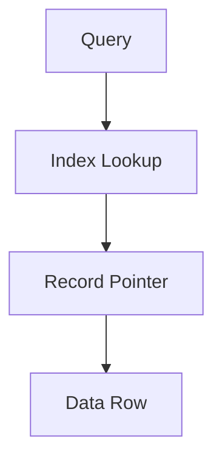

# Indexing

## Introduction
Indexing accelerates data lookup by creating auxiliary structures that make queries faster.

## Problem Statement
Without indexes, databases must scan entire tables or datasets for each query, causing slow response times as data grows.

## Why this exists
Indexes enable quick retrieval of records using search keys, reducing query latency and making large-scale systems practical.

## Real-world analogy
A book's index helps you find topics without reading every page. Similarly, a data index lets the system find rows without scanning all data.

## Definition
An index is a data structure that maps query keys to record locations, allowing faster access than a full data scan.

## Key concepts
- **B-tree** and **B+ tree** indexes
- **Hash indexes**
- **Composite indexes**
- **Covering indexes**
- **Clustered vs non-clustered indexes**

## Internal working
Indexes store key pointers, usually in a sorted structure or hash table. The database uses the index to jump directly to matching rows.

### Mermaid diagram


## Python implementation

### Bad implementation
No index; every query scans the whole table.

```python
class Table:
    def __init__(self):
        self.rows = []

    def insert(self, row: dict) -> None:
        self.rows.append(row)

    def find(self, key: str, value: str) -> list[dict]:
        return [row for row in self.rows if row.get(key) == value]
```

### Better implementation
A simple hash index for exact-match lookups.

```python
from collections import defaultdict
from typing import Any

class HashIndexedTable:
    def __init__(self, index_key: str):
        self.rows: list[dict] = []
        self.index_key = index_key
        self.index: dict[Any, list[int]] = defaultdict(list)

    def insert(self, row: dict) -> None:
        self.rows.append(row)
        self.index[row[self.index_key]].append(len(self.rows) - 1)

    def find(self, value: Any) -> list[dict]:
        return [self.rows[i] for i in self.index.get(value, [])]
```

### Best implementation
A composite index supporting multiple keys and range scans.

```python
from bisect import bisect_left, insort
from dataclasses import dataclass
from typing import Any

@dataclass(order=True)
class IndexEntry:
    key: Any
    row_id: int

class SortedIndexTable:
    def __init__(self, index_key: str):
        self.rows: list[dict] = []
        self.index_key = index_key
        self.index: list[IndexEntry] = []

    def insert(self, row: dict) -> None:
        row_id = len(self.rows)
        self.rows.append(row)
        entry = IndexEntry(key=row[self.index_key], row_id=row_id)
        insort(self.index, entry)

    def find(self, value: Any) -> list[dict]:
        left = bisect_left(self.index, IndexEntry(key=value, row_id=0))
        result: list[dict] = []
        while left < len(self.index) and self.index[left].key == value:
            result.append(self.rows[self.index[left].row_id])
            left += 1
        return result
```

## Step-by-step explanation
1. A full scan checks each row and is expensive for large data.
2. A hash index directly maps values to row positions for fast equality queries.
3. A sorted index supports ordered lookups and range queries.

## Multiple real-world examples
- Database engines use B-tree indexes for primary key and range queries.
- Search engines index keywords with inverted indexes.
- Analytics stores build bitmap indexes for fast filtering.

## Pros
- Dramatically faster query performance.
- Lower CPU usage for repeated queries.
- Supports efficient joins and lookups.

## Cons
- Indexes consume extra storage.
- Write operations cost more due to index maintenance.
- Too many indexes can slow down inserts and updates.

## Interview Questions
### Beginner
- What is an index in a database?
- Answer: A structure that improves query performance by mapping keys to rows.

### Intermediate
- What is the difference between clustered and non-clustered indexes?
- Answer: Clustered indexes determine row order on disk, while non-clustered indexes are separate lookup structures.

### Senior
- How do composite indexes affect query planning?
- Answer: They support multi-column lookups and can be used only when query predicates match the leading columns.

### Staff Engineer
- Design index strategy for a large transactional system with mixed OLTP and reporting workloads.
- Answer: Use narrow clustered indexes for primary keys, selective non-clustered indexes for frequent queries, and maintain separate OLAP replicas for analytics.

## Common mistakes
- Indexing every column without considering write cost.
- Using low-selectivity indexes for high-volume queries.
- Forgetting to update indexes after schema changes.

## Best practices
- Only index columns used by queries.
- Monitor index usage and drop unused indexes.
- Use covering indexes for common query patterns.

## When NOT to use
- Very small tables where scans are inexpensive.
- Temporary tables with short lifetimes and heavy writes.

## Comparison with similar concepts
- **Caching:** stores query results; indexing stores data access paths.
- **Partitioning:** divides data; indexing speeds access within partitions.
- **Sharding:** distributes data across nodes; indexing optimizes local queries.

## Summary
Indexes are essential for fast data access in large systems. The right index strategy balances read speed and maintenance cost.

## Related topics
- [Partitioning](../partitioning)
- [Sharding](../sharding)
- [SQL](../sql)
- [NoSQL](../nosql)
