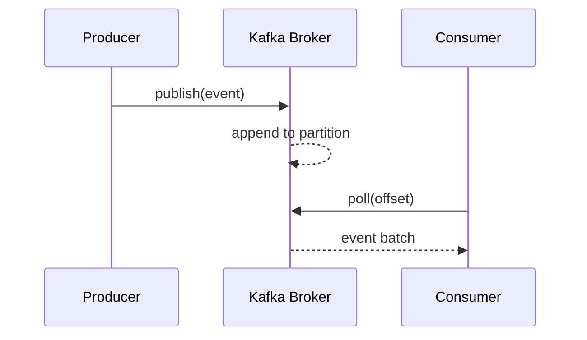

# Kafka

## Introduction
Apache Kafka is a distributed streaming platform used for building real-time data pipelines and event-driven systems.

## Problem Statement
Monolithic async communication patterns become brittle under high throughput and scaling requirements.

## Why this exists
Kafka provides durable, ordered, scalable messaging that decouples producers and consumers with high throughput and fault tolerance.

## Real-world analogy
Kafka is like a reliable postal sorting center: senders deposit messages into ordered bins, and receivers can pick them up independently.

## Definition
Kafka is a distributed log-based messaging system that stores streams of events in topics and allows multiple consumers to process them.

## Key concepts
- **Producer**
- **Consumer**
- **Topic**
- **Partition**
- **Broker**
- **Consumer group**
- **Offset**

## Internal working
Kafka persists messages to topic partitions, replicates them across brokers, and tracks consumer offsets for processing progress.

### Mermaid diagram


## Python implementation

### Bad implementation
A simple in-memory queue that loses data on failure and does not scale.

```python
class SimpleQueue:
    def __init__(self):
        self.messages = []

    def publish(self, message: str) -> None:
        self.messages.append(message)

    def consume(self) -> str:
        return self.messages.pop(0)
```

### Better implementation
A partitioned in-memory log with simple replay capability.

```python
from collections import defaultdict
from typing import Dict, List

class PartitionedLog:
    def __init__(self, partitions: int):
        self.partitions = partitions
        self.log: Dict[int, List[str]] = defaultdict(list)

    def publish(self, key: str, message: str) -> None:
        partition = hash(key) % self.partitions
        self.log[partition].append(message)

    def consume(self, partition: int, offset: int) -> List[str]:
        return self.log[partition][offset:]
```

### Best implementation
A Kafka-like log with topic partitions, replication simulation, and consumer groups.

```python
from dataclasses import dataclass, field
from typing import Dict, List

@dataclass
class Partition:
    messages: List[str] = field(default_factory=list)

@dataclass
class Topic:
    partitions: Dict[int, Partition]

class KafkaSimulator:
    def __init__(self, partition_count: int = 3):
        self.topics: Dict[str, Topic] = {}
        self.partition_count = partition_count

    def create_topic(self, topic_name: str) -> None:
        partitions = {i: Partition() for i in range(self.partition_count)}
        self.topics[topic_name] = Topic(partitions=partitions)

    def publish(self, topic_name: str, key: str, message: str) -> None:
        topic = self.topics[topic_name]
        partition = hash(key) % self.partition_count
        topic.partitions[partition].messages.append(message)

    def consume(self, topic_name: str, partition: int, offset: int) -> List[str]:
        topic = self.topics[topic_name]
        return topic.partitions[partition].messages[offset:]
```

## Step-by-step explanation
1. Producers write messages to topics.
2. Kafka distributes messages across partitions by key.
3. Consumers read partitions independently and track offsets.

## Multiple real-world examples
- Log aggregation and analytics pipelines.
- Event sourcing for microservices.
- Stream processing systems like fraud detection.

## Pros
- High throughput and low latency.
- Durable, ordered storage.
- Strong consumer scaling with consumer groups.

## Cons
- Operational complexity.
- Requires careful partition and retention configuration.
- Not ideal for low-latency request-response use cases.

## Interview Questions
### Beginner
- What is a Kafka topic?
- Answer: A category or feed name to which messages are published.

### Intermediate
- How does Kafka scale consumers?
- Answer: Consumers in a group share partitions, enabling parallel processing.

### Senior
- Why are partitions important in Kafka?
- Answer: They provide parallelism and ordering guarantees within each partition.

### Staff Engineer
- Design a Kafka-based pipeline for a transaction audit log.
- Answer: Use a dedicated audit topic, partition by account or transaction ID, replicate across brokers, and build consumers for analytics and compliance.

## Common mistakes
- Using too few or too many partitions.
- Treating Kafka as a traditional queue instead of a log.
- Not monitoring lag and retention.

## Best practices
- Partition by high-cardinality key for even load.
- Use compacted topics for changelog style data.
- Monitor consumer lag and broker health.

## When NOT to use
- Small-scale tasks with simple queue needs.
- Systems that require synchronous request-response semantics.

## Comparison with similar concepts
- **RabbitMQ:** queue-first, better for classic messaging.
- **SQS:** managed queue service with simpler semantics.
- **Event-driven architecture:** Kafka is a core platform for streaming events.

## Summary
Kafka is ideal for scalable event streaming and durable log-based pipelines. It excels when throughput, replayability, and decoupling are required.

## Related topics
- [Event-Driven Architecture](../event-driven-architecture)
- [SQS](./sqs)
- [RabbitMQ](./rabbitmq)
