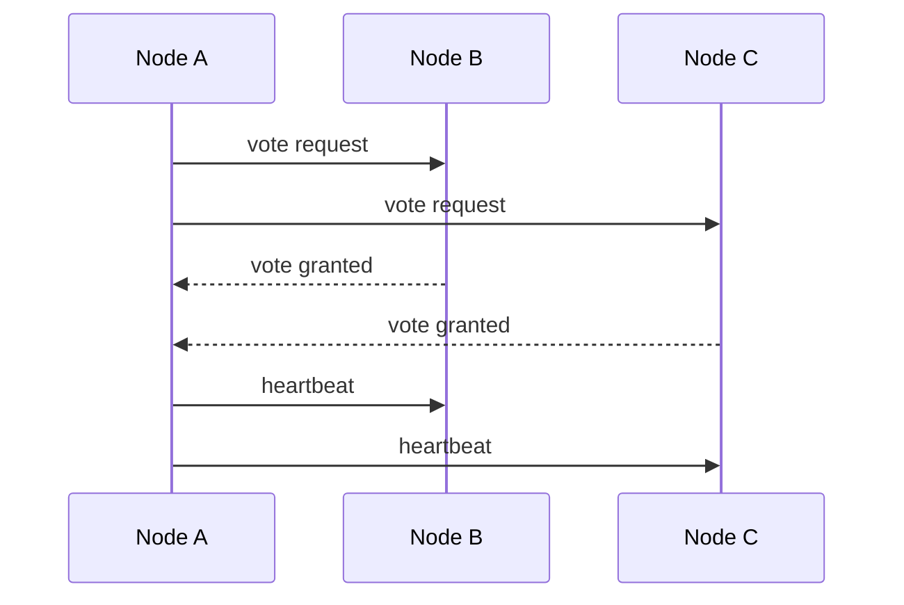

# Leader Election

## Introduction
Leader election is the process of selecting a single coordinator among distributed nodes to perform a specific task.

## Problem Statement
In a distributed system, multiple nodes may be capable of coordinating work, but only one node should act as the leader at a time to avoid conflicts and rival operations.

## Why this exists
Leader election provides a clear owner for responsibilities like metadata management, cluster coordination, and write coordination.

## Real-world analogy
When a team needs a project lead, members vote and agree on one person to coordinate the effort until a new lead is chosen.

## Definition
Leader election is a distributed protocol that ensures exactly one node is designated as leader and others become followers or standby nodes.

## Key concepts
- **Node identity**
- **Election timeout**
- **Heartbeat**
- **Quorum**
- **Leader failure detection**

## Internal working
Nodes exchange messages to nominate candidates and agree on a leader. The leader periodically sends heartbeats to prevent new elections.

### Mermaid sequence diagram


## Python implementation

### Bad implementation
A naive approach that does not tolerate failures.

```python
class SingleNodeCoordinator:
    def __init__(self):
        self.leader = None

    def elect(self, nodes):
        self.leader = nodes[0]
```

### Better implementation
A token-based election with basic leader handoff.

```python
class TokenRingElection:
    def __init__(self, nodes):
        self.nodes = nodes
        self.leader = None

    def elect(self):
        self.leader = self.nodes[0]

    def rotate(self):
        self.nodes.append(self.nodes.pop(0))
        self.leader = self.nodes[0]
```

### Best implementation
A heartbeat-driven election protocol with quorum voting.

```python
import random
from dataclasses import dataclass, field
from enum import Enum
from typing import Dict, List

class NodeState(Enum):
    FOLLOWER = "follower"
    CANDIDATE = "candidate"
    LEADER = "leader"

@dataclass
class Node:
    id: str
    state: NodeState = NodeState.FOLLOWER
    voted_for: str | None = None
    heartbeat_timeout: int = field(default_factory=lambda: random.randint(150, 300))

class Election:
    def __init__(self, nodes: List[Node]):
        self.nodes = {node.id: node for node in nodes}
        self.current_term = 0
        self.leader_id: str | None = None

    def request_vote(self, candidate_id: str) -> bool:
        candidate = self.nodes[candidate_id]
        votes = 0
        self.current_term += 1
        candidate.state = NodeState.CANDIDATE
        for node in self.nodes.values():
            if node.voted_for in (None, candidate_id):
                node.voted_for = candidate_id
                votes += 1
        if votes > len(self.nodes) // 2:
            candidate.state = NodeState.LEADER
            self.leader_id = candidate_id
            return True
        return False
```

## Step-by-step explanation
1. Nodes detect the absence of a leader through missing heartbeats.
2. A candidate requests votes from peers.
3. If it receives a majority, it becomes leader and begins sending heartbeats.

## Multiple real-world examples
- Raft and Paxos include leader election mechanisms.
- ZooKeeper elects one node to manage coordination state.
- Kubernetes uses leader election for controllers.

## Pros
- Prevents split-brain scenarios.
- Centralizes coordination responsibilities.
- Simplifies conflict resolution.

## Cons
- Leader failure causes a short election pause.
- Requires reliable failure detection.
- Can be complicated with many nodes.

## Interview Questions
### Beginner
- What is leader election?
- Answer: A way for distributed nodes to agree on one coordinator.

### Intermediate
- Why is quorum important for leader election?
- Answer: It ensures a majority of nodes agree on the leader, preventing split-brain.

### Senior
- How does heartbeat frequency affect election stability?
- Answer: Frequent heartbeats reduce false elections but increase network traffic.

### Staff Engineer
- Design a leader election strategy for a geo-distributed cluster.
- Answer: Use region-aware quorums, unique node ids, and an election leader with strong failure detection.

## Common mistakes
- Using timeouts that are too short.
- Not handling message delays or temporary partitions.
- Allowing multiple leaders to appear simultaneously.

## Best practices
- Choose election timeouts with jitter.
- Use heartbeats to maintain leadership.
- Persist election metadata for recovery.

## When NOT to use
- Stateless systems without central coordination needs.
- Small clusters where leader election overhead is unnecessary.

## Comparison with similar concepts
- **Consensus:** leader election is often a step in consensus algorithms.
- **Leaderless replication:** avoids a single coordinator.
- **Distributed locking:** sometimes uses leader election for lock management.

## Summary
Leader election enables a single coordinator in distributed clusters. It is a vital building block for consensus, coordination, and consistent leadership.

## Related topics
- [Raft](../raft)
- [Paxos](../paxos)
- [Consensus](../consensus)
