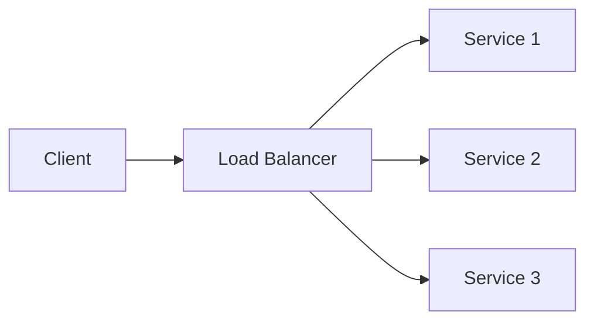

# Load Balancing

## Introduction
Load balancing distributes client requests across multiple servers to improve performance and availability.

## Problem Statement
Without load balancing, traffic concentrates on a single node, causing bottlenecks and outages.

## Why this exists
Distributing traffic evenly enables horizontal scaling and prevents individual machines from becoming single points of failure.

## Real-world analogy
A traffic cop directing cars across multiple lanes at a busy intersection so no single lane gets overloaded.

## Definition
Load balancing is the practice of routing requests to multiple service instances according to defined algorithms and health checks.

## Key concepts
- **Round robin**
- **Least connections**
- **Health checks**
- **Session affinity**
- **Layer 4 vs Layer 7 balancing**

## Internal working
Load balancers decide the target server based on algorithm, current load, and server health.

### Mermaid flowchart


## Python implementation

### Bad implementation
A naive router with no health checks.

```python
from typing import List

class SimpleRouter:
    def __init__(self, servers: List[str]):
        self.servers = servers
        self.index = 0

    def get_next_server(self) -> str:
        server = self.servers[self.index]
        self.index = (self.index + 1) % len(self.servers)
        return server
```

### Better implementation
A router with health status and least-connections selection.

```python
from dataclasses import dataclass
from typing import List

@dataclass
class Server:
    address: str
    health: bool
    active_connections: int

class LoadBalancer:
    def __init__(self, servers: List[Server]):
        self.servers = servers

    def get_server(self) -> Server:
        healthy = [server for server in self.servers if server.health]
        return min(healthy, key=lambda s: s.active_connections)
```

### Best implementation
A load balancer with weighted routing and health checks.

```python
from dataclasses import dataclass
from random import random
from typing import List

@dataclass
class Server:
    address: str
    weight: int
    healthy: bool

class WeightedLoadBalancer:
    def __init__(self, servers: List[Server]):
        self.servers = servers

    def get_server(self) -> Server:
        choices = [server for server in self.servers if server.healthy]
        if not choices:
            raise RuntimeError("no healthy servers")
        total_weight = sum(server.weight for server in choices)
        threshold = random() * total_weight
        current = 0.0
        for server in choices:
            current += server.weight
            if current >= threshold:
                return server
        return choices[-1]
```

## Step-by-step explanation
1. A naive router sends all traffic without checking server availability.
2. Health-aware balancing sends traffic only to live instances.
3. Weighted routing spreads traffic according to capacity.

## Multiple real-world examples
- AWS Elastic Load Balancer intelligently routes to healthy targets.
- Nginx and HAProxy provide software load balancing.
- DNS-based load balancing can route traffic across regions.

## Pros
- Improves performance and fault tolerance.
- Enables horizontal scaling.
- Can provide session sticky or stateless distribution.

## Cons
- Adds a routing layer and potential bottleneck.
- Can become complex with advanced traffic rules.
- Health checks must be accurate to avoid routing to bad nodes.

## Interview Questions
### Beginner
- What does a load balancer do?
- Answer: It distributes client requests across multiple servers.

### Intermediate
- What is session affinity and when is it useful?
- Answer: It binds a client to the same backend for session state; useful for legacy stateful apps.

### Senior
- Explain the difference between Layer 4 and Layer 7 load balancing.
- Answer: Layer 4 balances based on transport info (IP/port); Layer 7 uses application data like URLs and headers.

### Staff Engineer
- How would you design global load balancing for a multi-region service?
- Answer: Use DNS routing with latency-based policies, regional load balancers, and health-aware failover.

## Common mistakes
- Using stale health checks that route traffic to unhealthy servers.
- Relying on a single load balancer with no redundancy.
- Ignoring rebalancing when capacity changes.

## Best practices
- Perform real-time health checks.
- Use multiple load balancers for redundancy.
- Choose the algorithm based on application traffic patterns.

## When NOT to use
- Simple local applications with a single process.
- Very low traffic services where load distribution is unnecessary.

## Comparison with similar concepts
- **Caching:** reduces load by serving repeated requests from memory.
- **Scalability:** load balancing is a tool to achieve scalable traffic distribution.
- **Fault tolerance:** load balancing contributes to fault tolerance by routing around failures.

## Summary
Load balancing is essential for scaling and reliability in modern distributed systems. It requires careful health checking, routing rules, and redundancy.

## Related topics
- [Scalability](../scalability)
- [Availability](../availability)
- [Fault Tolerance](../fault-tolerance)
