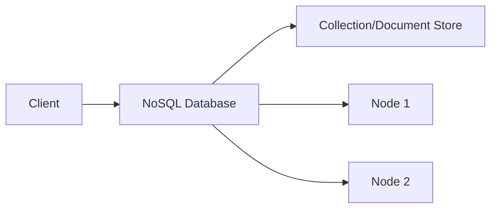

# NoSQL

## Introduction
NoSQL refers to non-relational databases designed for flexible, schema-less, and scalable data storage.

## Problem Statement
Relational databases can struggle with flexible schemas, massive scale, or high write throughput.

## Why this exists
NoSQL systems support evolving data models, large distributed workloads, and low-latency operations without strict relational schemas.

## Real-world analogy
NoSQL is like a collection of folders and notes instead of a fixed filing cabinet with rigid labels.

## Definition
NoSQL databases store data in document, key-value, column-family, or graph formats, offering schema flexibility and horizontal scale.

## Key concepts
- **Document stores**
- **Key-value stores**
- **Wide-column stores**
- **Graph databases**
- **Eventual consistency**

## Internal working
NoSQL systems often denormalize data, use partitioning, and optimize for fast reads or writes rather than strict transactional integrity.

### Mermaid flowchart


## Python implementation

### Bad implementation
A rigid data model that rejects flexible records.

```python
class RigidStore:
    def __init__(self):
        self.store: dict[str, dict] = {}

    def insert(self, key: str, record: dict) -> None:
        if set(record.keys()) != {"id", "name"}:
            raise ValueError("unsupported schema")
        self.store[key] = record
```

### Better implementation
A simple schema-less document store.

```python
class DocumentStore:
    def __init__(self):
        self.store: dict[str, dict] = {}

    def insert(self, key: str, document: dict) -> None:
        self.store[key] = document

    def find(self, key: str) -> dict | None:
        return self.store.get(key)
```

### Best implementation
A NoSQL-style store with optional secondary indexing and replica awareness.

```python
from collections import defaultdict
from typing import Any

class DocumentDB:
    def __init__(self):
        self.store: dict[str, dict] = {}
        self.indexes: dict[str, defaultdict] = {}

    def create_index(self, field: str) -> None:
        self.indexes[field] = defaultdict(list)
        for key, doc in self.store.items():
            self.indexes[field][doc.get(field)].append(key)

    def insert(self, key: str, document: dict) -> None:
        self.store[key] = document
        for field, index in self.indexes.items():
            index[document.get(field)].append(key)

    def find_by_field(self, field: str, value: Any) -> list[dict]:
        keys = self.indexes.get(field, {}).get(value, [])
        return [self.store[key] for key in keys]
```

## Step-by-step explanation
1. NoSQL avoids fixed schema requirements.
2. Documents are stored in flexible key-value structures.
3. Optional indexing improves query speed.

## Multiple real-world examples
- MongoDB stores JSON-like documents.
- DynamoDB is a key-value and document store optimized for scale.
- Cassandra stores wide-column data with high write throughput.

## Pros
- Flexible schema design.
- High scalability across distributed nodes.
- Fast writes for denormalized data models.

## Cons
- Weaker consistency guarantees in some models.
- More application-side logic for relationships.
- Harder to perform complex joins and transactions.

## Interview Questions
### Beginner
- What does NoSQL mean?
- Answer: A category of databases that are not strictly relational and often support schema flexibility.

### Intermediate
- When would you choose a document store over a relational database?
- Answer: When data shapes vary frequently or fast schema evolution is required.

### Senior
- How do NoSQL systems handle relationships?
- Answer: They typically denormalize relationships, embed documents, or use application-level joins.

### Staff Engineer
- Design a NoSQL model for a global user profile store.
- Answer: Use documents keyed by user ID, replicate regionally, and shard by user hash for scale.

## Common mistakes
- Treating NoSQL as a replacement for every database problem.
- Over-normalizing data in a schema-less store.
- Ignoring eventual consistency implications.

## Best practices
- Model data around access patterns.
- Use denormalization where it improves performance.
- Select the NoSQL type based on workload: key-value, document, column, or graph.

## When NOT to use
- Highly relational transactional systems requiring complex joins.
- Workloads requiring strong ACID semantics for all operations.

## Comparison with similar concepts
- **SQL:** relational schema and strong transactions.
- **Sharding:** NoSQL often uses sharding for distributed scale.
- **Indexing:** still important for query speed in NoSQL stores.

## Summary
NoSQL is a broad category for scalable, flexible data stores. It is ideal when schema flexibility and distribution matter more than relational rigidity.

## Related topics
- [SQL](../sql)
- [Sharding](../sharding)
- [Partitioning](../partitioning)
- [Indexing](../indexing)
