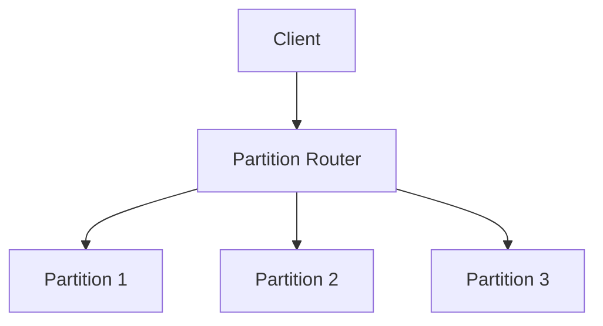

# Partitioning

## Introduction
Partitioning divides large datasets into smaller, independent segments to improve manageability and scalability.

## Problem Statement
Monolithic data tables or stores can become too large to query, maintain, or scale efficiently.

## Why this exists
Partitioning reduces the data footprint of each node, improves query performance, and enables independent scaling of partitions.

## Real-world analogy
A library organizes books into sections and shelves instead of storing every book in one giant room.

## Definition
Partitioning is the act of splitting data into segments (partitions) based on a key or range, so each partition can be stored and queried separately.

## Key concepts
- **Horizontal partitioning (sharding)**
- **Vertical partitioning**
- **Range partitioning**
- **Hash partitioning**
- **Directory-based partitioning**

## Internal working
Partitioning assigns rows or objects to partitions using a partitioning function and stores each partition on separate nodes or disks.

### Mermaid flowchart


## Python implementation

### Bad implementation
A single storage table without any partitioning.

```python
class Table:
    def __init__(self):
        self.rows = []

    def insert(self, row):
        self.rows.append(row)
```

### Better implementation
A simple range partitioner.

```python
class RangePartitioner:
    def __init__(self, boundaries):
        self.boundaries = boundaries
        self.partitions = {i: [] for i in range(len(boundaries) + 1)}

    def _find_partition(self, key: int) -> int:
        for idx, boundary in enumerate(self.boundaries):
            if key < boundary:
                return idx
        return len(self.boundaries)

    def insert(self, key: int, row: dict):
        partition = self._find_partition(key)
        self.partitions[partition].append(row)
```

### Best implementation
A partition router with hash and range strategies and partition metadata.

```python
from typing import Any, Callable, Dict, List

class Partition:
    def __init__(self, name: str):
        self.name = name
        self.rows: List[Dict[str, Any]] = []

    def insert(self, row: Dict[str, Any]) -> None:
        self.rows.append(row)

class PartitionManager:
    def __init__(self, partitions: List[Partition], strategy: Callable[[Any], int]):
        self.partitions = partitions
        self.strategy = strategy

    def route(self, key: Any) -> Partition:
        index = self.strategy(key) % len(self.partitions)
        return self.partitions[index]

    def insert(self, key: Any, row: Dict[str, Any]) -> None:
        partition = self.route(key)
        partition.insert(row)

def hash_strategy(key: Any) -> int:
    return hash(key)

partitions = [Partition(name=f"partition-{i}") for i in range(4)]
manager = PartitionManager(partitions=partitions, strategy=hash_strategy)
manager.insert("user-123", {"id": "user-123", "name": "Alice"})
```

## Step-by-step explanation
1. Partitioning avoids storing the entire dataset in one physical location.
2. A router determines which partition owns each record.
3. Queries can target specific partitions instead of scanning all data.

## Multiple real-world examples
- Databases use partitioned tables to speed up analytics.
- Kafka partitions messages across brokers.
- Distributed caches partition keys across shards.

## Pros
- Improves performance for large datasets.
- Enables parallel processing.
- Reduces maintenance windows.

## Cons
- Adds complexity to query routing.
- Can create hotspots if partitioning is uneven.
- Rebalancing partitions can be expensive.

## Interview Questions
### Beginner
- What is partitioning?
- Answer: Splitting data into smaller pieces based on a key or criteria.

### Intermediate
- What is the difference between horizontal and vertical partitioning?
- Answer: Horizontal splits rows across partitions, vertical splits columns.

### Senior
- How do you avoid hotspots in partitioned systems?
- Answer: Use hash-based partitioning or composite keys to spread load evenly.

### Staff Engineer
- Design a partitioning strategy for a social feed service.
- Answer: Partition by user ID or region, combine with time bucketing, and support rebalancing.

## Common mistakes
- Using a poor partition key that concentrates load.
- Forgetting to plan for partition rebalancing.
- Treating partitions like independent databases without cross-partition joins.

## Best practices
- Choose the partition key based on access patterns.
- Monitor partition sizes and query distribution.
- Prefer stateless routers and well-defined partition metadata.

## When NOT to use
- Small datasets where a single node is sufficient.
- Systems where partitioning complicates business logic more than it helps.

## Comparison with similar concepts
- **Sharding:** a form of horizontal partitioning.
- **Replication:** copies the same data, while partitioning splits data.
- **Indexing:** speeds lookups within partitions.

## Summary
Partitioning is essential for scaling large datasets. The right strategy balances query efficiency, storage, and operational complexity.

## Related topics
- [Sharding](../sharding)
- [Replication](../replication)
- [Indexing](../indexing)
