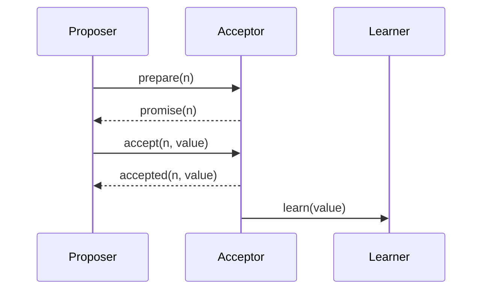

# Paxos

## Introduction
Paxos is a family of consensus algorithms that enables a distributed system to agree on a value even when some nodes fail.

## Problem Statement
Distributed systems must reach agreement without assuming all nodes are always available.

## Why this exists
Paxos provides a fault-tolerant way to make decisions with a majority of nodes while tolerating message loss and node crashes.

## Real-world analogy
A committee votes on a proposal in multiple rounds. As long as a majority agrees, the decision is accepted even if some members are absent.

## Definition
Paxos is a protocol for reaching consensus by using proposals, promises, and acceptances among participants.

## Key concepts
- **Proposers**
- **Acceptors**
- **Learners**
- **Prepare and promise**
- **Accept and accepted**

## Internal working
Paxos runs in two phases: prepare/promise and accept/accepted. A proposal becomes chosen when a majority of acceptors agree.

### Mermaid sequence diagram


## Python implementation

### Bad implementation
A single-round vote without the promise phase.

```python
class SimplePaxos:
    def __init__(self, acceptors):
        self.acceptors = acceptors

    def propose(self, value):
        for acceptor in self.acceptors:
            acceptor.value = value
```

### Better implementation
A two-phase proposal with naive acceptance.

```python
class Acceptor:
    def __init__(self):
        self.promised_id = None
        self.accepted_value = None

class Paxos:
    def __init__(self, acceptors):
        self.acceptors = acceptors

    def propose(self, proposal_id, value):
        for acceptor in self.acceptors:
            if acceptor.promised_id is None or proposal_id > acceptor.promised_id:
                acceptor.promised_id = proposal_id
        for acceptor in self.acceptors:
            acceptor.accepted_value = value
```

### Best implementation
A simplified Paxos implementation with prepare and accept phases.

```python
from dataclasses import dataclass
from typing import Any, Dict, List, Optional

@dataclass
class Acceptor:
    promised_proposal: int = 0
    accepted_proposal: int = 0
    accepted_value: Any = None

class Paxos:
    def __init__(self, acceptors: List[Acceptor]):
        self.acceptors = acceptors

    def prepare(self, proposal_id: int) -> Optional[Any]:
        highest_accepted = None
        promises = 0
        for acceptor in self.acceptors:
            if proposal_id > acceptor.promised_proposal:
                acceptor.promised_proposal = proposal_id
                promises += 1
                if acceptor.accepted_value is not None:
                    highest_accepted = acceptor.accepted_value
        if promises > len(self.acceptors) // 2:
            return highest_accepted
        return None

    def accept(self, proposal_id: int, value: Any) -> bool:
        accepts = 0
        for acceptor in self.acceptors:
            if proposal_id >= acceptor.promised_proposal:
                acceptor.promised_proposal = proposal_id
                acceptor.accepted_proposal = proposal_id
                acceptor.accepted_value = value
                accepts += 1
        return accepts > len(self.acceptors) // 2
```

## Step-by-step explanation
1. The proposer sends a prepare request with a proposal id.
2. Acceptors promise not to accept lower proposal ids.
3. The proposer sends accept requests, and if a majority accepts, the value is chosen.

## Multiple real-world examples
- Google Chubby uses Paxos for distributed lock service.
- Apache ZooKeeper's Zab is inspired by Paxos concepts.
- Some distributed databases implement Multi-Paxos for consensus.

## Pros
- Proven correctness for consensus.
- Tolerates crashes of minority nodes.
- Can reach agreement without a fixed leader.

## Cons
- Harder to understand than Raft.
- More complex to implement correctly.
- Performance depends on multiple communication rounds.

## Interview Questions
### Beginner
- What are the roles in Paxos?
- Answer: Proposers, acceptors, and learners.

### Intermediate
- Why does Paxos use proposal numbers?
- Answer: To ensure newer proposals override older ones and avoid conflicts.

### Senior
- What is Multi-Paxos?
- Answer: A Paxos optimization that reuses the same leader for a sequence of decisions.

### Staff Engineer
- Choose between Raft and Paxos for a new consensus service.
- Answer: Use Raft for clarity and usability in most cases, or Paxos for more flexible leaderless proposals.

## Common mistakes
- Confusing Paxos phases with two-phase commit.
- Ignoring the need for majority quorums.
- Implementing Paxos without handling duplicate proposals.

## Best practices
- Prefer Multi-Paxos for repeated decisions.
- Keep proposal ids monotonic.
- Separate learners from acceptors if needed.

## When NOT to use
- Systems that need simplicity over theoretical flexibility.
- Very small clusters where consensus overhead outweighs benefits.

## Comparison with similar concepts
- **Raft:** easier to understand, leader-driven.
- **Two-phase commit:** consensus for transaction commit, not general agreement.
- **Gossip protocol:** different goal of state dissemination, not strict agreement.

## Summary
Paxos is a foundational consensus protocol that ensures agreement under failure. It is powerful but more complicated than leader-based protocols like Raft.

## Related topics
- [Consensus](../consensus)
- [Raft](../raft)
- [Leader Election](../leader-election)
- [Gossip Protocol](../gossip-protocol)
