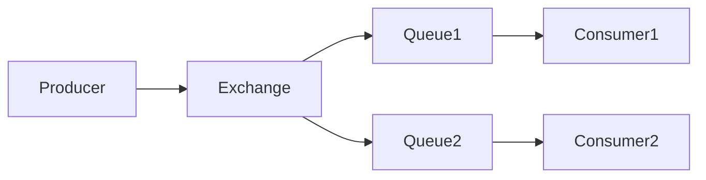

# RabbitMQ

## Introduction
RabbitMQ is a message broker that implements AMQP and supports flexible routing, reliability, and queuing semantics.

## Problem Statement
Synchronous service coupling leads to brittle systems, especially when services must communicate asynchronously.

## Why this exists
RabbitMQ provides reliable messaging with rich routing capabilities, making it easier to decouple producers from consumers.

## Real-world analogy
RabbitMQ is like a postal sorting facility that routes letters to specific destinations based on labels and envelopes.

## Definition
RabbitMQ is a broker-based messaging platform that routes messages to queues according to exchanges and binding rules.

## Key concepts
- **Producer**
- **Consumer**
- **Exchange**
- **Queue**
- **Binding**
- **Acknowledgement**
- **Dead-letter exchange**

## Internal working
Messages are published to exchanges, routed to queues based on bindings, and delivered to consumers with acknowledgement.

### Mermaid diagram


## Python implementation

### Bad implementation
A simple queue without routing or acknowledgement.

```python
class SimpleQueue:
    def __init__(self):
        self.queue = []

    def publish(self, message):
        self.queue.append(message)

    def consume(self):
        return self.queue.pop(0)
```

### Better implementation
A broker with simple exchange routing.

```python
from collections import defaultdict

class Exchange:
    def __init__(self):
        self.bindings = defaultdict(list)

    def bind(self, routing_key, queue):
        self.bindings[routing_key].append(queue)

    def publish(self, routing_key, message):
        for queue in self.bindings[routing_key]:
            queue.put(message)

class Queue:
    def __init__(self):
        self.messages = []

    def put(self, message):
        self.messages.append(message)

    def get(self):
        return self.messages.pop(0)
```

### Best implementation
A message broker with exchange types and acknowledgements.

```python
from collections import defaultdict
from dataclasses import dataclass, field
from typing import Any, Dict, List

@dataclass
class Queue:
    messages: List[Any] = field(default_factory=list)

    def put(self, message: Any) -> None:
        self.messages.append(message)

    def get(self) -> Any:
        return self.messages.pop(0)

@dataclass
class Exchange:
    type: str
    bindings: Dict[str, List[Queue]] = field(default_factory=lambda: defaultdict(list))

    def bind(self, routing_key: str, queue: Queue) -> None:
        self.bindings[routing_key].append(queue)

    def publish(self, routing_key: str, message: Any) -> None:
        for queue in self.bindings.get(routing_key, []):
            queue.put(message)

class RabbitMQSimulator:
    def __init__(self):
        self.exchanges: Dict[str, Exchange] = {}
        self.queues: Dict[str, Queue] = {}

    def create_exchange(self, name: str, type: str) -> None:
        self.exchanges[name] = Exchange(type=type)

    def create_queue(self, name: str) -> None:
        self.queues[name] = Queue()

    def bind(self, exchange_name: str, routing_key: str, queue_name: str) -> None:
        exchange = self.exchanges[exchange_name]
        queue = self.queues[queue_name]
        exchange.bind(routing_key, queue)

    def publish(self, exchange_name: str, routing_key: str, message: Any) -> None:
        exchange = self.exchanges[exchange_name]
        exchange.publish(routing_key, message)
```

## Step-by-step explanation
1. Producers send messages to an exchange.
2. The exchange routes messages to queues based on bindings.
3. Consumers read messages from queues and acknowledge receipt.

## Multiple real-world examples
- Task queues for asynchronous processing.
- Event notification systems.
- Work distribution in microservices.

## Pros
- Flexible routing with exchange types.
- Reliable delivery with acknowledgements.
- Support for dead-letter queues.

## Cons
- More operational overhead than simpler queue systems.
- Can become complex with many exchanges and queues.
- Not optimized for extremely high throughput compared to log-based systems.

## Interview Questions
### Beginner
- What is a message exchange in RabbitMQ?
- Answer: A routing component that forwards messages to queues.

### Intermediate
- How does acknowledgement improve reliability?
- Answer: It ensures messages are only removed after successful consumer processing.

### Senior
- When should you use a dead-letter queue?
- Answer: For failed messages that need retry or inspection without blocking primary processing.

### Staff Engineer
- Architect a distributed job processing system with RabbitMQ.
- Answer: Use separate exchanges for command and retry flows, dead-letter queues for failures, and autoscaling workers.

## Common mistakes
- Not acknowledging messages, causing duplicates.
- Binding too few queues for high throughput.
- Leaving unprocessed messages in queues indefinitely.

## Best practices
- Use prefetch limits to avoid worker overload.
- Monitor queue depth and consumer lag.
- Use durable queues and persistent messages for reliability.

## When NOT to use
- Simple pub/sub needs with minimal routing.
- High-throughput streaming pipelines better served by Kafka.

## Comparison with similar concepts
- **Kafka:** log-based, high throughput, long retention.
- **SQS:** managed queue service with simpler semantics.
- **Event-driven architecture:** RabbitMQ is a broker implementation.

## Summary
RabbitMQ is a powerful broker for routing messages with reliability and flexibility. It suits distributed systems with complex routing or task queue requirements.

## Related topics
- [Kafka](../kafka)
- SQS
- [Event-Driven Architecture](../event-driven-architecture)
