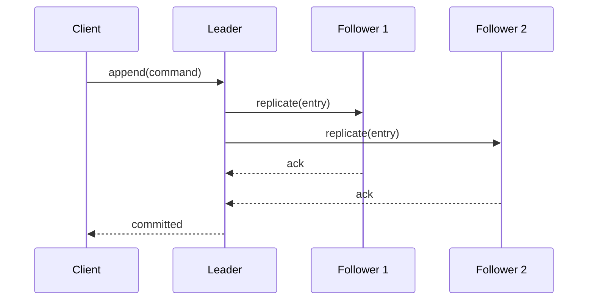

# Raft

## Introduction
Raft is a distributed consensus algorithm designed to be understandable and practical for replicated state machines.

## Problem Statement
Existing consensus algorithms were difficult to understand and implement correctly.

## Why this exists
Raft was created to make consensus easier to reason about while providing safety and liveness guarantees.

## Real-world analogy
A committee elects a leader who then coordinates decisions; if the leader fails, a new election starts.

## Definition
Raft is a leader-based consensus protocol that uses leader election, log replication, and safety rules to maintain a distributed state machine.

## Key concepts
- **Leader election**
- **Log replication**
- **Commit index**
- **Safety**
- **Follower and candidate states**

## Internal working
Raft nodes elect a leader, which appends commands to a replicated log. Followers apply committed entries in order.

### Mermaid sequence diagram


## Python implementation

### Bad implementation
A leader that appends entries locally without replication.

```python
class BadRaftLeader:
    def __init__(self):
        self.log = []

    def append(self, command):
        self.log.append(command)
```

### Better implementation
A leader with naive replication to followers.

```python
class RaftLeader:
    def __init__(self, followers):
        self.log = []
        self.followers = followers

    def append(self, command):
        self.log.append(command)
        for follower in self.followers:
            follower.log.append(command)
```

### Best implementation
A simplified Raft replica set with election and commit tracking.

```python
from dataclasses import dataclass, field
from enum import Enum
from typing import Any, Dict, List

class NodeState(Enum):
    FOLLOWER = "follower"
    CANDIDATE = "candidate"
    LEADER = "leader"

@dataclass
class LogEntry:
    term: int
    command: Any

@dataclass
class RaftNode:
    id: str
    state: NodeState = NodeState.FOLLOWER
    current_term: int = 0
    log: List[LogEntry] = field(default_factory=list)
    commit_index: int = 0
    last_applied: int = 0

class RaftCluster:
    def __init__(self, nodes: List[RaftNode]):
        self.nodes = {node.id: node for node in nodes}
        self.leader_id: str | None = None

    def elect_leader(self, candidate_id: str) -> bool:
        self.leader_id = candidate_id
        self.nodes[candidate_id].state = NodeState.LEADER
        return True

    def append_entry(self, command: Any) -> bool:
        leader = self.nodes[self.leader_id]
        entry = LogEntry(term=leader.current_term, command=command)
        leader.log.append(entry)
        replication_count = 1
        for node in self.nodes.values():
            if node.id == leader.id:
                continue
            node.log.append(entry)
            replication_count += 1
        if replication_count > len(self.nodes) // 2:
            leader.commit_index += 1
            return True
        return False
```

## Step-by-step explanation
1. Nodes elect a leader through voting.
2. The leader receives client commands and appends them to its log.
3. The leader replicates entries, commits upon majority acknowledgement, and followers apply committed commands.

## Multiple real-world examples
- etcd and Consul implement Raft for cluster metadata.
- CockroachDB uses Raft for distributed SQL metadata.
- HashiCorp Vault uses Raft for leader election and storage.

## Pros
- Clear, understandable protocol.
- Strong consistency and safety.
- Works well for replicated state machines.

## Cons
- Single leader can become a bottleneck.
- Requires stable leader election and log synchronization.
- Complex failure recovery in edge cases.

## Interview Questions
### Beginner
- What are the main states in Raft?
- Answer: Follower, Candidate, and Leader.

### Intermediate
- When does Raft start a new election?
- Answer: When a follower does not receive a heartbeat before its election timeout.

### Senior
- How does Raft ensure log consistency?
- Answer: Leaders replicate logs in order and followers reject inconsistent entries.

### Staff Engineer
- Design a Raft-backed metadata store for a global service.
- Answer: Use region-aware clusters, careful leader failover, and log snapshotting for state persistence.

## Common mistakes
- Treating Raft as a simple queue.
- Ignoring leader election timeouts and heartbeats.
- Failing to snapshot logs and manage state size.

## Best practices
- Use stable leader terms and election backoff.
- Snapshot state periodically to limit log growth.
- Monitor commit latency and follower lag.

## When NOT to use
- Systems that need many concurrent writers without a strong coordinator.
- Lightweight coordination tasks better solved by leaderless protocols.

## Comparison with similar concepts
- **Paxos:** more complex but also consensus-based.
- **ZooKeeper/Zab:** leader-based consensus with different replication semantics.
- **Leader election:** Raft includes leader election as part of the protocol.

## Summary
Raft is a practical consensus protocol for replicated state machines. Its design emphasizes understandability while providing strong correctness.

## Related topics
- [Leader Election](../leader-election)
- [Consensus](../consensus)
- [Paxos](../paxos)
- [Gossip Protocol](../gossip-protocol)
