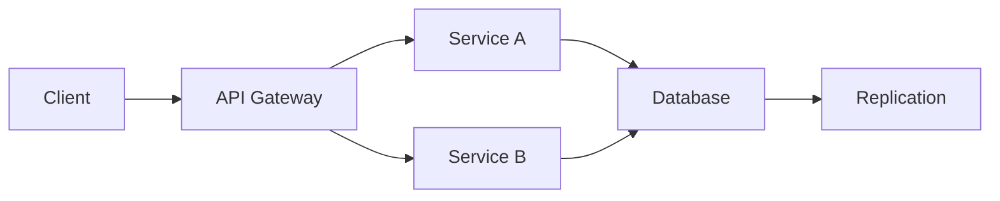

# Reliability

## Introduction
Reliability measures how consistently a system performs its function over time.

## Problem Statement
Users expect services to remain correct and dependable even when components fail.

## Why this exists
A system can be available but unreliable if it returns incorrect or inconsistent results. Reliability focuses on correctness and predictability.

## Real-world analogy
A power grid is reliable when electricity is delivered steadily without interruptions or voltage spikes.

## Definition
Reliability is the probability that a system will operate without failure for a given period under specified conditions.

## Key concepts
- **Mean time between failures (MTBF)**
- **Mean time to repair (MTTR)**
- **Redundancy**
- **Graceful degradation**
- **Data integrity**

## Internal working
Reliability is enforced through automated recovery, retries, idempotency, and strong monitoring.

### Mermaid diagram


## Python implementation

### Bad implementation
No retry or error handling.

```python
class UnreliableService:
    def get_value(self, key: str) -> int:
        raise RuntimeError("temporary failure")
```

### Better implementation
A retry loop without idempotency or backoff.

```python
class RetryService:
    def __init__(self, service):
        self.service = service

    def get_value(self, key: str) -> int:
        for _ in range(3):
            try:
                return self.service.get_value(key)
            except RuntimeError:
                continue
        raise
```

### Best implementation
A reliable wrapper with retries, backoff, and idempotent operations.

```python
import time
from typing import Callable

class ReliableService:
    def __init__(self, service: object, max_retries: int = 3, base_delay: float = 0.2):
        self.service = service
        self.max_retries = max_retries
        self.base_delay = base_delay

    def get_value(self, key: str) -> int:
        for attempt in range(1, self.max_retries + 1):
            try:
                return self.service.get_value(key)
            except RuntimeError as error:
                if attempt == self.max_retries:
                    raise
                time.sleep(self.base_delay * attempt)

class DatabaseClient:
    def __init__(self, store: dict[str, int]):
        self.store = store

    def get_value(self, key: str) -> int:
        if key not in self.store:
            raise RuntimeError("temporary failure")
        return self.store[key]
```

## Step-by-step explanation
1. The bad example fails instantly and breaks user requests.
2. Retries reduce transient failure impact.
3. Exponential backoff avoids overwhelming unreliable dependencies.

## Multiple real-world examples
- Payment systems use retries with idempotency keys.
- Cloud storage replicates objects across zones for reliability.
- Circuit breakers protect services from repeated failure.

## Pros
- Improves user trust.
- Reduces incident impact.
- Makes systems more predictable.

## Cons
- Retries can mask slowness.
- Overuse of fallback logic increases complexity.
- Poorly designed retries can cause cascading failures.

## Interview Questions
### Beginner
- What is reliability in system design?
- Answer: The ability of a system to operate correctly over time.

### Intermediate
- How does idempotency help reliability?
- Answer: It ensures repeated operations produce the same result without side effects.

### Senior
- How do you design reliable distributed writes?
- Answer: Use retries, acknowledgments, ordered logs, and conflict resolution.

### Staff Engineer
- Explain how reliability and availability differ in a distributed system.
- Answer: Availability is about serving requests, while reliability is about correct and consistent operation.

## Common mistakes
- Treating retries as a substitute for fixing root causes.
- Ignoring failure modes in dependent services.
- Not measuring error budgets.

## Best practices
- Build idempotent APIs.
- Define clear service contracts and SLAs.
- Monitor both success rates and error budgets.

## When NOT to use
- Reliability measures are less critical for disposable prototypes.
- Some low-risk experimental systems can accept lower reliability.

## Comparison with similar concepts
- **Availability:** ensures access; reliability ensures correctness.
- **Fault tolerance:** reliability often depends on tolerating faults.
- **Consistency:** reliable systems maintain expected state.

## Summary
Reliability is the bedrock of trust in software systems. It requires design discipline, automation, and careful handling of failures.

## Related topics
- [Fault Tolerance](../fault-tolerance)
- [Load Balancing](../load-balancing)
- [CAP Theorem](../cap-theorem)
