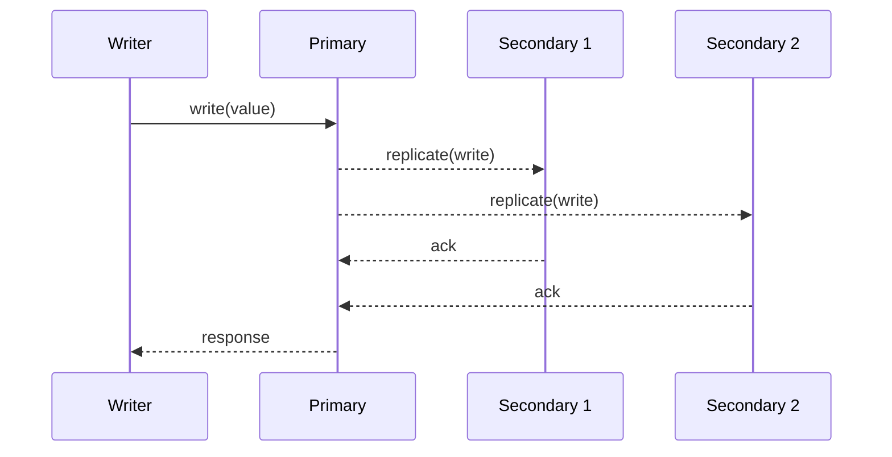

# Replication

## Introduction
Replication is the process of copying and maintaining data across multiple servers or nodes.

## Problem Statement
A single datastore can become a bottleneck or a single point of failure, risking availability and durability.

## Why this exists
Replication improves read performance, fault tolerance, and disaster recovery by maintaining multiple copies of the same data.

## Real-world analogy
A library keeps copies of a popular book in multiple branches so readers can access it from different locations even if one branch is closed.

## Definition
Replication is a data distribution strategy where changes on one node are propagated to other nodes to keep them synchronized.

## Key concepts
- **Primary-secondary (master-slave)** replication
- **Multi-primary (multi-master)** replication
- **Synchronous** vs **asynchronous** replication
- **Read replicas**
- **Replication lag**

## Internal working
Replication typically involves a source node emitting a stream of write operations and target nodes applying those operations in order.

### Mermaid sequence diagram


## Python implementation

### Bad implementation
A naive replication approach that ignores order and failure handling.

```python
class ReplicationStore:
    def __init__(self):
        self.primary = {}
        self.replicas = []

    def add_replica(self, replica):
        self.replicas.append(replica)

    def write(self, key, value):
        self.primary[key] = value
        for replica in self.replicas:
            replica[key] = value
```

### Better implementation
A versioned replication stream with simple acknowledgement.

```python
from dataclasses import dataclass
from typing import Any, Dict, List

@dataclass
class Replica:
    store: Dict[str, Any]

class ReplicationController:
    def __init__(self, replicas: List[Replica]):
        self.replicas = replicas
        self.log: List[Dict[str, Any]] = []

    def write(self, key: str, value: Any) -> None:
        event = {"key": key, "value": value}
        self.log.append(event)
        for replica in self.replicas:
            replica.store[key] = value
```

### Best implementation
A replication system with ordered logs, consistency modes, and lag tracking.

```python
from dataclasses import dataclass, field
from enum import Enum
from typing import Any, Dict, List, Optional

class ReplicationMode(Enum):
    SYNCHRONOUS = "synchronous"
    ASYNCHRONOUS = "asynchronous"

@dataclass
class Replica:
    name: str
    store: Dict[str, Any] = field(default_factory=dict)
    last_applied_index: int = 0
    healthy: bool = True

@dataclass
class ReplicationEvent:
    index: int
    key: str
    value: Any

class ReplicationManager:
    def __init__(self, replicas: List[Replica], mode: ReplicationMode):
        self.replicas = replicas
        self.mode = mode
        self.log: List[ReplicationEvent] = []
        self.index = 1

    def write(self, key: str, value: Any) -> bool:
        event = ReplicationEvent(index=self.index, key=key, value=value)
        self.log.append(event)
        self.index += 1

        if self.mode == ReplicationMode.SYNCHRONOUS:
            return self._replicate_synchronously(event)

        self._replicate_asynchronously(event)
        return True

    def _replicate_synchronously(self, event: ReplicationEvent) -> bool:
        for replica in self.replicas:
            if not replica.healthy:
                return False
            replica.store[event.key] = event.value
            replica.last_applied_index = event.index
        return True

    def _replicate_asynchronously(self, event: ReplicationEvent) -> None:
        for replica in self.replicas:
            if replica.healthy:
                replica.store[event.key] = event.value
                replica.last_applied_index = event.index

    def get_replication_lag(self, replica_name: str) -> Optional[int]:
        replica = next((r for r in self.replicas if r.name == replica_name), None)
        if not replica:
            return None
        return self.index - 1 - replica.last_applied_index
```
```

## Step-by-step explanation
1. A write is accepted by a primary node.
2. The write is emitted to replicas via a replication stream.
3. Synchronous replication waits for replicas before acknowledging; asynchronous does not.

## Multiple real-world examples
- PostgreSQL uses primary-secondary replication.
- MySQL Group Replication and Galera provide multi-primary replication.
- Cassandra uses peer-to-peer replication across clusters.

## Pros
- Improved read throughput with replicas.
- Better fault tolerance.
- Faster recovery from node failure.

## Cons
- Synchronous replication increases write latency.
- Replication lag can cause stale reads.
- Conflict resolution is required for multi-primary setups.

## Interview Questions
### Beginner
- What is replication?
- Answer: Copying data across multiple nodes so replicas have the same data.

### Intermediate
- What is replication lag?
- Answer: The delay between a write committing on the primary and being applied on a replica.

### Senior
- When should you use asynchronous replication instead of synchronous?
- Answer: When performance is critical and the application can tolerate eventual consistency.

### Staff Engineer
- Design a replication scheme for a global read-heavy service.
- Answer: Use primary-secondary replication in each region, route reads to nearest replicas, and keep writes in a strong-consistency region if needed.

## Common mistakes
- Assuming replicas are always up to date.
- Using synchronous replication for every workload.
- Not monitoring replica health and lag.

## Best practices
- Use read replicas for read-heavy workloads.
- Monitor lag and choose the right consistency mode.
- Keep failover processes automated and tested.

## When NOT to use
- Small systems where a single node is sufficient.
- Write-heavy systems that cannot tolerate added latency from replication.

## Comparison with similar concepts
- **Sharding:** splits data horizontally; replication copies the same data.
- **Consistency models:** replication affects how fresh reads are.
- **Availability:** replication supports availability by providing redundant nodes.

## Summary
Replication is a foundational strategy for distributed data systems. The right mode depends on the tradeoff between latency, consistency, and availability.

## Related topics
- [CAP Theorem](../cap-theorem)
- [Consistency Models](../consistency-models)
- [Sharding](../sharding)
- [Partitioning](../partitioning)
