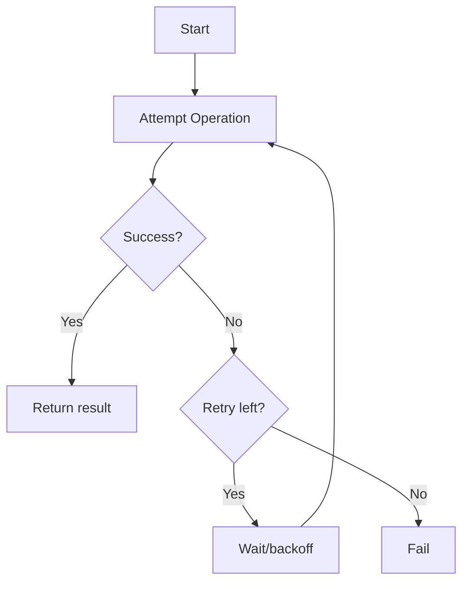

# Retry

## Introduction
Retry is a fault-tolerance pattern where failed operations are attempted again automatically.

## Problem Statement
Transient failures such as network timeouts and temporary service overloads can be fixed by simply retrying the request.

## Why this exists
Retries help services recover from intermittent failures without requiring manual intervention.

## Real-world analogy
If a pedestrian crossing signal fails, you try again after a short pause rather than giving up immediately.

## Definition
Retry is a pattern that re-attempts failed operations according to a policy until they succeed or a limit is reached.

## Key concepts
- **Retry count**
- **Backoff strategy**
- **Idempotency**
- **Jitter**
- **Retry budget**

## Internal working
The caller retries according to rules, optionally waiting longer after each attempt to avoid overwhelming the dependency.

### Mermaid flowchart


## Python implementation

### Bad implementation
A retry loop without backoff or idempotency checks.

```python
def retry(operation, retries=3):
    for _ in range(retries):
        try:
            return operation()
        except Exception:
            continue
    raise RuntimeError("operation failed")
```

### Better implementation
A retry with exponential backoff.

```python
import time

def retry(operation, retries=3, base_delay=0.1):
    for attempt in range(retries):
        try:
            return operation()
        except Exception:
            if attempt == retries - 1:
                raise
            time.sleep(base_delay * 2 ** attempt)
```

### Best implementation
A retry policy with jitter and idempotent guard.

```python
import random
import time
from typing import Callable

class RetryPolicy:
    def __init__(self, max_attempts: int = 5, base_delay: float = 0.1, max_delay: float = 2.0):
        self.max_attempts = max_attempts
        self.base_delay = base_delay
        self.max_delay = max_delay

    def execute(self, operation: Callable[[], any], is_idempotent: bool = True) -> any:
        if not is_idempotent:
            raise ValueError("operation must be idempotent")

        for attempt in range(1, self.max_attempts + 1):
            try:
                return operation()
            except Exception as exc:
                if attempt == self.max_attempts:
                    raise
                delay = min(self.base_delay * 2 ** (attempt - 1), self.max_delay)
                delay = delay * (0.5 + random.random() / 2)
                time.sleep(delay)
```

## Step-by-step explanation
1. Attempt the operation.
2. If it fails, decide whether to retry.
3. Wait with backoff and possibly jitter before retrying.

## Multiple real-world examples
- HTTP clients retry transient 500-level responses.
- Database clients retry deadlocks.
- Payment processors retry idempotent charge requests.

## Pros
- Improves resilience against transient errors.
- Reduces manual retries.
- Can smooth load spikes.

## Cons
- Can increase latency.
- May amplify load if retries are too aggressive.
- Requires idempotent operations to avoid duplicate effects.

## Interview Questions
### Beginner
- What is exponential backoff?
- Answer: A strategy where retry delay grows exponentially after each failure.

### Intermediate
- Why should retry operations be idempotent?
- Answer: To avoid repeated side effects when requests are retried.

### Senior
- How does jitter improve retry behavior?
- Answer: It avoids synchronized retries and reduces thundering herd effects.

### Staff Engineer
- Design a global retry policy for service calls in a distributed system.
- Answer: Use idempotent retries, bounded backoff, per-client budgets, and circuit breakers for stability.

## Common mistakes
- Retrying non-idempotent operations.
- Using fixed retry intervals without backoff.
- Retrying forever without limits.

## Best practices
- Use exponential backoff and jitter.
- Keep retry budgets and limits.
- Combine retry with circuit breakers.

## When NOT to use
- Strongly side-effecting operations without idempotency.
- High-latency operations where retries add too much delay.

## Comparison with similar concepts
- **Circuit Breaker:** stops retries after repeated failures.
- **Timeouts:** limit single attempt duration; retries repeat attempts.
- **Bulkhead:** isolates retries to specific resources.

## Summary
Retry is a powerful pattern for transient failures. It must be used carefully with idempotency, backoff, and limits.

## Related topics
- [Circuit Breaker](../circuit-breaker)
- [API Gateway](../api-gateway)
- [Service Discovery](../service-discovery)
