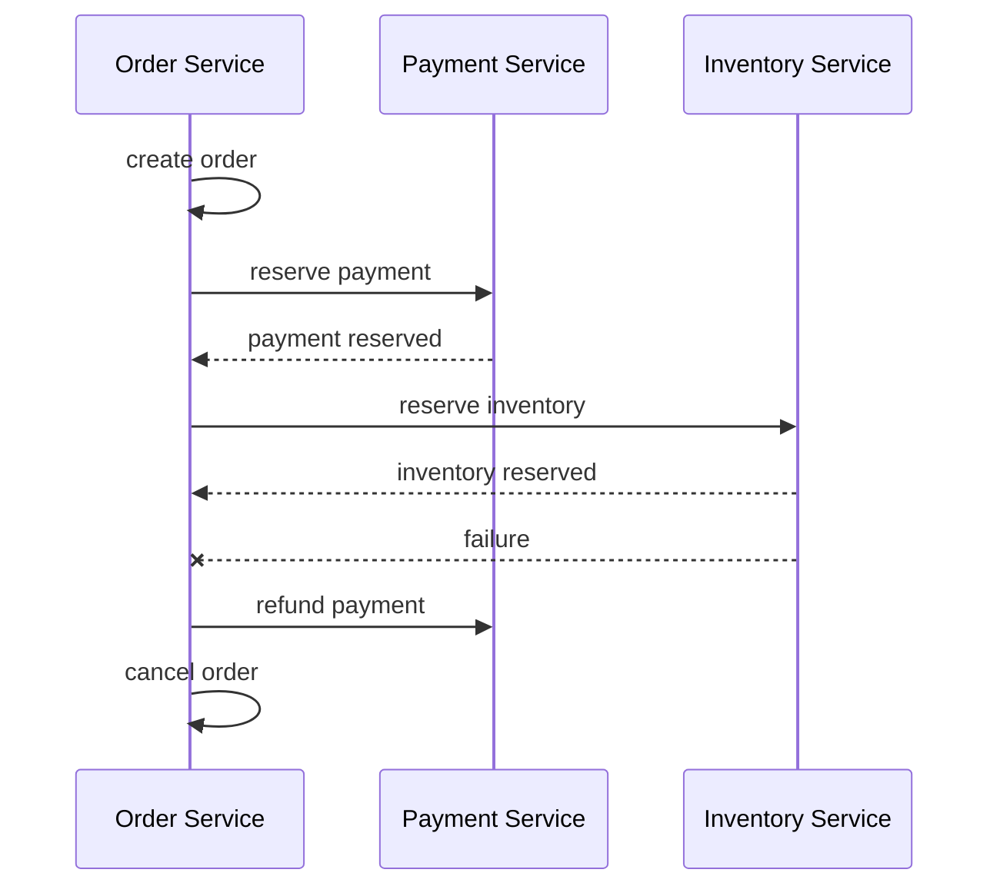

# Saga Pattern

## Introduction
The saga pattern coordinates long-running distributed transactions across microservices using a series of compensating actions.

## Problem Statement
Distributed transactions spanning multiple services cannot use traditional ACID transactions without sacrificing scalability or availability.

## Why this exists
Saga provides a way to maintain consistency across services by orchestrating multiple local transactions and compensating when failures occur.

## Real-world analogy
A travel booking system that books flights, hotels, and cars separately and compensates by canceling earlier steps if one booking fails.

## Definition
A saga is a sequence of local transactions where each step publishes an event and a compensating action reverses the step if a later step fails.

## Key concepts
- **Local transaction**
- **Compensation**
- **Orchestration**
- **Choreography**
- **Eventual consistency**

## Internal working
Each service runs its own transaction and emits an event upon success. If a step fails, compensating transactions are executed to revert previous work.

### Mermaid diagram


## Python implementation

### Bad implementation
A distributed transaction that locks resources across services.

```python
class DistributedTransaction:
    def execute(self, steps):
        for step in steps:
            step()
```

### Better implementation
A saga with compensating functions for each step.

```python
from typing import Callable, List, Tuple

class Saga:
    def __init__(self):
        self.steps: List[Tuple[Callable[[], bool], Callable[[], None]]] = []

    def add_step(self, action: Callable[[], bool], compensation: Callable[[], None]) -> None:
        self.steps.append((action, compensation))

    def execute(self) -> bool:
        completed = []
        for action, compensation in self.steps:
            if action():
                completed.append(compensation)
            else:
                for rollback in reversed(completed):
                    rollback()
                return False
        return True
```

### Best implementation
A saga orchestrator with event logging and compensating actions.

```python
from dataclasses import dataclass
from typing import Callable, List

@dataclass
class SagaStep:
    action: Callable[[], bool]
    compensation: Callable[[], None]

class SagaOrchestrator:
    def __init__(self):
        self.steps: List[SagaStep] = []

    def add_step(self, step: SagaStep) -> None:
        self.steps.append(step)

    def execute(self) -> bool:
        completed: List[SagaStep] = []
        for step in self.steps:
            if step.action():
                completed.append(step)
            else:
                for completed_step in reversed(completed):
                    completed_step.compensation()
                return False
        return True
```

## Step-by-step explanation
1. Define each local transaction and its compensation.
2. Execute steps sequentially.
3. On failure, undo prior completed steps using compensating actions.

## Multiple real-world examples
- Order fulfillment with payment and inventory services.
- Account creation workflows across identity and billing systems.
- Reservation systems where multiple resources must be booked.

## Pros
- Avoids distributed ACID transactions.
- Supports eventual consistency.
- Scales with independent service ownership.

## Cons
- Compensating actions can be complex.
- Eventual consistency means temporary inconsistency.
- Requires careful error handling and monitoring.

## Interview Questions
### Beginner
- What is a saga?
- Answer: A sequence of local transactions with compensations for failures.

### Intermediate
- What is the difference between orchestration and choreography?
- Answer: Orchestration uses a central coordinator; choreography uses events between services.

### Senior
- How do you ensure idempotency in saga compensations?
- Answer: Use stable compensation operations that can safely run multiple times.

### Staff Engineer
- Design a saga-based order processing workflow with failure recovery.
- Answer: Orchestrate steps in order, emit events, use compensations for each step, and monitor failure paths.

## Common mistakes
- Forgetting to build compensation for every step.
- Relying on synchronous rollbacks across services.
- Not handling partial success states.

## Best practices
- Keep saga steps small and independent.
- Use event logging for audit and replay.
- Build compensations that are safe and idempotent.

## When NOT to use
- Simple transactional workflows that fit within one service.
- Systems requiring strict ACID semantics globally.

## Comparison with similar concepts
- **Distributed transaction:** saga is eventual and compensating, while distributed transactions are ACID.
- **CQRS:** often paired with sagas for command handling.
- **Event sourcing:** can store saga progress as events.

## Summary
The saga pattern enables flexible distributed workflows without distributed ACID transactions. It relies on compensating operations and eventual consistency.

## Related topics
- [CQRS](../cqrs)
- [Event Sourcing](../event-sourcing)
- [Retry](../retry)
