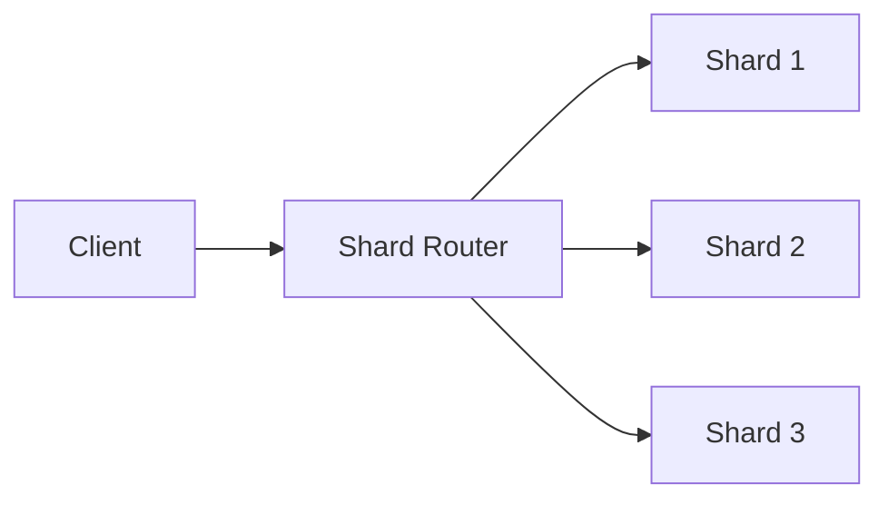

# Sharding

## Introduction
Sharding is a type of horizontal partitioning that distributes data across multiple database instances.

## Problem Statement
A single database instance can become a bottleneck for large-scale read and write workloads.

## Why this exists
Sharding enables the system to scale by splitting data across multiple machines and allowing parallel processing.

## Real-world analogy
A delivery company divides addresses into geographic zones and assigns each zone to a separate local hub.

## Definition
Sharding divides data horizontally so each shard contains a subset of records, typically based on a shard key.

## Key concepts
- **Shard key**
- **Shard map**
- **Resharding**
- **Shard router**
- **Cross-shard queries**

## Internal working
A shard router uses the shard key to determine which shard holds a given record and routes reads/writes accordingly.

### Mermaid diagram


## Python implementation

### Bad implementation
A single database instance handling all keys.

```python
class Database:
    def __init__(self):
        self.store = {}

    def write(self, key, value):
        self.store[key] = value

    def read(self, key):
        return self.store.get(key)
```

### Better implementation
A shard router with a simple hash-based shard assignment.

```python
from typing import Any, Dict, List

class Shard:
    def __init__(self, name: str):
        self.name = name
        self.store: Dict[Any, Any] = {}

class ShardRouter:
    def __init__(self, shards: List[Shard]):
        self.shards = shards

    def _choose_shard(self, key: Any) -> Shard:
        index = hash(key) % len(self.shards)
        return self.shards[index]

    def write(self, key: Any, value: Any) -> None:
        shard = self._choose_shard(key)
        shard.store[key] = value

    def read(self, key: Any):
        shard = self._choose_shard(key)
        return shard.store.get(key)
```

### Best implementation
A sharding system with metadata, resharding support, and health checks.

```python
from dataclasses import dataclass, field
from typing import Any, Dict, List

@dataclass
class ShardMetadata:
    name: str
    range_start: int
    range_end: int
    healthy: bool = True

@dataclass
class Shard:
    metadata: ShardMetadata
    store: Dict[Any, Any] = field(default_factory=dict)

class ShardManager:
    def __init__(self, shards: List[Shard]):
        self.shards = shards

    def _find_shard(self, key: int) -> Shard:
        for shard in self.shards:
            if shard.metadata.range_start <= key < shard.metadata.range_end:
                return shard
        raise KeyError("no shard found")

    def write(self, key: int, value: Any) -> None:
        shard = self._find_shard(key)
        if not shard.metadata.healthy:
            raise RuntimeError("shard unavailable")
        shard.store[key] = value

    def read(self, key: int) -> Any:
        shard = self._find_shard(key)
        return shard.store.get(key)

shards = [
    Shard(metadata=ShardMetadata(name="shard-1", range_start=0, range_end=1000)),
    Shard(metadata=ShardMetadata(name="shard-2", range_start=1000, range_end=2000)),
]
