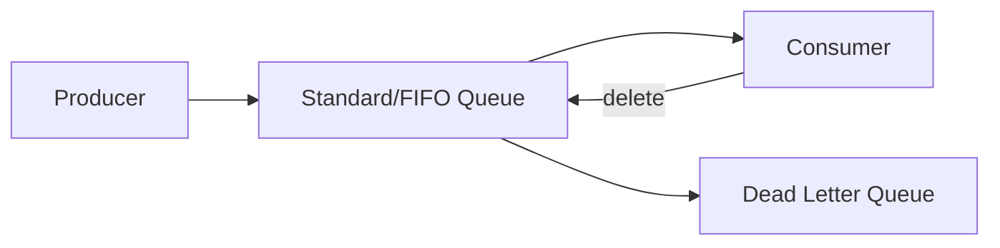

# SQS

## Introduction
Amazon SQS is a fully managed message queuing service that decouples microservices, distributed systems, and serverless applications.

## Problem Statement
Applications need a durable, scalable queueing layer without managing broker infrastructure.

## Why this exists
SQS provides reliable delivery, elasticity, and visibility controls with minimal operational overhead.

## Real-world analogy
SQS is like a managed postal service where senders drop messages into a queue and receivers pick them up when ready.

## Definition
Amazon Simple Queue Service (SQS) is a managed queue service offering standard and FIFO queues for asynchronous communication.

## Key concepts
- **Standard queue**
- **FIFO queue**
- **Visibility timeout**
- **Dead-letter queue**
- **Message retention**

## Internal working
SQS stores messages durably and delivers them to consumers. Consumers can delete messages after processing, and un-deleted messages become visible again.

### Mermaid diagram


## Python implementation

### Bad implementation
A queue that drops messages when consumers are unavailable.

```python
class DroppingQueue:
    def __init__(self):
        self.queue = []

    def send(self, message):
        self.queue.append(message)

    def receive(self):
        return self.queue.pop(0)
```

### Better implementation
A queue with visibility timeout and retry.

```python
import time

class VisibilityQueue:
    def __init__(self):
        self.queue = []
        self.inflight = {}

    def send(self, message):
        self.queue.append(message)

    def receive(self):
        message = self.queue.pop(0)
        self.inflight[message] = time.time() + 30
        return message

    def delete(self, message):
        self.inflight.pop(message, None)
```

### Best implementation
A queue with visibility timeout, dead-letter handling, and poison message tracking.

```python
import time
from collections import deque
from dataclasses import dataclass, field
from typing import Any, Deque, Dict, List

@dataclass
class Message:
    body: Any
    receipt_handle: str
    retries: int = 0
    visible_at: float = field(default_factory=time.time)

class SQSLikeQueue:
    def __init__(self, visibility_timeout: float = 30, max_retries: int = 5):
        self.queue: Deque[Message] = deque()
        self.inflight: Dict[str, Message] = {}
        self.dead_letter: List[Message] = []
        self.visibility_timeout = visibility_timeout
        self.max_retries = max_retries

    def send(self, body: Any) -> None:
        self.queue.append(Message(body=body, receipt_handle=str(time.time())))

    def receive(self) -> Message | None:
        now = time.time()
        while self.queue:
            message = self.queue.popleft()
            if message.visible_at <= now:
                message.visible_at = now + self.visibility_timeout
                self.inflight[message.receipt_handle] = message
                return message
            self.queue.append(message)
        self._requeue_inflight(now)
        return None

    def delete(self, receipt_handle: str) -> None:
        self.inflight.pop(receipt_handle, None)

    def _requeue_inflight(self, now: float) -> None:
        expired = [msg for msg in self.inflight.values() if msg.visible_at <= now]
        for message in expired:
            self.inflight.pop(message.receipt_handle, None)
            message.retries += 1
            if message.retries > self.max_retries:
                self.dead_letter.append(message)
            else:
                self.queue.append(message)
```

## Step-by-step explanation
1. Producers enqueue messages.
2. Consumers receive messages and process them.
3. Messages are deleted after success or returned to the queue after timeout.

## Multiple real-world examples
- Order processing pipelines.
- Event ingestion for serverless processing.
- Retryable background jobs.

## Pros
- No broker management.
- Durable and scalable.
- Supports FIFO and standard queue modes.

## Cons
- Higher latency compared to in-memory queues.
- Visibility timeouts must be tuned carefully.
- Limited ordering guarantees for standard queues.

## Interview Questions
### Beginner
- What is a dead-letter queue?
- Answer: A queue for messages that could not be processed successfully.

### Intermediate
- Why use visibility timeout in SQS?
- Answer: To prevent multiple consumers from processing the same message simultaneously.

### Senior
- What are the tradeoffs between standard and FIFO queues?
- Answer: Standard provides higher throughput and at-least-once delivery; FIFO provides ordering and exactly-once processing.

### Staff Engineer
- Design a resilient event ingestion pipeline using SQS.
- Answer: Use a standard queue for scale, dead-letter handling, idempotent processing, and separate retry/backoff consumers.

## Common mistakes
- Forgetting to delete processed messages.
- Setting visibility timeout too low.
- Not using dead-letter queues for poison messages.

## Best practices
- Use idempotent consumers.
- Tune visibility timeout based on processing time.
- Use DLQs for problematic messages.

## When NOT to use
- Extremely low-latency requirements.
- Tight ordering requirements outside FIFO queue support.

## Comparison with similar concepts
- **RabbitMQ:** supports richer routing and broker control.
- **Kafka:** optimized for log retention and replay.
- **Event-driven architecture:** SQS is a building block for asynchronous workflows.

## Summary
SQS is a robust managed queue service for decoupled asynchronous workloads. It provides reliability, scale, and simplified operations.

## Related topics
- [Kafka](../kafka)
- [RabbitMQ](../rabbitmq)
- [Event-Driven Architecture](../event-driven-architecture)
